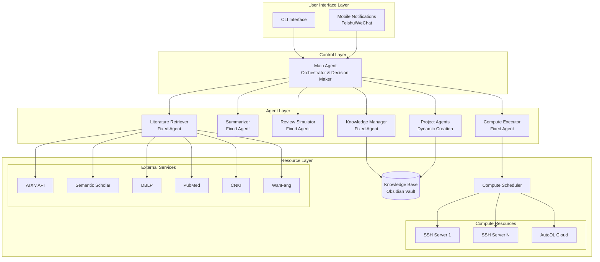
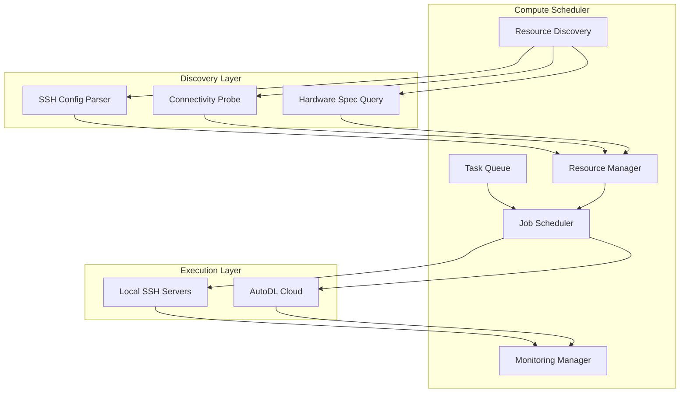
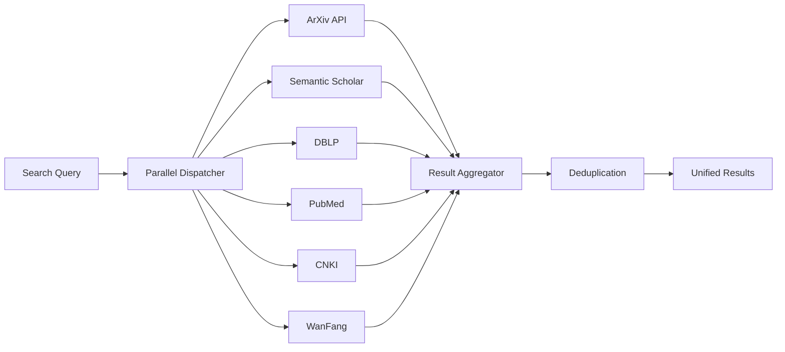
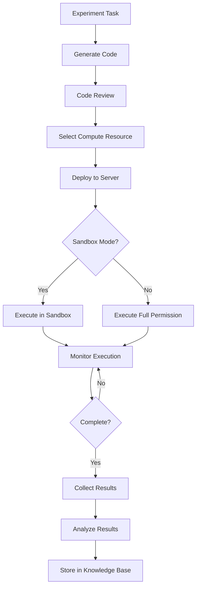
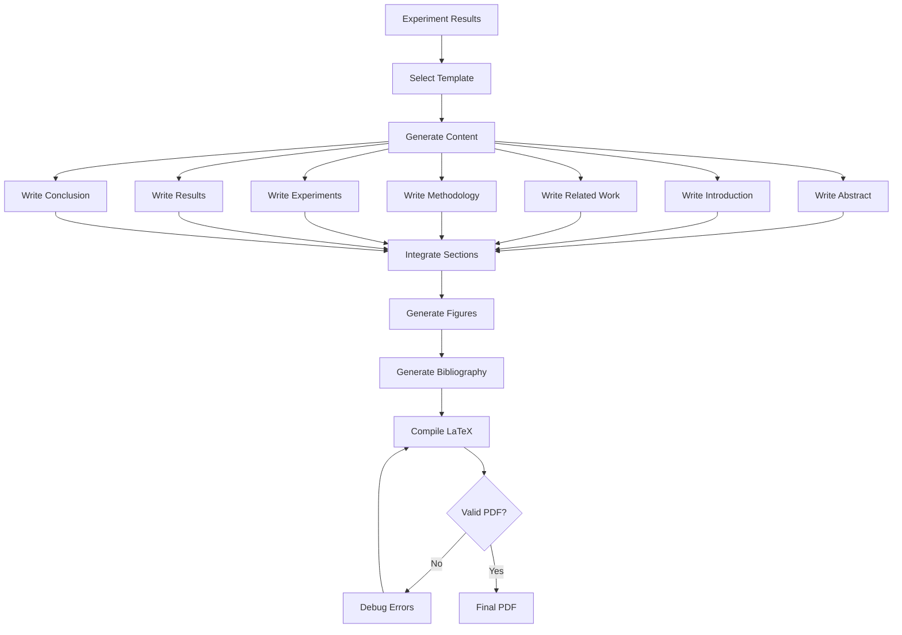

# Design Document: 自动科研系统 (AutoResearch System)

## Overview

The AutoResearch System is a full-stack automated research platform that orchestrates the complete scientific research workflow from idea generation through paper publication. The system employs a multi-agent architecture where specialized agents collaborate to conduct literature reviews, generate research ideas, execute experiments, and produce academic papers.

### Core Capabilities

- **Autonomous Research Pipeline**: End-to-end automation from research direction discovery to paper submission
- **Multi-Agent Collaboration**: Hierarchical agent architecture with Main Agent, Fixed Agents, and Project Agents
- **Intelligent Resource Management**: Dynamic compute resource discovery and scheduling across SSH servers and cloud platforms
- **Structured Knowledge Management**: Obsidian-based knowledge base with access control and automatic organization
- **Multi-Source Literature Integration**: Parallel retrieval from ArXiv, Semantic Scholar, DBLP, PubMed, CNKI, and WanFang
- **Experiment Automation**: Sandbox and full-permission execution modes with result collection and analysis
- **Academic Paper Generation**: LaTeX-based paper writing with template management and figure generation
- **Quality Control**: Simulated peer review with CCF-B level quality assessment

### Technology Stack

- **Primary Language**: Python 3.10+
- **Agent Framework**: LangGraph (for stateful multi-agent workflows with cycles)
- **Knowledge Base**: Obsidian (Markdown files with Local REST API)
- **Compute Scheduler**: Custom Python scheduler with SSH/AutoDL integration
- **Literature APIs**: arxiv.py, semanticscholar, requests for web scraping
- **Paper Generation**: LaTeX with Jinja2 templating
- **Version Control**: Git for code, file-based versioning for documents
- **Mobile Integration**: Feishu/WeChat APIs

## Architecture

### System Architecture Diagram



### Agent Architecture

The system uses a three-tier agent hierarchy:

1. **Main Agent** (Singleton): Orchestrates the entire research workflow, makes high-level decisions, coordinates communication between agents
2. **Fixed Agents** (Persistent): Specialized agents for specific functions (literature, summarization, review, execution, knowledge management)
3. **Project Agents** (Dynamic): Created per research project, responsible for project-specific workflows with isolated scope

### Communication Patterns

Agents communicate through:
- **Shared State**: LangGraph state management for workflow coordination
- **Message Passing**: Structured messages between agents with typed schemas
- **Knowledge Base**: Persistent storage for cross-agent data sharing
- **Event System**: Asynchronous notifications for long-running operations


## Components and Interfaces

### Agent Components

#### Main Agent

**Responsibilities:**
- User interaction and command processing
- High-level workflow orchestration
- Task decomposition and delegation
- Decision-making based on agent outputs
- Progress monitoring and error handling
- Agent registry management

**Key Methods:**
```python
class MainAgent:
    def __init__(self, knowledge_base: KnowledgeBase, agent_registry: AgentRegistry)
    
    def process_user_command(self, command: Command) -> Response
    def create_project_agent(self, research_task: ResearchTask) -> ProjectAgent
    def assign_task(self, task: Task, agent: Agent) -> TaskAssignment
    def aggregate_results(self, results: List[AgentResult]) -> AggregatedResult
    def make_decision(self, context: DecisionContext) -> Decision
    def record_execution_outcome(self, task: Task, outcome: Outcome, feedback: UserFeedback)
```

**State Management:**
```python
@dataclass
class MainAgentState:
    active_projects: Dict[str, ProjectAgent]
    task_queue: PriorityQueue[Task]
    agent_registry: AgentRegistry
    execution_history: List[ExecutionRecord]
```


#### Fixed Agents

**Literature Retriever Agent:**
```python
class LiteratureRetrieverAgent:
    def __init__(self, api_clients: Dict[str, APIClient], rate_limiter: RateLimiter)
    
    def search_papers(self, query: str, databases: List[str]) -> List[Paper]
    def parallel_search(self, query: str) -> Dict[str, List[Paper]]
    def deduplicate_results(self, results: List[Paper]) -> List[Paper]
    def extract_metadata(self, paper: Paper) -> PaperMetadata
    def scrape_web_content(self, url: str) -> WebContent
```

**Summarizer Agent:**
```python
class SummarizerAgent:
    def generate_summary(self, abstract: str) -> str
    def extract_key_innovations(self, paper: Paper) -> List[str]
    def classify_research_category(self, paper: Paper) -> str
    def extract_methods(self, paper: Paper) -> List[str]
    def extract_datasets(self, paper: Paper) -> List[Dataset]
```

**Review Simulator Agent:**
```python
class ReviewSimulatorAgent:
    def __init__(self, venue_criteria: Dict[str, ReviewCriteria])
    
    def evaluate_paper(self, paper: Paper, venue: str = None) -> ReviewReport
    def assess_novelty(self, paper: Paper) -> float
    def assess_technical_soundness(self, paper: Paper) -> float
    def assess_writing_quality(self, paper: Paper) -> float
    def compare_to_ccf_b_standard(self, paper: Paper) -> ComparisonReport
```

**Compute Executor Agent:**
```python
class ComputeExecutorAgent:
    def __init__(self, scheduler: ComputeScheduler)
    
    def execute_experiment(self, task: ExperimentTask, mode: ExecutionMode) -> ExecutionResult
    def monitor_execution(self, job_id: str) -> ExecutionStatus
    def collect_results(self, job_id: str) -> ExperimentResults
```


**Knowledge Manager Agent:**
```python
class KnowledgeManagerAgent:
    def __init__(self, knowledge_base: KnowledgeBase)
    
    def store_knowledge(self, entry: KnowledgeEntry, zone: Zone, project_id: str = None)
    def retrieve_knowledge(self, query: str, zone: Zone = None) -> List[KnowledgeEntry]
    def create_links(self, source: str, target: str, link_type: LinkType)
    def cluster_knowledge(self) -> List[KnowledgeCluster]
    def extract_skills(self, tasks: List[Task]) -> List[Skill]
    def version_knowledge(self, entry_id: str) -> VersionHistory
```

#### Project Agent

**Responsibilities:**
- Project-specific workflow execution
- Preliminary investigation
- Research idea generation
- Experiment code generation
- Result analysis and paper drafting

**Key Methods:**
```python
class ProjectAgent:
    def __init__(self, project_id: str, research_direction: ResearchCandidate, 
                 knowledge_base: KnowledgeBase)
    
    def conduct_preliminary_investigation(self) -> InvestigationReport
    def generate_research_ideas(self, gaps: List[ResearchGap]) -> List[ResearchIdea]
    def decompose_into_experiments(self, idea: ResearchIdea) -> List[ExperimentTask]
    def generate_experiment_code(self, task: ExperimentTask) -> ExperimentCode
    def analyze_results(self, results: List[ExperimentResults]) -> Analysis
    def draft_paper(self, analysis: Analysis) -> PaperDraft
```

**Access Control:**
- Read: Exploration zone + own project directory
- Write: Own project directory only
- Enforced by KnowledgeBase permission layer


### Knowledge Base Component

#### Structure

```
obsidian-vault/
├── exploration/                    # Global knowledge (Exploration Zone)
│   ├── topics/
│   │   ├── machine-learning.md
│   │   ├── optimization.md
│   │   └── data-structures.md
│   ├── skills/
│   │   ├── hyperparameter-tuning.md
│   │   └── experiment-design.md
│   ├── methodologies/
│   └── index.md                    # Topic index
│
└── projects/                       # Project-specific knowledge (Project Zone)
    ├── project-001-gan-optimization/
    │   ├── knowledge/
    │   │   ├── literature-review.md
    │   │   ├── sota-methods.md
    │   │   └── datasets.md
    │   ├── progress/
    │   │   ├── timeline.md
    │   │   └── milestones.md
    │   ├── issues/
    │   │   └── challenges.md
    │   ├── experience/
    │   │   └── lessons-learned.md
    │   └── results/
    │       ├── experiment-001.md
    │       └── figures/
    │
    └── project-002-transformer-compression/
        └── ...
```


#### Knowledge Base Interface

```python
class KnowledgeBase:
    def __init__(self, vault_path: Path, api_endpoint: str = None)
    
    # Core operations
    def create_entry(self, path: str, content: str, metadata: Dict) -> KnowledgeEntry
    def read_entry(self, path: str) -> KnowledgeEntry
    def update_entry(self, path: str, content: str) -> KnowledgeEntry
    def delete_entry(self, path: str) -> bool
    
    # Search and retrieval
    def search(self, query: str, zone: Zone = None) -> List[KnowledgeEntry]
    def get_linked_entries(self, entry_id: str) -> List[KnowledgeEntry]
    def get_by_tag(self, tag: str) -> List[KnowledgeEntry]
    
    # Organization
    def create_bidirectional_link(self, source: str, target: str)
    def update_topic_index(self, keywords: List[str], entry_id: str)
    def cluster_entries(self, threshold: int) -> List[Cluster]
    
    # Permission control
    def check_permission(self, agent: Agent, path: str, operation: Operation) -> bool
    def enforce_access_control(self, agent: Agent, path: str, operation: Operation)
    
    # Versioning
    def get_version_history(self, path: str) -> List[Version]
    def rollback(self, path: str, version_id: str) -> KnowledgeEntry
    def create_backup(self) -> str
```

#### Access Control Matrix

| Agent Type | Exploration Zone | Own Project | Other Projects |
|------------|-----------------|-------------|----------------|
| Main Agent | Read/Write | Read/Write | Read/Write |
| Fixed Agent | Read/Write | Read/Write | Read/Write |
| Project Agent | Read | Read/Write | None |


### Compute Scheduler Component

#### Architecture




#### Compute Scheduler Interface

```python
class ComputeScheduler:
    def __init__(self, config: SchedulerConfig)
    
    # Resource discovery
    def discover_resources(self) -> List[ComputeResource]
    def parse_ssh_config(self, config_path: Path) -> List[SSHServer]
    def test_connectivity(self, server: SSHServer) -> bool
    def query_hardware_specs(self, server: SSHServer) -> HardwareSpec
    
    # Resource management
    def register_resource(self, resource: ComputeResource)
    def update_resource_status(self, resource_id: str, status: ResourceStatus)
    def get_available_resources(self, requirements: ResourceRequirements) -> List[ComputeResource]
    
    # Task scheduling
    def submit_task(self, task: ExperimentTask, priority: int = 5) -> str  # Returns job_id
    def schedule_next_task(self) -> Optional[Tuple[ExperimentTask, ComputeResource]]
    def select_optimal_resource(self, task: ExperimentTask, 
                               available: List[ComputeResource]) -> ComputeResource
    
    # Cloud integration
    def rent_autodl_instance(self, requirements: ResourceRequirements) -> AutoDLInstance
    def release_autodl_instance(self, instance_id: str)
    
    # Monitoring
    def get_job_status(self, job_id: str) -> JobStatus
    def monitor_resource_usage(self, resource_id: str) -> ResourceUsage
    def collect_job_results(self, job_id: str) -> JobResults
```


#### Resource Selection Algorithm

```python
def select_optimal_resource(task: ExperimentTask, 
                           available: List[ComputeResource]) -> ComputeResource:
    """
    Priority-based resource selection:
    1. Local SSH servers over cloud (cost optimization)
    2. Best matching specifications (GPU type, memory, CPU)
    3. Lowest current load
    4. If no suitable local resource and GPU queue wait > threshold, rent AutoDL
    """
    
    # Filter by requirements
    suitable = [r for r in available if meets_requirements(r, task.requirements)]
    
    # Prioritize local resources
    local_resources = [r for r in suitable if r.type == ResourceType.SSH_SERVER]
    
    if local_resources:
        # Score by spec matching and load
        scored = [(score_resource(r, task), r) for r in local_resources]
        return max(scored, key=lambda x: x[0])[1]
    
    # Check GPU queue wait time
    if task.requires_gpu and get_gpu_queue_wait_time() > WAIT_THRESHOLD:
        # Attempt AutoDL rental
        return rent_autodl_instance(task.requirements)
    
    # Return best available or None
    return suitable[0] if suitable else None
```


### Literature Retrieval Pipeline

#### Multi-Source Parallel Retrieval



#### Literature Retriever Implementation

```python
class LiteratureRetriever:
    def __init__(self):
        self.api_clients = {
            'arxiv': ArxivClient(),
            'semantic_scholar': SemanticScholarClient(),
            'dblp': DBLPClient(),
            'pubmed': PubMedClient(),
            'cnki': CNKIClient(),
            'wanfang': WanFangClient()
        }
        self.rate_limiter = RateLimiter()
        self.cache = LiteratureCache()
    
    async def search_papers(self, query: str, 
                           databases: List[str] = None) -> List[Paper]:
        """Parallel search across multiple databases with rate limiting"""
        if databases is None:
            databases = list(self.api_clients.keys())
        
        tasks = []
        for db in databases:
            task = self._search_single_database(db, query)
            tasks.append(task)
        
        results = await asyncio.gather(*tasks, return_exceptions=True)
        
        # Flatten and deduplicate
        all_papers = []
        for result in results:
            if isinstance(result, list):
                all_papers.extend(result)
        
        return self.deduplicate_results(all_papers)
```


    
    async def _search_single_database(self, db: str, query: str) -> List[Paper]:
        """Search single database with rate limiting and error handling"""
        client = self.api_clients[db]
        
        # Check cache first
        cached = self.cache.get(db, query)
        if cached:
            return cached
        
        # Rate limiting
        await self.rate_limiter.acquire(db)
        
        try:
            results = await client.search(query)
            self.cache.set(db, query, results)
            return results
        except RateLimitError as e:
            # Exponential backoff
            await asyncio.sleep(e.retry_after)
            return await self._search_single_database(db, query)
        except Exception as e:
            logger.error(f"Error searching {db}: {e}")
            return []
    
    def deduplicate_results(self, papers: List[Paper]) -> List[Paper]:
        """Remove duplicates based on DOI and title similarity"""
        seen_dois = set()
        seen_titles = []
        unique_papers = []
        
        for paper in papers:
            # Check DOI
            if paper.doi and paper.doi in seen_dois:
                continue
            
            # Check title similarity
            if any(title_similarity(paper.title, t) > 0.9 for t in seen_titles):
                continue
            
            unique_papers.append(paper)
            if paper.doi:
                seen_dois.add(paper.doi)
            seen_titles.append(paper.title)
        
        return unique_papers
```


### Experiment Execution Workflow

#### Execution Modes

**Sandbox Mode (Default):**
- Restricted file system access (experiment directory only)
- Limited network access (academic databases and approved repositories only)
- Resource limits enforced (memory, CPU, GPU time)
- System-level operations prohibited

**Full Permission Mode:**
- Unrestricted file system and network access
- System operations allowed (except dangerous operations)
- All operations logged for audit
- Explicit user approval required

#### Experiment Execution Pipeline




#### Experiment Code Structure

```python
# Generated experiment structure
experiment_dir/
├── main.py                 # Main execution script
├── config.yaml             # Hyperparameters and settings
├── requirements.txt        # Python dependencies
├── README.md               # Documentation
├── models/                 # Model definitions
│   └── architecture.py
├── data/                   # Data loading
│   └── dataset.py
├── utils/                  # Utilities
│   ├── logging.py
│   ├── checkpoint.py
│   └── metrics.py
└── outputs/                # Results directory
    ├── logs/
    ├── checkpoints/
    └── results/
```

**Standard Features in Generated Code:**
- Structured logging with timestamps and levels
- Automatic checkpointing at regular intervals
- Configuration management with YAML
- Result serialization to JSON/CSV
- Error handling and recovery
- Progress reporting to main system


### Paper Generation Pipeline

#### LaTeX Paper Generation Workflow




#### Paper Generator Interface

```python
class PaperGenerator:
    def __init__(self, template_manager: TemplateManager, 
                 figure_generator: FigureGenerator)
    
    def generate_paper(self, analysis: Analysis, template: str, 
                      metadata: PaperMetadata) -> LaTeXDocument
    
    def write_section(self, section: SectionType, content: Dict) -> str
    
    def insert_results(self, section: str, results: ExperimentResults) -> str
    
    def generate_bibliography(self, cited_papers: List[Paper]) -> str
    
    def compile_latex(self, latex_doc: LaTeXDocument) -> PDFDocument
    
    def validate_compilation(self, latex_doc: LaTeXDocument) -> ValidationResult

class TemplateManager:
    def __init__(self, template_dir: Path)
    
    def list_templates(self) -> List[Template]
    
    def get_template(self, name: str) -> Template
    
    def import_template(self, source: str) -> Template
    
    def validate_template(self, template: Template) -> ValidationResult
    
    def extract_required_fields(self, template: Template) -> List[Field]

class FigureGenerator:
    def generate_training_curve(self, data: TrainingData, style: str) -> Figure
    
    def generate_comparison_table(self, results: List[Result]) -> Table
    
    def generate_confusion_matrix(self, predictions: np.ndarray, 
                                 labels: np.ndarray) -> Figure
    
    def generate_bar_chart(self, data: Dict, style: str) -> Figure
    
    def apply_style(self, figure: Figure, journal_style: str) -> Figure
    
    def export_pdf(self, figure: Figure, path: Path) -> Path
```


## Data Models

### Core Data Models

```python
from dataclasses import dataclass
from datetime import datetime
from enum import Enum
from typing import List, Dict, Optional

@dataclass
class Paper:
    """Literature paper metadata"""
    title: str
    authors: List[str]
    abstract: str
    doi: Optional[str]
    arxiv_id: Optional[str]
    publication_date: datetime
    venue: str
    citation_count: int
    url: str
    source_database: str

@dataclass
class ResearchCandidate:
    """Research direction candidate"""
    id: str
    title: str
    description: str
    research_gap: str
    novelty_score: float
    feasibility_score: float
    impact_score: float
    related_papers: List[Paper]
    generated_at: datetime

@dataclass
class ResearchIdea:
    """Concrete research idea"""
    id: str
    candidate_id: str
    title: str
    hypothesis: str
    proposed_method: str
    expected_contribution: str
    required_resources: ResourceRequirements
    estimated_time_hours: int
    technical_risks: List[str]

@dataclass
class ExperimentTask:
    """Executable experiment task"""
    id: str
    project_id: str
    idea_id: str
    name: str
    description: str
    code_path: Path
    config: Dict
    requirements: ResourceRequirements
    dependencies: List[str]
    priority: int
```


@dataclass
class ResourceRequirements:
    """Compute resource requirements"""
    cpu_cores: int
    memory_gb: int
    gpu_count: int
    gpu_type: Optional[str]  # e.g., "V100", "A100"
    disk_gb: int
    max_runtime_hours: int

@dataclass
class ComputeResource:
    """Available compute resource"""
    id: str
    type: str  # "ssh_server" or "autodl"
    hostname: str
    port: int
    credentials: Dict
    hardware_spec: HardwareSpec
    status: str  # "available", "busy", "offline"
    current_load: float

@dataclass
class HardwareSpec:
    """Hardware specifications"""
    cpu_model: str
    cpu_cores: int
    memory_gb: int
    gpus: List[GPU]
    disk_gb: int

@dataclass
class GPU:
    """GPU information"""
    model: str  # e.g., "NVIDIA RTX 3090"
    memory_gb: int
    compute_capability: str

@dataclass
class ExperimentResults:
    """Experiment execution results"""
    task_id: str
    status: str  # "success", "failed", "timeout"
    metrics: Dict[str, float]
    logs: str
    checkpoints: List[Path]
    figures: List[Path]
    execution_time_seconds: float
    resource_usage: ResourceUsage
```


@dataclass
class KnowledgeEntry:
    """Knowledge base entry"""
    id: str
    path: str
    title: str
    content: str
    metadata: Dict
    tags: List[str]
    links: List[str]
    zone: str  # "exploration" or "project"
    project_id: Optional[str]
    created_at: datetime
    updated_at: datetime
    version: int

@dataclass
class ReviewReport:
    """Simulated review report"""
    paper_id: str
    venue: Optional[str]
    overall_score: float
    novelty_score: float
    soundness_score: float
    writing_score: float
    experimental_rigor_score: float
    detailed_comments: str
    improvement_suggestions: List[str]
    ccf_level_comparison: str
    recommended_venues: List[str]

class ExecutionMode(Enum):
    """Experiment execution mode"""
    SANDBOX = "sandbox"
    FULL_PERMISSION = "full_permission"

class Zone(Enum):
    """Knowledge base zone"""
    EXPLORATION = "exploration"
    PROJECT = "project"
```


## Error Handling

### Error Classification

```python
class SystemError(Exception):
    """Base class for system errors"""
    pass

class AgentError(SystemError):
    """Agent-related errors"""
    pass

class ResourceError(SystemError):
    """Resource management errors"""
    pass

class KnowledgeBaseError(SystemError):
    """Knowledge base operation errors"""
    pass

class ExperimentError(SystemError):
    """Experiment execution errors"""
    pass

class ExternalServiceError(SystemError):
    """External service integration errors"""
    pass
```

### Error Handling Strategies

**Network Operations:**
- Automatic retry with exponential backoff (3 attempts, delays: 1s, 2s, 4s)
- Rate limit detection and respect retry-after headers
- Circuit breaker pattern for repeatedly failing services
- Fallback to alternative data sources when available

**Experiment Execution:**
- Timeout enforcement with configurable limits
- Resource limit violations trigger graceful termination
- Failed experiments logged with full context for debugging
- Retry logic for transient failures (network, resource contention)
- Non-blocking: other experiments continue on failure


**Agent Failures:**
- Agent crash detection and automatic restart
- State recovery from Knowledge Base
- Task reassignment to backup agents when available
- User notification for critical agent failures

**Data Integrity:**
- Atomic Knowledge Base operations with rollback on failure
- Automatic backups before destructive operations
- Validation of all data before persistence
- Corruption detection with checksums

**Security:**
- Input validation for all user inputs (prevent injection attacks)
- Credential encryption at rest
- Secure communication channels (TLS for all network operations)
- Audit logging for all security-relevant events
- Sandbox escape attempt detection and blocking

### Error Recovery Workflow

```python
async def execute_with_retry(operation: Callable, 
                             max_attempts: int = 3,
                             backoff_base: float = 1.0) -> Any:
    """Execute operation with exponential backoff retry"""
    for attempt in range(max_attempts):
        try:
            return await operation()
        except TransientError as e:
            if attempt == max_attempts - 1:
                raise
            delay = backoff_base * (2 ** attempt)
            logger.warning(f"Attempt {attempt + 1} failed: {e}. Retrying in {delay}s...")
            await asyncio.sleep(delay)
        except PermanentError as e:
            logger.error(f"Permanent error: {e}. Aborting.")
            raise
```


## Testing Strategy

### Testing Approach

The system requires a multi-layered testing strategy combining:
- **Property-Based Tests**: For core logic with universal properties
- **Unit Tests**: For specific scenarios and edge cases
- **Integration Tests**: For external service interactions
- **Smoke Tests**: For system initialization and configuration

### Property-Based Testing

**Property-Based Testing Library:** Use `hypothesis` for Python

**Configuration:** Minimum 100 iterations per property test

**Test Organization:**
```python
# tests/properties/test_agent_management.py
from hypothesis import given, strategies as st

@given(research_task=st.builds(ResearchTask))
@settings(max_examples=100)
def test_property_project_agent_creation(research_task):
    """
    Feature: auto-research-system, Property 1: Project agent creation
    For any research task, creating a Project_Agent should result in a new agent instance
    """
    system = SystemUnderTest()
    agent = system.create_project_agent(research_task)
    
    assert agent is not None
    assert agent.project_id == research_task.id
    assert agent in system.get_active_agents()
```


### Unit Testing

**Focus Areas:**
- Specific error scenarios (empty inputs, malformed data)
- Edge cases (boundary values, null handling)
- Business logic with concrete examples
- LLM integration with mocked responses

### Integration Testing

**Focus Areas:**
- External API interactions (ArXiv, Semantic Scholar, etc.)
- SSH connections and command execution
- AutoDL web automation
- Knowledge Base file operations
- Git operations
- LaTeX compilation

**Approach:**
- Mock external services for unit-like tests
- Use test doubles for SSH servers
- Separate integration test suite with real services (optional, slower)

### Smoke Testing

**Focus Areas:**
- System initialization
- Agent creation and registration
- Configuration file loading
- Dependency validation

### Test Coverage Goals

- Property tests: 80% coverage of core logic
- Unit tests: 90% coverage overall
- Integration tests: All external service integrations
- Smoke tests: All initialization paths


## Correctness Properties

*A property is a characteristic or behavior that should hold true across all valid executions of a system—essentially, a formal statement about what the system should do. Properties serve as the bridge between human-readable specifications and machine-verifiable correctness guarantees.*

### Agent Management Properties

#### Property 1: Project Agent Creation

*For any* valid research task, when the system creates a Project_Agent, the agent SHALL be successfully instantiated with a unique identifier and registered in the active agents registry.

**Validates: Requirements 1.3**

#### Property 2: Task Routing Correctness

*For any* task with a specified task type, when the Main_Agent assigns the task to an agent, the assigned agent SHALL have the capability required for that task type.

**Validates: Requirements 1.4**

#### Property 3: Message Delivery

*For any* message sent from one agent to another through the Main_Agent coordination system, the message SHALL be delivered to the correct recipient agent with its content preserved.

**Validates: Requirements 1.5**

#### Property 4: Agent Registry Consistency

*For any* agent added to the registry, the agent SHALL be retrievable by its identifier, and *for any* agent removed from the registry, subsequent retrieval attempts SHALL return None.

**Validates: Requirements 1.6**


### Agent Learning Properties

#### Property 5: Execution Recording

*For any* completed task with an outcome and user feedback, when the Main_Agent records the execution, the outcome and feedback SHALL be retrievable from the execution history.

**Validates: Requirements 2.1**

#### Property 6: Experience Accumulation

*For any* Fixed_Agent completing a task in its domain, the task completion SHALL be added to the agent's experience records and retrievable later.

**Validates: Requirements 2.2**

#### Property 7: Failure Analysis Trigger

*For any* task that fails, the system SHALL create a failure analysis entry containing the task context and error information.

**Validates: Requirements 2.4**

#### Property 8: Skill Storage

*For any* learned skill identified by the system, when stored in the Knowledge_Base, the skill SHALL be retrievable by its identifier or related keywords.

**Validates: Requirements 2.5**

#### Property 9: Skill Retrieval for Similar Tasks

*For any* two tasks with similarity score above threshold, when executing the second task, the agent SHALL retrieve skills learned from the first task.

**Validates: Requirements 2.6**


### Configuration Parsing Properties

#### Property 10: SSH Config Parsing Round-Trip

*For any* valid SSH configuration object, when formatted to text, then parsed back to an object, the resulting object SHALL be equivalent to the original object (structure and values preserved).

**Validates: Requirements 3.2, 30.4**

#### Property 11: SSH Entry Count Preservation

*For any* SSH configuration file with N host entries, when parsed by the Compute_Scheduler, the number of identified SSH_Server entries SHALL equal N.

**Validates: Requirements 3.3**

#### Property 12: Registry Update Consistency

*For any* connectivity test result (success or failure) for a SSH_Server, when the result is processed, the server's status in the registry SHALL match the connectivity test outcome.

**Validates: Requirements 3.6**

#### Property 13: Configuration Format Round-Trip

*For any* valid configuration object in JSON, YAML, or TOML format, when serialized to string and then deserialized, the resulting object SHALL be equivalent to the original.

**Validates: Requirements 30.4**


### Scheduling Properties

#### Property 14: Resource Requirement Evaluation

*For any* Experiment_Task submitted to the Compute_Scheduler, the scheduler SHALL extract and store all resource requirements (CPU, memory, GPU specifications) from the task.

**Validates: Requirements 5.1**

#### Property 15: Priority-Based Task Ordering

*For any* set of tasks in the queue, when the scheduler selects the next task to execute, the selected task SHALL have priority greater than or equal to all remaining tasks in the queue.

**Validates: Requirements 5.6**

#### Property 16: Local Resource Preference

*For any* experiment task that can be executed on either a local SSH_Server or AutoDL instance, when both are available with matching specifications, the scheduler SHALL select the local SSH_Server.

**Validates: Requirements 5.2**

### Knowledge Base Properties

#### Property 17: Project Directory Structure

*For any* newly created research project, the system SHALL create a project directory containing subdirectories for knowledge, progress, issues, and experience branches.

**Validates: Requirements 6.3**

#### Property 18: Bidirectional Link Creation

*For any* two knowledge entries A and B, when a link is created from A to B, both entries SHALL contain references to each other.

**Validates: Requirements 6.5**


#### Property 19: Permission Enforcement for Project Agents

*For any* Project_Agent attempting to write to another project's directory, the Knowledge_Base SHALL deny the operation and the directory SHALL remain unchanged.

**Validates: Requirements 7.4, 7.5**

#### Property 20: Main Agent Universal Access

*For any* path in the Knowledge_Base (Exploration or Project zones), the Main_Agent SHALL have both read and write access granted.

**Validates: Requirements 7.1**

#### Property 21: Knowledge Entry Retrieval

*For any* knowledge entry stored in the Knowledge_Base with specific tags or keywords, when searched using those tags or keywords, the entry SHALL appear in the search results.

**Validates: Requirements 6.6**

#### Property 22: Version History Preservation

*For any* knowledge entry modified N times, the Knowledge_Base SHALL maintain N+1 versions (original + N modifications) retrievable through version history.

**Validates: Requirements 8.6, 28.2**

### Literature Retrieval Properties

#### Property 23: Deduplication Correctness

*For any* set of papers containing duplicates (same DOI or highly similar titles), when deduplication is applied, the resulting set SHALL contain at most one instance of each unique paper.

**Validates: Requirements 9.5**


#### Property 24: Metadata Completeness

*For any* paper retrieved from any Academic_Database, the extracted metadata SHALL include title, authors, abstract, publication date, and venue (or appropriate subset based on database capabilities).

**Validates: Requirements 9.6**

### Sandbox Execution Properties

#### Property 25: File System Access Restriction

*For any* operation attempting to access paths outside the designated experiment directory, when executed in sandbox mode, the operation SHALL be blocked and return an access denied error.

**Validates: Requirements 16.2**

#### Property 26: Network Access Restriction

*For any* network request to a non-approved domain, when executed in sandbox mode, the request SHALL be blocked and logged.

**Validates: Requirements 16.3**

#### Property 27: Resource Limit Enforcement

*For any* experiment task with specified memory or CPU limits, when the task exceeds those limits in sandbox mode, the system SHALL terminate the task and record the violation.

**Validates: Requirements 16.5**

#### Property 28: Operation Logging in Full Permission Mode

*For any* operation executed in full permission mode, the system SHALL create a log entry containing the operation type, timestamp, and affected resources.

**Validates: Requirements 17.4**


### Result Collection Properties

#### Property 29: Output File Collection

*For any* completed experiment task that generates output files, when result collection executes, all output files (logs, metrics, checkpoints) SHALL be present in the collected results.

**Validates: Requirements 19.1**

#### Property 30: Metrics Extraction

*For any* experiment log file containing quantitative metrics in the expected format, when metrics extraction executes, all metrics SHALL be parsed and included in the structured results.

**Validates: Requirements 19.2**

### Version Control Properties

#### Property 31: Git Tracking for Code Changes

*For any* code file modification in a project repository, when a git commit is created, the change SHALL be recorded in the git history and retrievable via git log.

**Validates: Requirements 27.3**

#### Property 32: Git Tag Association

*For any* experiment run with a unique identifier, when a git tag is created for that run, the tag SHALL reference the correct commit corresponding to the code state during that run.

**Validates: Requirements 27.4**


### Paper Generation Properties

#### Property 33: LaTeX Compilation Validation

*For any* LaTeX document generated by the Paper_Generator with substantive content, when compiled, the compilation SHALL succeed and produce a valid PDF output.

**Validates: Requirements 20.6**

#### Property 34: Template Field Handling

*For any* LaTeX template with N required fields, when the Paper_Generator applies the template with values for all N fields, the generated document SHALL contain all N values in their designated positions.

**Validates: Requirements 21.4, 21.6**

#### Property 35: Figure Format Consistency

*For any* set of figures generated for a paper, all figures SHALL use the same format (vector PDF), color scheme, and styling rules.

**Validates: Requirements 22.4, 22.5**

### Configuration Validation Properties

#### Property 36: Invalid Configuration Error Reporting

*For any* invalid configuration file (malformed syntax or missing required fields), when parsed by the system, the parser SHALL return a descriptive error message indicating the location and nature of the error.

**Validates: Requirements 30.2, 30.6**


## Security Considerations

### Authentication and Authorization

**Credential Management:**
- SSH credentials stored encrypted using `cryptography` library (Fernet symmetric encryption)
- API keys for external services stored in encrypted configuration files
- Credentials never logged or exposed in error messages
- Support for SSH key-based authentication (preferred over passwords)

**Access Control:**
- Agent-level permissions enforced by Knowledge Base layer
- Audit trail for all write operations to Knowledge Base
- Project isolation prevents cross-project data access by Project Agents
- User authentication required for system control operations

### Sandbox Security

**Isolation Mechanisms:**
- Process-level isolation using Python `subprocess` with restricted permissions
- File system access control via path validation before any I/O
- Network access filtering through allowlist of domains
- Resource limits enforced via `resource` module (RLIMIT_CPU, RLIMIT_AS)

**Dangerous Operation Prevention:**
```python
BLOCKED_OPERATIONS = [
    'rm -rf /',
    'dd if=/dev/zero',
    'fork bomb patterns',
    'kernel module operations',
    ':(){:|:&};:',  # Fork bomb
]

def validate_command(command: str) -> bool:
    """Check command against blocked operations"""
    for blocked in BLOCKED_OPERATIONS:
        if blocked in command.lower():
            raise SecurityError(f"Blocked dangerous operation: {blocked}")
    return True
```


### Input Validation

**Command Injection Prevention:**
- All user inputs validated against expected formats
- Shell commands use parameterized execution (list form) rather than string concatenation
- SQL-style queries (if any) use parameterized statements
- Path inputs validated against directory traversal attacks

**Data Validation:**
```python
def validate_project_name(name: str) -> bool:
    """Validate project name against injection attacks"""
    if not re.match(r'^[a-zA-Z0-9_-]+$', name):
        raise ValueError("Project name contains invalid characters")
    if len(name) > 100:
        raise ValueError("Project name too long")
    return True

def sanitize_path(path: str, base_dir: Path) -> Path:
    """Ensure path is within base directory"""
    resolved = (base_dir / path).resolve()
    if not str(resolved).startswith(str(base_dir.resolve())):
        raise SecurityError("Path traversal attack detected")
    return resolved
```

### Network Security

- All external API calls use HTTPS/TLS
- Certificate verification enabled for all connections
- Timeout limits on all network operations
- Rate limiting enforced to prevent abuse
- Proxy support for restricted network environments


### Audit Logging

**Security Events Logged:**
- Authentication attempts (success and failure)
- Permission escalations (sandbox to full permission mode)
- Access denied events (attempted unauthorized access)
- Credential access and rotation
- System configuration changes
- Dangerous operation attempts

**Log Format:**
```json
{
  "timestamp": "2024-01-15T10:30:45Z",
  "event_type": "permission_escalation",
  "agent_id": "project-agent-001",
  "user_id": "user@example.com",
  "details": {
    "from_mode": "sandbox",
    "to_mode": "full_permission",
    "reason": "requires system package installation",
    "approved_by": "user@example.com"
  },
  "severity": "warning"
}
```

## Deployment Architecture

### System Components

```
┌─────────────────────────────────────────────────────────────┐
│                     User Interface                          │
│  ┌─────────────┐  ┌──────────────┐  ┌──────────────────┐   │
│  │ CLI Client  │  │ Mobile Apps  │  │ Web Dashboard    │   │
│  │             │  │ (Feishu/     │  │ (Optional)       │   │
│  │             │  │  WeChat)     │  │                  │   │
│  └─────────────┘  └──────────────┘  └──────────────────┘   │
└────────────┬────────────────┬──────────────────┬───────────┘
             │                │                  │
             └────────────────┴──────────────────┘
                              │
┌─────────────────────────────┴───────────────────────────────┐
│                    Core System Server                       │
│  ┌────────────────────────────────────────────────────────┐ │
│  │              Main Agent + LangGraph Runtime            │ │
│  └────────────────────────────────────────────────────────┘ │
│  ┌────────────────────────────────────────────────────────┐ │
│  │                  Fixed Agents                          │ │
│  │  [Literature] [Summarizer] [Review] [Executor] [KB]   │ │
│  └────────────────────────────────────────────────────────┘ │
│  ┌────────────────────────────────────────────────────────┐ │
│  │              Dynamic Project Agents                    │ │
│  │  [Project-001] [Project-002] ... [Project-N]          │ │
│  └────────────────────────────────────────────────────────┘ │
└─────────────────────────────────────────────────────────────┘
             │                │                  │
     ┌───────┴────┐    ┌──────┴────────┐  ┌─────┴──────┐
     │            │    │               │  │            │
┌────▼────┐  ┌────▼────┐  ┌───────▼───────┐  ┌────▼─────────┐
│Knowledge│  │Compute  │  │External       │  │Version       │
│Base     │  │Resources│  │Services       │  │Control       │
│(Obsidian│  │         │  │               │  │(Git)         │
│Vault)   │  │├─SSH-1  │  │├─ArXiv        │  │              │
│         │  ││         │  ││               │  │              │
│         │  │├─SSH-N  │  │├─SemScholar   │  │              │
│         │  ││         │  ││               │  │              │
│         │  │└─AutoDL │  │├─DBLP/PubMed  │  │              │
└─────────┘  └─────────┘  └───────────────┘  └──────────────┘
```


### Deployment Options

#### Option 1: Single Server Deployment (Recommended for Small-Scale)

**Configuration:**
- Core system server runs on user's workstation or dedicated server
- Knowledge Base stored locally with Obsidian sync
- Access to remote compute resources via SSH
- AutoDL integration for cloud bursting

**Requirements:**
- Python 3.10+ environment
- Obsidian installed (or just file system access)
- SSH access to compute servers
- Internet connection for external APIs

**Pros:** Simple setup, low cost, full control
**Cons:** Limited scalability, single point of failure

#### Option 2: Distributed Deployment (For Large-Scale Operations)

**Configuration:**
- Core system server on dedicated high-availability server
- Shared Knowledge Base via networked file system or object storage
- Multiple compute clusters for parallel execution
- Load-balanced API access

**Requirements:**
- Container orchestration (Docker + Kubernetes optional)
- Distributed file system or cloud storage
- Multiple compute nodes
- High-bandwidth network

**Pros:** Scalable, fault-tolerant, high performance
**Cons:** Complex setup, higher cost


### Installation and Configuration

#### Prerequisites

```bash
# System requirements
- Python 3.10 or higher
- Git 2.30 or higher
- LaTeX distribution (TeX Live or MiKTeX)
- Obsidian (optional, for GUI access to knowledge base)
- SSH client
- Minimum 8GB RAM, 50GB storage

# Python dependencies (core)
pip install langgraph langchain anthropic openai
pip install arxiv semanticscholar requests beautifulsoup4
pip install pyyaml toml python-dotenv cryptography
pip install jinja2 matplotlib pandas numpy
pip install paramiko fabric scp
pip install hypothesis pytest pytest-asyncio
```

#### Configuration Structure

```yaml
# config.yaml
system:
  knowledge_base_path: "/path/to/obsidian/vault"
  working_directory: "/path/to/workspace"
  log_level: "INFO"
  
agents:
  main_agent:
    model: "claude-3-opus"
    temperature: 0.7
  
  fixed_agents:
    literature_retriever:
      databases: ["arxiv", "semantic_scholar", "dblp"]
      rate_limits:
        arxiv: 3  # requests per second
        semantic_scholar: 10
    
scheduler:
  ssh_config_path: "~/.ssh/config"
  autodl:
    enabled: true
    api_key: "${AUTODL_API_KEY}"
    max_instances: 2
  
  resource_selection:
    prefer_local: true
    gpu_queue_threshold_minutes: 30
    
security:
  sandbox_mode_default: true
  credential_encryption: true
  audit_log_path: "/var/log/autoresearch/audit.log"

mobile:
  feishu:
    enabled: false
    webhook_url: "${FEISHU_WEBHOOK}"
  wechat:
    enabled: false
    app_id: "${WECHAT_APP_ID}"
```


### Monitoring and Observability

**Metrics to Track:**
- Active agent count and resource utilization
- Task queue length and wait times
- Experiment success/failure rates
- Literature retrieval latency and cache hit rates
- Compute resource utilization (CPU, GPU, memory)
- Knowledge Base size and growth rate
- API rate limit consumption

**Logging Strategy:**
- Structured JSON logs for machine parsing
- Separate log files by component (agents, scheduler, knowledge base)
- Rotation policy: daily rotation, keep 30 days
- Log levels: DEBUG, INFO, WARNING, ERROR, CRITICAL

**Health Checks:**
```python
class SystemHealthCheck:
    def check_knowledge_base_accessible(self) -> bool
    def check_compute_resources_available(self) -> bool
    def check_external_apis_reachable(self) -> bool
    def check_agent_responsiveness(self) -> Dict[str, bool]
    def check_disk_space(self) -> Dict[str, float]
    
    def get_health_status(self) -> HealthStatus:
        """Aggregate health check results"""
        return HealthStatus(
            overall="healthy" | "degraded" | "unhealthy",
            components={...},
            timestamp=datetime.now()
        )
```


### Performance Optimization

**Caching Strategy:**
- Literature search results cached for 24 hours
- Web content cached to avoid redundant requests
- Template parsing results cached in memory
- SSH connection pooling for repeated access

**Parallelization:**
- Literature retrieval: parallel API calls across databases
- Experiment execution: concurrent task execution across resources
- Result processing: parallel analysis of multiple experiments
- Knowledge base operations: batch writes when possible

**Resource Management:**
- Connection pooling for SSH (max 10 connections per server)
- Thread pool for I/O operations (max 20 threads)
- Process pool for CPU-intensive tasks (cores - 1 processes)
- Memory-mapped files for large knowledge base operations

## Extensibility

### Adding New Literature Databases

```python
class CustomDatabaseClient(APIClient):
    """Template for adding new literature database"""
    
    def __init__(self, api_key: str, base_url: str):
        self.api_key = api_key
        self.base_url = base_url
    
    async def search(self, query: str, max_results: int = 50) -> List[Paper]:
        """Implement database-specific search logic"""
        pass
    
    def rate_limit(self) -> int:
        """Return requests per second limit"""
        return 5

# Register in configuration
# literature_retriever:
#   databases:
#     custom_db:
#       client: "path.to.CustomDatabaseClient"
#       api_key: "${CUSTOM_DB_API_KEY}"
```


### Adding New Agent Types

```python
class CustomAgent(Agent):
    """Template for custom agent implementation"""
    
    def __init__(self, agent_id: str, capabilities: List[str]):
        super().__init__(agent_id, capabilities)
    
    async def execute_task(self, task: Task) -> AgentResult:
        """Implement custom task execution logic"""
        pass
    
    def get_state(self) -> Dict:
        """Return agent state for persistence"""
        pass

# Register agent in system initialization
system.register_agent_type("custom_agent", CustomAgent)
```

### Plugin System

The system supports plugins for extending functionality:

**Plugin Types:**
- **Literature Sources**: Add new academic databases
- **Experiment Frameworks**: Support for new ML frameworks (PyTorch, TensorFlow, JAX)
- **Paper Templates**: Custom LaTeX templates for specific venues
- **Notification Channels**: Additional mobile/messaging platforms
- **Compute Providers**: Support for AWS, GCP, Azure, etc.

**Plugin Interface:**
```python
class Plugin:
    name: str
    version: str
    
    def initialize(self, config: Dict) -> None
    def shutdown(self) -> None
    def get_capabilities(self) -> List[str]
```


## Implementation Considerations

### Critical Implementation Priorities

**Phase 1: Core Infrastructure (Weeks 1-4)**
1. Agent architecture and communication framework
2. Knowledge Base implementation with Obsidian integration
3. Basic CLI interface
4. Configuration system

**Phase 2: Resource Management (Weeks 5-8)**
1. Compute Scheduler implementation
2. SSH resource discovery and connection management
3. Sandbox execution environment
4. Task queue and priority system

**Phase 3: Research Pipeline (Weeks 9-14)**
1. Literature Retriever with multi-source integration
2. Summarizer and classification agents
3. Research direction generation
4. Experiment code generation

**Phase 4: Execution and Results (Weeks 15-18)**
1. Experiment execution and monitoring
2. Result collection and analysis
3. Paper generation pipeline
4. Review simulation

**Phase 5: Advanced Features (Weeks 19-22)**
1. AutoDL cloud integration
2. Mobile notifications
3. Template management system
4. Agent learning and evolution

**Phase 6: Testing and Hardening (Weeks 23-24)**
1. Property-based testing suite
2. Security auditing
3. Performance optimization
4. Documentation


### Technology Selection Rationale

**LangGraph vs LangChain vs Custom:**
- **Selected: LangGraph**
- Rationale: Provides low-level control with built-in state management, cyclical flows essential for agent coordination, durability for long-running research workflows
- LangChain alone lacks cycle support; custom framework requires reinventing state management

**Obsidian for Knowledge Base:**
- **Selected: Obsidian with Local REST API**
- Rationale: Human-readable Markdown files, bidirectional linking, version-friendly (Git), user can view/edit in Obsidian GUI, plugin ecosystem
- Alternative (database) lacks human readability and visual exploration

**Hypothesis for Property Testing:**
- **Selected: Hypothesis**
- Rationale: Mature Python library, excellent shrinking, integrates with pytest, supports complex data generation
- Alternative (fast-check) is JavaScript-focused

### Key Technical Challenges

**1. Agent Coordination Complexity**
- Challenge: Managing state across multiple dynamic agents
- Solution: LangGraph's state management with strict message schemas and centralized coordination through Main Agent

**2. Long-Running Workflows**
- Challenge: Research workflows can span days or weeks
- Solution: Persistent state in Knowledge Base, checkpoint/resume capability, heartbeat monitoring

**3. External Service Reliability**
- Challenge: Academic APIs have rate limits and downtime
- Solution: Retry logic, exponential backoff, caching, graceful degradation with partial results

**4. Compute Resource Heterogeneity**
- Challenge: Different SSH servers have different capabilities
- Solution: Hardware profiling, capability-based scheduling, abstraction layer for execution

**5. Security vs Flexibility Trade-off**
- Challenge: Sandbox restricts legitimate operations
- Solution: Two-mode system with explicit user approval for privilege escalation, comprehensive audit logging


### Development Guidelines

**Code Organization:**
```
autoresearch/
├── agents/
│   ├── base.py              # Base agent class
│   ├── main_agent.py
│   ├── fixed_agents/
│   │   ├── literature.py
│   │   ├── summarizer.py
│   │   ├── reviewer.py
│   │   ├── executor.py
│   │   └── knowledge.py
│   └── project_agent.py
├── knowledge/
│   ├── base.py              # Knowledge base interface
│   ├── obsidian.py          # Obsidian integration
│   └── permissions.py       # Access control
├── scheduler/
│   ├── compute_scheduler.py
│   ├── resource_discovery.py
│   ├── ssh_manager.py
│   └── autodl_client.py
├── literature/
│   ├── clients/             # API clients for each database
│   ├── retriever.py
│   └── deduplicator.py
├── experiments/
│   ├── code_generator.py
│   ├── sandbox.py
│   ├── executor.py
│   └── result_collector.py
├── paper/
│   ├── generator.py
│   ├── template_manager.py
│   └── figure_generator.py
├── config/
│   ├── loader.py
│   ├── validators.py
│   └── parsers.py           # Config format parsers
├── security/
│   ├── credentials.py       # Encryption/decryption
│   ├── sandbox.py          # Security enforcement
│   └── audit.py            # Audit logging
└── cli/
    └── main.py             # CLI interface
```

**Code Style:**
- Follow PEP 8
- Type hints for all function signatures
- Docstrings for all public classes and methods (Google style)
- Maximum line length: 100 characters
- Use `black` for formatting, `ruff` for linting

**Testing Requirements:**
- Property tests in `tests/properties/`
- Unit tests in `tests/unit/`
- Integration tests in `tests/integration/`
- Minimum 80% code coverage
- All property tests run 100+ iterations
- CI/CD with GitHub Actions


## Future Enhancements

### Version 2.0 Features

1. **Multi-User Support**
   - Collaborative research projects
   - Shared knowledge bases with granular permissions
   - Team coordination and task assignment

2. **Advanced Agent Evolution**
   - Reinforcement learning for agent optimization
   - Automatic prompt engineering based on success metrics
   - Transfer learning between similar research domains

3. **Enhanced Paper Quality**
   - Integration with Grammarly or LanguageTool for writing quality
   - Automatic figure improvement suggestions
   - Citation recommendation based on content analysis

4. **Broader Compute Integration**
   - AWS/GCP/Azure cloud compute support
   - Kubernetes job orchestration
   - Support for distributed training frameworks

5. **Richer Knowledge Representation**
   - Knowledge graph instead of flat file structure
   - Semantic search using embeddings
   - Automatic ontology extraction from papers

6. **Extended Literature Sources**
   - Support for patent databases
   - Technical blog and preprint servers
   - Conference proceedings and workshop papers

7. **Interactive Research Guidance**
   - Web-based dashboard for progress tracking
   - Interactive visualization of research landscape
   - Real-time collaboration features

---

**Document Version:** 1.0  
**Last Updated:** 2024-01-15  
**Status:** Ready for Review
