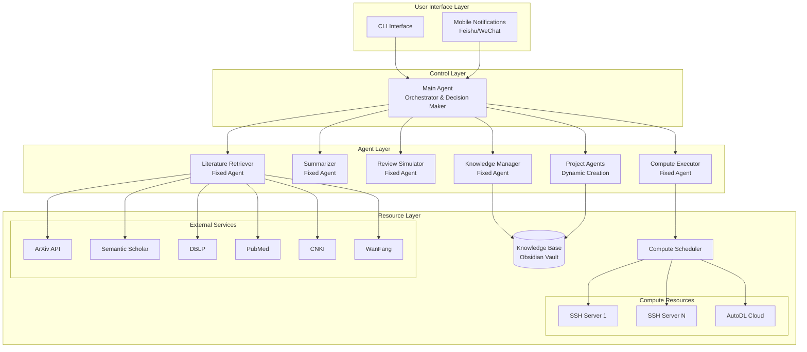
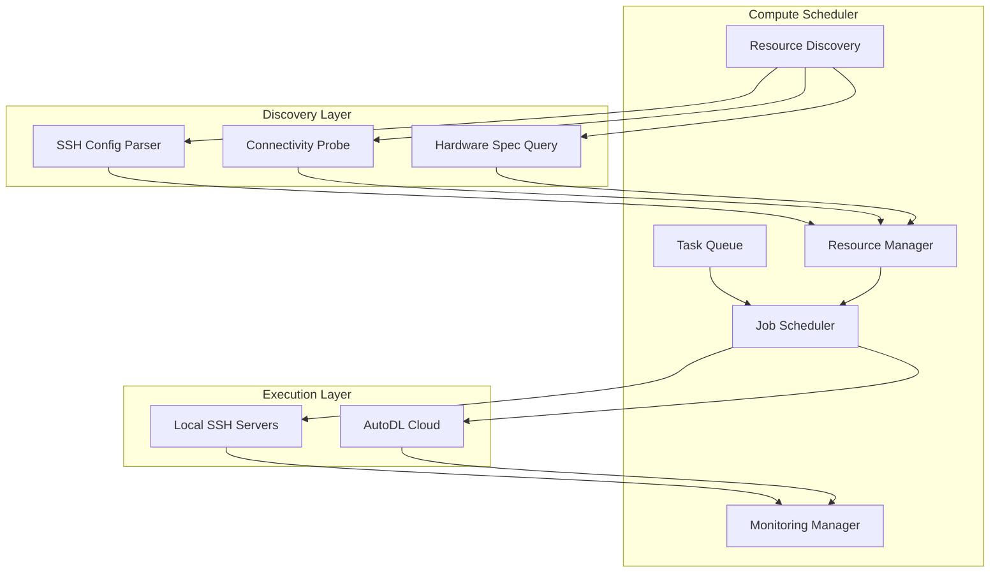
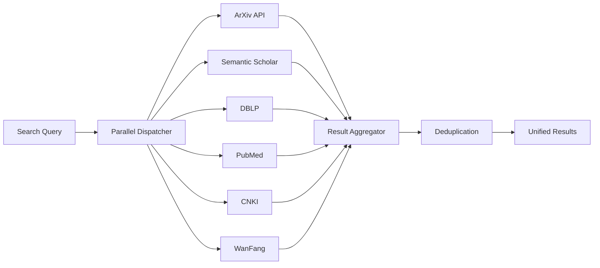
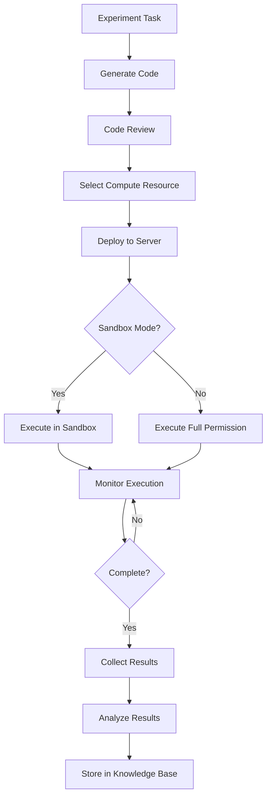
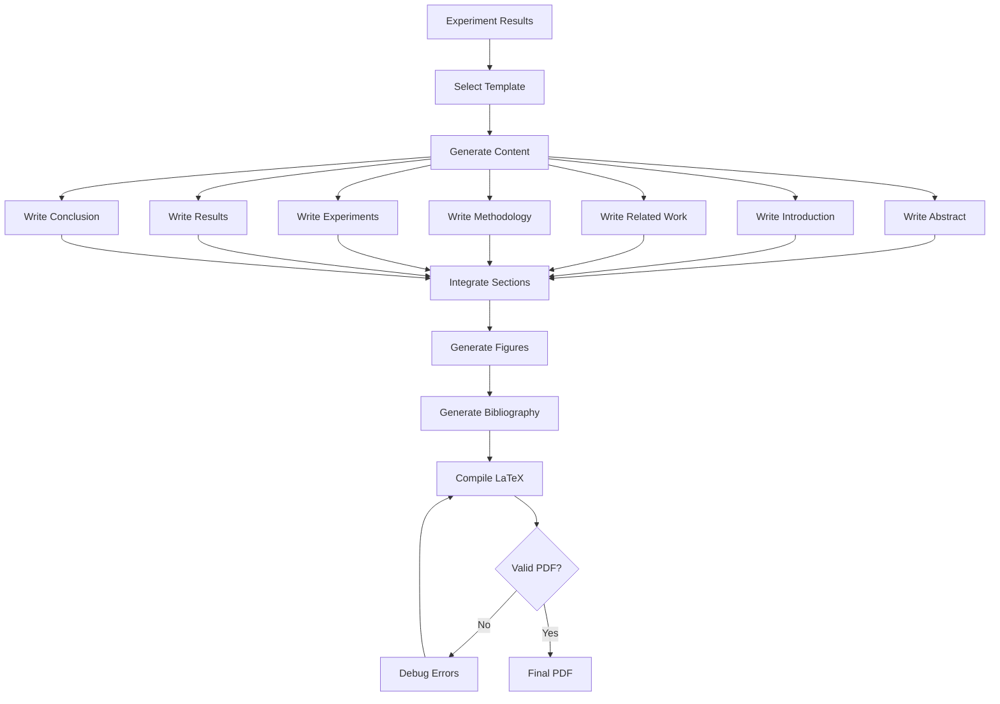

# Design Document: 自动科研系统 (AutoResearch System)

## Overview

The AutoResearch System is a full-stack automated research platform that orchestrates the complete scientific research workflow from idea generation through paper publication. The system employs a multi-agent architecture where specialized agents collaborate to conduct literature reviews, generate research ideas, execute experiments, and produce academic papers.

### Core Capabilities

- **Autonomous Research Pipeline**: End-to-end automation from research direction discovery to paper submission
- **Multi-Agent Collaboration**: Hierarchical agent architecture with Main Agent, Fixed Agents, and Project Agents
- **Intelligent Resource Management**: Dynamic compute resource discovery and scheduling across SSH servers and cloud platforms
- **Structured Knowledge Management**: Obsidian-based knowledge base with access control and automatic organization
- **Multi-Source Literature Integration**: Parallel retrieval from ArXiv, Semantic Scholar, DBLP, PubMed, CNKI, and WanFang
- **Experiment Automation**: Sandbox and full-permission execution modes with result collection and analysis
- **Academic Paper Generation**: LaTeX-based paper writing with template management and figure generation
- **Quality Control**: Simulated peer review with CCF-B level quality assessment

### Technology Stack

- **Primary Language**: Python 3.10+
- **Agent Framework**: LangGraph (for stateful multi-agent workflows with cycles)
- **Knowledge Base**: Obsidian (Markdown files with Local REST API)
- **Compute Scheduler**: Custom Python scheduler with SSH/AutoDL integration
- **Literature APIs**: arxiv.py, semanticscholar, requests for web scraping
- **Paper Generation**: LaTeX with Jinja2 templating
- **Version Control**: Git for code, file-based versioning for documents
- **Mobile Integration**: Feishu/WeChat APIs

## Architecture

### System Architecture Diagram



### Agent Architecture

The system uses a three-tier agent hierarchy:

1. **Main Agent** (Singleton): Orchestrates the entire research workflow, makes high-level decisions, coordinates communication between agents
2. **Fixed Agents** (Persistent): Specialized agents for specific functions (literature, summarization, review, execution, knowledge management)
3. **Project Agents** (Dynamic): Created per research project, responsible for project-specific workflows with isolated scope

### Communication Patterns

Agents communicate through:
- **Shared State**: LangGraph state management for workflow coordination
- **Message Passing**: Structured messages between agents with typed schemas
- **Knowledge Base**: Persistent storage for cross-agent data sharing
- **Event System**: Asynchronous notifications for long-running operations


## Components and Interfaces

### Agent Components

#### Main Agent

**Responsibilities:**
- User interaction and command processing
- High-level workflow orchestration
- Task decomposition and delegation
- Decision-making based on agent outputs
- Progress monitoring and error handling
- Agent registry management

**Key Methods:**
```python
class MainAgent:
    def __init__(self, knowledge_base: KnowledgeBase, agent_registry: AgentRegistry)
    
    def process_user_command(self, command: Command) -> Response
    def create_project_agent(self, research_task: ResearchTask) -> ProjectAgent
    def assign_task(self, task: Task, agent: Agent) -> TaskAssignment
    def aggregate_results(self, results: List[AgentResult]) -> AggregatedResult
    def make_decision(self, context: DecisionContext) -> Decision
    def record_execution_outcome(self, task: Task, outcome: Outcome, feedback: UserFeedback)
```

**State Management:**
```python
@dataclass
class MainAgentState:
    active_projects: Dict[str, ProjectAgent]
    task_queue: PriorityQueue[Task]
    agent_registry: AgentRegistry
    execution_history: List[ExecutionRecord]
```


#### Fixed Agents

**Literature Retriever Agent:**
```python
class LiteratureRetrieverAgent:
    def __init__(self, api_clients: Dict[str, APIClient], rate_limiter: RateLimiter)
    
    def search_papers(self, query: str, databases: List[str]) -> List[Paper]
    def parallel_search(self, query: str) -> Dict[str, List[Paper]]
    def deduplicate_results(self, results: List[Paper]) -> List[Paper]
    def extract_metadata(self, paper: Paper) -> PaperMetadata
    def scrape_web_content(self, url: str) -> WebContent
```

**Summarizer Agent:**
```python
class SummarizerAgent:
    def generate_summary(self, abstract: str) -> str
    def extract_key_innovations(self, paper: Paper) -> List[str]
    def classify_research_category(self, paper: Paper) -> str
    def extract_methods(self, paper: Paper) -> List[str]
    def extract_datasets(self, paper: Paper) -> List[Dataset]
```

**Review Simulator Agent:**
```python
class ReviewSimulatorAgent:
    def __init__(self, venue_criteria: Dict[str, ReviewCriteria])
    
    def evaluate_paper(self, paper: Paper, venue: str = None) -> ReviewReport
    def assess_novelty(self, paper: Paper) -> float
    def assess_technical_soundness(self, paper: Paper) -> float
    def assess_writing_quality(self, paper: Paper) -> float
    def compare_to_ccf_b_standard(self, paper: Paper) -> ComparisonReport
```

**Compute Executor Agent:**
```python
class ComputeExecutorAgent:
    def __init__(self, scheduler: ComputeScheduler)
    
    def execute_experiment(self, task: ExperimentTask, mode: ExecutionMode) -> ExecutionResult
    def monitor_execution(self, job_id: str) -> ExecutionStatus
    def collect_results(self, job_id: str) -> ExperimentResults
```


**Knowledge Manager Agent:**
```python
class KnowledgeManagerAgent:
    def __init__(self, knowledge_base: KnowledgeBase)
    
    def store_knowledge(self, entry: KnowledgeEntry, zone: Zone, project_id: str = None)
    def retrieve_knowledge(self, query: str, zone: Zone = None) -> List[KnowledgeEntry]
    def create_links(self, source: str, target: str, link_type: LinkType)
    def cluster_knowledge(self) -> List[KnowledgeCluster]
    def extract_skills(self, tasks: List[Task]) -> List[Skill]
    def version_knowledge(self, entry_id: str) -> VersionHistory
```

#### Project Agent

**Responsibilities:**
- Project-specific workflow execution
- Preliminary investigation
- Research idea generation
- Experiment code generation
- Result analysis and paper drafting

**Key Methods:**
```python
class ProjectAgent:
    def __init__(self, project_id: str, research_direction: ResearchCandidate, 
                 knowledge_base: KnowledgeBase)
    
    def conduct_preliminary_investigation(self) -> InvestigationReport
    def generate_research_ideas(self, gaps: List[ResearchGap]) -> List[ResearchIdea]
    def decompose_into_experiments(self, idea: ResearchIdea) -> List[ExperimentTask]
    def generate_experiment_code(self, task: ExperimentTask) -> ExperimentCode
    def analyze_results(self, results: List[ExperimentResults]) -> Analysis
    def draft_paper(self, analysis: Analysis) -> PaperDraft
```

**Access Control:**
- Read: Exploration zone + own project directory
- Write: Own project directory only
- Enforced by KnowledgeBase permission layer


### Knowledge Base Component

#### Structure

```
obsidian-vault/
├── exploration/                    # Global knowledge (Exploration Zone)
│   ├── topics/
│   │   ├── machine-learning.md
│   │   ├── optimization.md
│   │   └── data-structures.md
│   ├── skills/
│   │   ├── hyperparameter-tuning.md
│   │   └── experiment-design.md
│   ├── methodologies/
│   └── index.md                    # Topic index
│
└── projects/                       # Project-specific knowledge (Project Zone)
    ├── project-001-gan-optimization/
    │   ├── knowledge/
    │   │   ├── literature-review.md
    │   │   ├── sota-methods.md
    │   │   └── datasets.md
    │   ├── progress/
    │   │   ├── timeline.md
    │   │   └── milestones.md
    │   ├── issues/
    │   │   └── challenges.md
    │   ├── experience/
    │   │   └── lessons-learned.md
    │   └── results/
    │       ├── experiment-001.md
    │       └── figures/
    │
    └── project-002-transformer-compression/
        └── ...
```


#### Knowledge Base Interface

```python
class KnowledgeBase:
    def __init__(self, vault_path: Path, api_endpoint: str = None)
    
    # Core operations
    def create_entry(self, path: str, content: str, metadata: Dict) -> KnowledgeEntry
    def read_entry(self, path: str) -> KnowledgeEntry
    def update_entry(self, path: str, content: str) -> KnowledgeEntry
    def delete_entry(self, path: str) -> bool
    
    # Search and retrieval
    def search(self, query: str, zone: Zone = None) -> List[KnowledgeEntry]
    def get_linked_entries(self, entry_id: str) -> List[KnowledgeEntry]
    def get_by_tag(self, tag: str) -> List[KnowledgeEntry]
    
    # Organization
    def create_bidirectional_link(self, source: str, target: str)
    def update_topic_index(self, keywords: List[str], entry_id: str)
    def cluster_entries(self, threshold: int) -> List[Cluster]
    
    # Permission control
    def check_permission(self, agent: Agent, path: str, operation: Operation) -> bool
    def enforce_access_control(self, agent: Agent, path: str, operation: Operation)
    
    # Versioning
    def get_version_history(self, path: str) -> List[Version]
    def rollback(self, path: str, version_id: str) -> KnowledgeEntry
    def create_backup(self) -> str
```

#### Access Control Matrix

| Agent Type | Exploration Zone | Own Project | Other Projects |
|------------|-----------------|-------------|----------------|
| Main Agent | Read/Write | Read/Write | Read/Write |
| Fixed Agent | Read/Write | Read/Write | Read/Write |
| Project Agent | Read | Read/Write | None |


### Compute Scheduler Component

#### Architecture




#### Compute Scheduler Interface

```python
class ComputeScheduler:
    def __init__(self, config: SchedulerConfig)
    
    # Resource discovery
    def discover_resources(self) -> List[ComputeResource]
    def parse_ssh_config(self, config_path: Path) -> List[SSHServer]
    def test_connectivity(self, server: SSHServer) -> bool
    def query_hardware_specs(self, server: SSHServer) -> HardwareSpec
    
    # Resource management
    def register_resource(self, resource: ComputeResource)
    def update_resource_status(self, resource_id: str, status: ResourceStatus)
    def get_available_resources(self, requirements: ResourceRequirements) -> List[ComputeResource]
    
    # Task scheduling
    def submit_task(self, task: ExperimentTask, priority: int = 5) -> str  # Returns job_id
    def schedule_next_task(self) -> Optional[Tuple[ExperimentTask, ComputeResource]]
    def select_optimal_resource(self, task: ExperimentTask, 
                               available: List[ComputeResource]) -> ComputeResource
    
    # Cloud integration
    def rent_autodl_instance(self, requirements: ResourceRequirements) -> AutoDLInstance
    def release_autodl_instance(self, instance_id: str)
    
    # Monitoring
    def get_job_status(self, job_id: str) -> JobStatus
    def monitor_resource_usage(self, resource_id: str) -> ResourceUsage
    def collect_job_results(self, job_id: str) -> JobResults
```


#### Resource Selection Algorithm

```python
def select_optimal_resource(task: ExperimentTask, 
                           available: List[ComputeResource]) -> ComputeResource:
    """
    Priority-based resource selection:
    1. Local SSH servers over cloud (cost optimization)
    2. Best matching specifications (GPU type, memory, CPU)
    3. Lowest current load
    4. If no suitable local resource and GPU queue wait > threshold, rent AutoDL
    """
    
    # Filter by requirements
    suitable = [r for r in available if meets_requirements(r, task.requirements)]
    
    # Prioritize local resources
    local_resources = [r for r in suitable if r.type == ResourceType.SSH_SERVER]
    
    if local_resources:
        # Score by spec matching and load
        scored = [(score_resource(r, task), r) for r in local_resources]
        return max(scored, key=lambda x: x[0])[1]
    
    # Check GPU queue wait time
    if task.requires_gpu and get_gpu_queue_wait_time() > WAIT_THRESHOLD:
        # Attempt AutoDL rental
        return rent_autodl_instance(task.requirements)
    
    # Return best available or None
    return suitable[0] if suitable else None
```


### Literature Retrieval Pipeline

#### Multi-Source Parallel Retrieval



#### Literature Retriever Implementation

```python
class LiteratureRetriever:
    def __init__(self):
        self.api_clients = {
            'arxiv': ArxivClient(),
            'semantic_scholar': SemanticScholarClient(),
            'dblp': DBLPClient(),
            'pubmed': PubMedClient(),
            'cnki': CNKIClient(),
            'wanfang': WanFangClient()
        }
        self.rate_limiter = RateLimiter()
        self.cache = LiteratureCache()
    
    async def search_papers(self, query: str, 
                           databases: List[str] = None) -> List[Paper]:
        """Parallel search across multiple databases with rate limiting"""
        if databases is None:
            databases = list(self.api_clients.keys())
        
        tasks = []
        for db in databases:
            task = self._search_single_database(db, query)
            tasks.append(task)
        
        results = await asyncio.gather(*tasks, return_exceptions=True)
        
        # Flatten and deduplicate
        all_papers = []
        for result in results:
            if isinstance(result, list):
                all_papers.extend(result)
        
        return self.deduplicate_results(all_papers)
```


    
    async def _search_single_database(self, db: str, query: str) -> List[Paper]:
        """Search single database with rate limiting and error handling"""
        client = self.api_clients[db]
        
        # Check cache first
        cached = self.cache.get(db, query)
        if cached:
            return cached
        
        # Rate limiting
        await self.rate_limiter.acquire(db)
        
        try:
            results = await client.search(query)
            self.cache.set(db, query, results)
            return results
        except RateLimitError as e:
            # Exponential backoff
            await asyncio.sleep(e.retry_after)
            return await self._search_single_database(db, query)
        except Exception as e:
            logger.error(f"Error searching {db}: {e}")
            return []
    
    def deduplicate_results(self, papers: List[Paper]) -> List[Paper]:
        """Remove duplicates based on DOI and title similarity"""
        seen_dois = set()
        seen_titles = []
        unique_papers = []
        
        for paper in papers:
            # Check DOI
            if paper.doi and paper.doi in seen_dois:
                continue
            
            # Check title similarity
            if any(title_similarity(paper.title, t) > 0.9 for t in seen_titles):
                continue
            
            unique_papers.append(paper)
            if paper.doi:
                seen_dois.add(paper.doi)
            seen_titles.append(paper.title)
        
        return unique_papers
```


### Experiment Execution Workflow

#### Execution Modes

**Sandbox Mode (Default):**
- Restricted file system access (experiment directory only)
- Limited network access (academic databases and approved repositories only)
- Resource limits enforced (memory, CPU, GPU time)
- System-level operations prohibited

**Full Permission Mode:**
- Unrestricted file system and network access
- System operations allowed (except dangerous operations)
- All operations logged for audit
- Explicit user approval required

#### Experiment Execution Pipeline




#### Experiment Code Structure

```python
# Generated experiment structure
experiment_dir/
├── main.py                 # Main execution script
├── config.yaml             # Hyperparameters and settings
├── requirements.txt        # Python dependencies
├── README.md               # Documentation
├── models/                 # Model definitions
│   └── architecture.py
├── data/                   # Data loading
│   └── dataset.py
├── utils/                  # Utilities
│   ├── logging.py
│   ├── checkpoint.py
│   └── metrics.py
└── outputs/                # Results directory
    ├── logs/
    ├── checkpoints/
    └── results/
```

**Standard Features in Generated Code:**
- Structured logging with timestamps and levels
- Automatic checkpointing at regular intervals
- Configuration management with YAML
- Result serialization to JSON/CSV
- Error handling and recovery
- Progress reporting to main system


### Paper Generation Pipeline

#### LaTeX Paper Generation Workflow




#### Paper Generator Interface

```python
class PaperGenerator:
    def __init__(self, template_manager: TemplateManager, 
                 figure_generator: FigureGenerator)
    
    def generate_paper(self, analysis: Analysis, template: str, 
                      metadata: PaperMetadata) -> LaTeXDocument
    
    def write_section(self, section: SectionType, content: Dict) -> str
    
    def insert_results(self, section: str, results: ExperimentResults) -> str
    
    def generate_bibliography(self, cited_papers: List[Paper]) -> str
    
    def compile_latex(self, latex_doc: LaTeXDocument) -> PDFDocument
    
    def validate_compilation(self, latex_doc: LaTeXDocument) -> ValidationResult

class TemplateManager:
    def __init__(self, template_dir: Path)
    
    def list_templates(self) -> List[Template]
    
    def get_template(self, name: str) -> Template
    
    def import_template(self, source: str) -> Template
    
    def validate_template(self, template: Template) -> ValidationResult
    
    def extract_required_fields(self, template: Template) -> List[Field]

class FigureGenerator:
    def generate_training_curve(self, data: TrainingData, style: str) -> Figure
    
    def generate_comparison_table(self, results: List[Result]) -> Table
    
    def generate_confusion_matrix(self, predictions: np.ndarray, 
                                 labels: np.ndarray) -> Figure
    
    def generate_bar_chart(self, data: Dict, style: str) -> Figure
    
    def apply_style(self, figure: Figure, journal_style: str) -> Figure
    
    def export_pdf(self, figure: Figure, path: Path) -> Path
```


## Data Models

### Core Data Models

```python
from dataclasses import dataclass
from datetime import datetime
from enum import Enum
from typing import List, Dict, Optional

@dataclass
class Paper:
    """Literature paper metadata"""
    title: str
    authors: List[str]
    abstract: str
    doi: Optional[str]
    arxiv_id: Optional[str]
    publication_date: datetime
    venue: str
    citation_count: int
    url: str
    source_database: str

@dataclass
class ResearchCandidate:
    """Research direction candidate"""
    id: str
    title: str
    description: str
    research_gap: str
    novelty_score: float
    feasibility_score: float
    impact_score: float
    related_papers: List[Paper]
    generated_at: datetime

@dataclass
class ResearchIdea:
    """Concrete research idea"""
    id: str
    candidate_id: str
    title: str
    hypothesis: str
    proposed_method: str
    expected_contribution: str
    required_resources: ResourceRequirements
    estimated_time_hours: int
    technical_risks: List[str]

@dataclass
class ExperimentTask:
    """Executable experiment task"""
    id: str
    project_id: str
    idea_id: str
    name: str
    description: str
    code_path: Path
    config: Dict
    requirements: ResourceRequirements
    dependencies: List[str]
    priority: int
```


@dataclass
class ResourceRequirements:
    """Compute resource requirements"""
    cpu_cores: int
    memory_gb: int
    gpu_count: int
    gpu_type: Optional[str]  # e.g., "V100", "A100"
    disk_gb: int
    max_runtime_hours: int

@dataclass
class ComputeResource:
    """Available compute resource"""
    id: str
    type: str  # "ssh_server" or "autodl"
    hostname: str
    port: int
    credentials: Dict
    hardware_spec: HardwareSpec
    status: str  # "available", "busy", "offline"
    current_load: float

@dataclass
class HardwareSpec:
    """Hardware specifications"""
    cpu_model: str
    cpu_cores: int
    memory_gb: int
    gpus: List[GPU]
    disk_gb: int

@dataclass
class GPU:
    """GPU information"""
    model: str  # e.g., "NVIDIA RTX 3090"
    memory_gb: int
    compute_capability: str

@dataclass
class ExperimentResults:
    """Experiment execution results"""
    task_id: str
    status: str  # "success", "failed", "timeout"
    metrics: Dict[str, float]
    logs: str
    checkpoints: List[Path]
    figures: List[Path]
    execution_time_seconds: float
    resource_usage: ResourceUsage
```


@dataclass
class KnowledgeEntry:
    """Knowledge base entry"""
    id: str
    path: str
    title: str
    content: str
    metadata: Dict
    tags: List[str]
    links: List[str]
    zone: str  # "exploration" or "project"
    project_id: Optional[str]
    created_at: datetime
    updated_at: datetime
    version: int

@dataclass
class ReviewReport:
    """Simulated review report"""
    paper_id: str
    venue: Optional[str]
    overall_score: float
    novelty_score: float
    soundness_score: float
    writing_score: float
    experimental_rigor_score: float
    detailed_comments: str
    improvement_suggestions: List[str]
    ccf_level_comparison: str
    recommended_venues: List[str]

class ExecutionMode(Enum):
    """Experiment execution mode"""
    SANDBOX = "sandbox"
    FULL_PERMISSION = "full_permission"

class Zone(Enum):
    """Knowledge base zone"""
    EXPLORATION = "exploration"
    PROJECT = "project"
```

