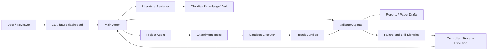

# AI-Researcher

[Simplified Chinese](README.zh-CN.md)

AI-Researcher is an early-stage Python platform for evidence-first automated computational research. The long-term goal is to orchestrate a constrained, auditable research loop: literature search, knowledge modeling, hypothesis generation, experiment design, sandboxed execution, result validation, paper drafting, review simulation, and controlled strategy evolution.

> Status: local MVP scaffold with tested research-loop components. The repository includes the executable task plan, Obsidian vault substrate, provider-agnostic deployment setup, local demo loop, literature/similarity retrieval foundations, validation/reporting modules, and release-preparation checks. It is not yet a production multi-user service.

## Why This Exists

Most automated research demos start with writing. This project starts with evidence. A result should only become a claim when the system can trace it back to a real run, configuration, metric file, source artifact, and validation status.

The core product idea is an Obsidian-compatible unified knowledge base stored under the project-root `autoresearch-vault/` directory. It acts as both human-readable research memory and machine-readable evolution substrate. Literature notes, project progress, issues, experiment records, failures, skills, evidence links, and strategy versions all live in one linked Markdown vault so the system can self-loop and self-improve without hiding its reasoning in an opaque database.

The first usable milestone is not a fully autonomous scientist. It is a minimal trusted research loop that can run a small computational experiment, collect outputs, validate them, and produce a reproducible Markdown report.

## Core Principles

- Evidence before claims.
- Reproducibility before autonomy.
- Human approval before high-cost, high-risk, or public actions.
- Sandboxed execution by default.
- Obsidian-compatible Markdown vault under `autoresearch-vault/` as the shared memory for research, failures, skills, and strategy evolution.
- Online literature and similar-work discovery are required at project start and during scheduled refresh; the vault stores source-backed summaries, not fabricated claims.
- Every experiment records run ID, commit, config hash, data hash, metrics, logs, artifacts, and cost.
- Every agent change is logged in [Agent.md](Agent.md).
- Every discovered blocker or risk is tracked in [Problem.md](Problem.md).

## Target Architecture



## Roadmap

| Phase | Focus | Outcome |
|---|---|---|
| Phase 0 | Governance and engineering baseline | Agent rules, problem log, Obsidian vault contract, schemas, config, logging, smoke tests, minimal CLI |
| Phase 1 | Minimal trusted loop | Obsidian knowledge base, literature search, experiment execution, validation, and Markdown report |
| Phase 2 | Research assistant | Multi-agent workflow, evidence graph, paper draft, citation checks, review simulation |
| Phase 3 | Self-loop platform | Obsidian-backed candidate pool, scheduler, failure library, skill cards, monitoring, rollback |
| Phase 4 | Controlled self-evolution | Obsidian-backed strategy cards, offline replay, golden tests, shadow evaluation, gray release |
| Phase 5 | Product platform | Web dashboard, multi-user permissions, plugin system, deployment, compliance audit |

The executable task plan lives in [.kiro/specs/auto-research-system/tasks.md](.kiro/specs/auto-research-system/tasks.md).

## References and Design Inspirations

AI-Researcher is designed as an evidence-first system rather than a clone of any single project. Important references include:

- [HKUDS AI-Researcher](https://github.com/HKUDS/AI-Researcher) for the end-to-end scientific pipeline ambition and Scientist-Bench-style evaluation pressure. This repository treats it as a conceptual reference only: AI-Researcher focuses on an Obsidian-backed self-loop memory substrate, permissioned always-on operation, evidence graphs, real run records, and publication audits before paper claims.
- [AutoResearchClaw](https://github.com/aiming-lab/AutoResearchClaw) for its MIT-licensed one-command/OpenClaw-style operator experience, 23-stage research pipeline framing, human-in-the-loop modes, multi-source literature workflow, claim verification, and skill-learning direction. AI-Researcher is intentionally differentiated around an Obsidian-compatible vault as the canonical auditable memory substrate, stricter publication-readiness blocking before paper claims, provider-agnostic local deployment, and permissioned long-running operation.
- [SCALE Engine](https://github.com/hongmaple0820/scale-engine) for the lightweight lesson that AI-agent governance should be enforced through executable workflow gates and evidence files, not prompt-only self-discipline. AI-Researcher adopts this as a narrower research-cycle release gate: missing evidence, missing define/plan/build/verify/review/ship lifecycle trace, failed review, non-publishable audit, or missing compiled PDF blocks release claims.
- Long-horizon auto-research roadmaps and surveys such as [AI for Auto-Research](https://worldbench.github.io/awesome-ai-auto-research/) for evaluation pressure around hallucination, novelty checks, and reproducible artifacts.
- [Horizon](https://github.com/Thysrael/Horizon) and daily literature-update projects such as [agent-arxiv-daily](https://github.com/UltraClr/agent-arxiv-daily) for scheduled source discovery, scoring, digest, and delivery patterns.
- [Microsoft SkillOpt](https://github.com/microsoft/SkillOpt) for treating Markdown skill artifacts as optimizable external agent state with rollout evidence, bounded edits, validation gates, and deployable `best_skill.md` outputs.
- [OpenClaw](https://github.com/openclaw/openclaw) for the operator experience of a self-hosted assistant that is configured once and then runs as an always-on local service.
- [OpenCode](https://github.com/anomalyco/opencode) as the preferred direct external code-generation backend because it exposes non-interactive `run`, headless `serve`, ACP, permissions, project commands, and project skills. OpenCode may draft changes, but AI-Researcher keeps validation, dangerous-command approval, merge, rollback, and Obsidian logging authority.
- [cc-switch](https://github.com/farion1231/cc-switch) for provider/profile management across coding CLIs. AI-Researcher keeps it as an optional legacy/bridge path for Claude Code provider routing when direct OpenCode integration is not the desired backend.

The license and attribution status for these references is tracked in [THIRD_PARTY_NOTICES.md](THIRD_PARTY_NOTICES.md). They are design inspirations unless that notice file explicitly says code or assets were incorporated.

This repository's differentiator is the Obsidian-compatible vault as the shared evidence, issue, skill, and strategy substrate for self-looping research. Autonomy is added only where the loop can write auditable evidence and review artifacts.

## Obsidian Vault Setup

Structure the local vault with dashboards, templates, plugin recommendations, and a CSS snippet:

```bash
poetry run airesearcher obsidian-setup --vault autoresearch-vault --project-id autoresearch-system
```

Add `--write-local-snippet` on your own machine to also create `.obsidian/snippets/ai-researcher.css` and enable it in the local Obsidian appearance settings. Third-party Obsidian plugins are not bundled; see `autoresearch-vault/_system/plugins/recommended-plugins.md` after setup for optional manual installs such as Dataview, Tasks, Templater, Periodic Notes, and Omnisearch.

## Repository Layout

```text
.
├── AutoResearch_System_Research_Plan.md
├── AutoResearch_System_Execution_Plan.md
├── AGENTS.md
├── Agent.md
├── autoresearch-vault/
├── Problem.md
├── README.md
├── README.zh-CN.md
├── pyproject.toml
├── src/
│   └── autoresearch/
└── .kiro/
    └── specs/
        └── auto-research-system/
```

## Development Setup

Prerequisites:

- Python 3.10+
- Poetry
- Git

Install dependencies:

```bash
poetry install
```

First-deploy setup:

```bash
poetry run airesearcher deploy-setup
```

The guided setup asks for the LLM provider label, API base URL, model name, API key, and optional WeChat/Feishu channel credentials. API keys and channel secrets are written only to `.env`; `config.yaml` stores non-secret model and channel metadata plus environment variable names. If `.env.example` is missing, the CLI creates it as a public non-secret template.

If you prefer to fill the model configuration manually, copy `.env.example` to `.env` and set `AUTORESEARCH_LLM_BASE_URL`, `AUTORESEARCH_LLM_MODEL_NAME`, and `AUTORESEARCH_LLM_API_KEY`. You can also set `SEMANTIC_SCHOLAR_API_KEY` for higher Semantic Scholar Graph API limits, plus optional `SEMANTIC_SCHOLAR_MIN_INTERVAL_SECONDS` and `SEMANTIC_SCHOLAR_CIRCUIT_RESET_SECONDS` values when a deployment needs stricter throttling. OpenAlex is used as a no-key fallback source by default; optional `OPENALEX_API_KEY`, `OPENALEX_MAILTO`, `OPENALEX_MIN_INTERVAL_SECONDS`, and `OPENALEX_CIRCUIT_RESET_SECONDS` settings can make larger deployments more polite and predictable. The root `.env` file is intentionally ignored by git and must never be committed.

For scripted deployment:

```bash
poetry run airesearcher deploy-setup \
  --config config.yaml \
  --env-path .env \
  --provider openai-compatible \
  --base-url https://api.example.com/v1 \
  --model-name your-model-name \
  --api-key your-api-key \
  --wechat --wechat-webhook-url https://wechat.example/hook \
  --feishu --feishu-webhook-url https://feishu.example/hook \
  --non-interactive
```

Project slash command templates:

```bash
poetry run airesearcher slash-commands init
poetry run airesearcher slash-commands list
```

This creates project-scoped TOML templates under `.airesearcher/commands/`, including `/research:refresh-literature`, `/research:similarity-check`, `/research:run-demo`, `/research:autopilot`, `/research:serve`, `/research:publication-audit`, `/research:paper-build`, `/research:evidence-gate`, `/research:session-claim`, `/research:approve`, `/research:openclaw-channels`, `/research:code-agent-backends`, `/research:obsidian-setup`, `/research:issue-followups`, and `/research:status`.

Always-on runtime:

```bash
poetry run airesearcher serve --permission-mode approve-dangerous
```

This is the preferred one-command operator entry point for a 24h local/server deployment. It sits on top of the existing autopilot cycle but queues dangerous actions in `.airesearcher/runtime-approvals.json` before running online discovery, experiments, live review, or vault writes. Trusted single-user deployments can use `--permission-mode allow-all`; safer deployments should keep `approve-dangerous` and approve pending work from a local terminal or a chat-channel adapter:

```bash
poetry run airesearcher runtime list
poetry run airesearcher runtime approve latest --approved-by operator
```

OpenClaw communication channel mounts:

```bash
poetry run airesearcher channels openclaw init
poetry run airesearcher channels openclaw list
```

This writes `integrations/openclaw/channels.json`, a repository runbook for mounting official/common OpenClaw channel plugins onto AI-Researcher. The manifest covers Lark/Feishu (`@larksuite/openclaw-lark`), Weixin/WeChat (`npx -y @tencent-weixin/openclaw-weixin-cli install` / `@tencent-weixin/openclaw-weixin`), WeCom (`@wecom/wecom-openclaw-plugin`), and OpenClaw-documented channels such as Telegram, Discord, Slack, WhatsApp, Microsoft Teams, QQ Bot, Signal, and Zalo. Channel plugins are not vendored here; install them inside an OpenClaw deployment after reviewing upstream permissions and storing secrets outside git.

Chat adapters should map `/approve` to:

```bash
poetry run airesearcher runtime approve latest --state .airesearcher/runtime-approvals.json --approved-by <operator>
```

External code-agent backend contract:

```bash
poetry run airesearcher code-agents opencode init
poetry run airesearcher code-agents opencode list
poetry run airesearcher code-agents cc-switch init
poetry run airesearcher code-agents cc-switch list
```

The preferred path writes `integrations/opencode/code-agent.json`, a repository runbook for using OpenCode directly through `opencode run`, `opencode serve`, or `opencode acp`. It is an execution contract, not a vendored copy of OpenCode and not an automatic merge path: generated diffs remain proposals until AI-Researcher captures the diff, runs focused validation, applies runtime approval to dangerous actions, writes `Agent.md`/Obsidian records, and creates a focused commit. The cc-switch command remains available only when you explicitly want Claude Code provider routing through cc-switch.

Autopilot one-command loop:

```bash
poetry run airesearcher autopilot --watch --cycles 0 --interval-seconds 86400
```

After `deploy-setup`, this keeps the local loop running directly. Each cycle performs a source-cooldown preflight gate, live literature refresh, source-backed similarity checking, a local demo or public benchmark experiment, a command-line reproduction rerun, optional live LLM evidence review, publication-readiness audit, automatic LaTeX paper build, physical evidence gate, Obsidian review/issue writing, and local follow-up state merging. Use `--no-review` for offline dry runs, or omit `--watch` for a single cycle. The current loop produces a reproducible evidence-backed report, paper-build record, reproduction-check record, and review trail; the publication audit and evidence gate are deliberately strict and will reject toy-data cycles as not CCF-B/Q3-ready.

By default, `autopilot` and `serve` use 4 generated queries and up to 10 papers per source/query for publication-gate evidence breadth. Known demos also inject method-aligned seed queries and candidate metadata so online novelty checks target the same method, dataset, benchmark, and baseline as the executed experiment. Similarity checking prioritizes concise structured novelty-stress queries such as method+benchmark, baseline+benchmark, and adjacent-risk-technique+benchmark before long research-gap prose, because live academic search APIs often return weak matches for paragraph-like prompts. Pass lower `--max-queries` or `--max-results-per-source` values only for explicit smoke or cost-control runs.

Within one `autopilot` or `serve` cycle, literature refresh and similarity checking share the same source clients. If Semantic Scholar opens a 429 circuit in the refresh phase, the similarity phase inherits that circuit-open state instead of rebuilding a fresh client and hammering the same source again. The circuit state is also persisted under the selected literature cache root as `source-circuit-breakers.json`, so a later cycle in the same deployment can respect the cooldown window before trying the source again. That state file is written through a same-directory temporary file and atomic replace, so an interrupted write should not leave a half-written cooldown file; read-modify-write updates also use a local `.lock` file so concurrent workers do not silently overwrite each other's source cooldowns. Before costly work starts, a SCALE-lite source preflight gate reads that persisted state without making network calls; if a source is still cooling down, if the state file is locked by another process, or if the persisted state is malformed and cannot be verified, the cycle writes `source-preflight.json`/`.md`, creates an Obsidian issue note, queues a follow-up task, and skips experiment, review, and paper-build work for that cycle.

Real benchmark opt-in:

```bash
poetry run airesearcher run-demo --demo pendigits_centroid_baseline --timeout-seconds 60
poetry run airesearcher run-demo --demo pendigits_prototype_shrinkage --timeout-seconds 60
poetry run airesearcher run-demo --demo pendigits_variance_calibrated_prototypes --timeout-seconds 60
poetry run airesearcher serve --once --permission-mode allow-all --demo pendigits_centroid_baseline --review --timeout-seconds 60
```

The `pendigits_centroid_baseline` demo downloads the UCI Pen-Based Recognition of Handwritten Digits train/test files at run time, writes a local merged CSV under `runs/`, evaluates a nearest-centroid baseline and first-8-features ablation, and records source URLs, data hash, metrics, confidence interval, and validation artifacts. The `pendigits_prototype_shrinkage` demo uses the same public train/test split but evaluates a concrete class-prototype shrinkage method candidate against the baseline and writes `artifacts/innovation_evidence.json` with the proposed mechanism, prototype shift, baseline/candidate metrics, and an honest interpretation. It may improve, tie, or underperform the baseline; the system must report that result as measured and must not convert a negative delta into a publication claim. The `pendigits_variance_calibrated_prototypes` demo evaluates a diagonal variance-calibrated prototype candidate; in the current real run it records a positive method-effect delta, which lets `method_effect_evidence` pass while the broader publication audit can still block release for insufficient literature breadth or skipped review. These demos are stronger evidence checks than the toy demos, but publication-level claims still require literature breadth, similar-work breadth, method novelty evidence, method-effect evidence, manuscript structure, reviewer gates, and the physical evidence gate.

Skill evolution candidates:

```bash
poetry run airesearcher skill-evolve \
  --parent-skill-id skill_evidence_bound_review \
  --issue-ref projects/autoresearch-system/issues/example_issue \
  --change-summary "Tighten the evidence bundle before live review." \
  --proposed-action "Attach run-record evidence before review." \
  --validation-check "Held-out review has zero unsupported reproduction claims."
```

This is SkillOpt-inspired but conservative: it writes a candidate skill card and rejected-edit buffer under the Obsidian vault. It does not overwrite or promote the parent skill; promotion still needs held-out validation and human review.

Online discovery commands:

```bash
poetry run airesearcher literature-refresh --vault autoresearch-vault --cache .cache/literature --max-queries 1 --max-results-per-source 1
poetry run airesearcher similarity-check --candidate-file candidate.json --vault autoresearch-vault --cache .cache/literature --project-id my_project
```

Both commands use real literature APIs by default: ArXiv, Semantic Scholar, and OpenAlex. They load optional literature API keys from `.env`, apply conservative source-specific rate limiting with tunable request spacing and 429 circuit breaking, preserve per-source fetch errors, and write guarded Obsidian summaries that keep unsupported outcomes as `unknown` or `pending verification`. Similarity summaries can classify direct duplicates, adjacent work, supporting prior work, contradictory evidence, and benchmark gaps, but only when source title/abstract metadata supports the classification; conservative method/dataset token overlap is recorded in the classification basis, and weak live hits remain `unknown`. The project-start query generator now prefers short structured query forms over long prose for the first publication-gate searches, while keeping research-gap, negative-result, and vault-context queries available as breadth. OpenAlex is included so Semantic Scholar 429s do not automatically collapse cross-source coverage to ArXiv-only.

Live LLM smoke and output quality gate:

```bash
poetry run airesearcher llm-smoke --config config.yaml --env-path .env --output runs/llm-smoke/latest.json
```

This calls the configured OpenAI-compatible model, requires structured JSON output, checks evidence-policy language, verifies no API key leakage, and writes a local quality report under `runs/`.
Critical structured-output failures are hard failures: malformed JSON, missing required fields, quoted JSON arrays, fake URLs, and secret leaks are capped below the default quality threshold. The smoke command retries once with a deterministic repair prompt and records `attempts`; the local checks remain the final authority.

LLM-as-reviewer with local evidence:

```bash
poetry run airesearcher llm-review \
  --subject runs/manual-live/demo/tabular-baseline/report/report.md \
  --evidence runs/manual-live/demo/tabular-baseline/validation/validation-report.json \
  --evidence runs/manual-live/demo/tabular-baseline/evidence/evidence-map.json \
  --config config.yaml \
  --env-path .env \
  --output runs/llm-review/latest.json \
  --max-tokens 4096 \
  --vault autoresearch-vault \
  --project-id demo_project
```

The reviewer can use the configured live model, but the deterministic gate requires every finding to cite provided local evidence IDs such as `evidence_1`; missing or unknown evidence references fail below the quality threshold. Critical review-JSON failures also get one bounded repair attempt, recorded as `attempts`, but the repair prompt cannot override the local citation, fake-URL, or secret-leak gates. Passing reviews can be written back to `autoresearch-vault/projects/<project-id>/review/` as Obsidian `review_note` entries, and actionable warning/blocking findings become stable-fingerprinted `issue_note` entries under `autoresearch-vault/projects/<project-id>/issues/`. Repeated reviews update the same issue note for the same subject and claim instead of polluting the self-loop issue pool with duplicates. `airesearcher issue-followups --state .airesearcher/scheduler-state.json` can persist reviewable local follow-up task records without executing them automatically, and `airesearcher scheduler-state list|complete|remove` lets operators inspect, finish, or clean those records without hand-editing JSON. Reasoning models may need the higher review token budget shown above.

Publication-level quality audit:

```bash
poetry run airesearcher publication-audit runs/autopilot/<cycle-id>/cycle-summary.json \
  --target ccf-b \
  --review-json runs/llm-review/latest.json \
  --vault autoresearch-vault \
  --project-id demo_project
```

This is a higher bar than `llm-review`: it checks whether the cycle actually executed script/data artifacts, whether validated data are strong enough, whether cross-source literature and similar-work search are broad enough, whether source failures such as Semantic Scholar 429s reduce novelty coverage, whether the report has paper-level sections, whether baseline/ablation/statistical sanity evidence exists, and whether the proposed method has file-backed innovation evidence. If a historical cycle skipped review, `--review-json` can point to a later real `llm-review.json`; that can satisfy only the review checks and cannot override literature breadth, source errors, novelty classification, method-effect, or manuscript gates. Standalone review artifacts must also bind to the audited cycle: their subject hash/path must match the cycle report, and their evidence bundle must cover the validation report and evidence map by hash or path. For CCF-B/Q3-style targets, baseline-only tasks or `baseline_only=true` metadata are not publishable even if the manuscript is well structured; the run record must contain proposed mechanism/contribution metadata plus an existing innovation/mechanism/contribution artifact. That artifact must also report a positive baseline-vs-candidate effect delta for empirical-gain claims; neutral, negative, or missing method-effect evidence fails `method_effect_evidence` and must be treated as negative evidence or a prompt for stronger experiments. Similar-work findings also need evidence-backed classifications: if every similarity finding remains `unknown` or unclassified, `similarity_classification_coverage` fails, and only non-`unknown` classifications count toward `similarity_classified_finding_breadth`. The system cannot use raw finding count as novelty support. Generated Markdown reports now include paper-style sections while keeping metrics evidence-bound and Obsidian-readable. Process data, summaries, evidence notes, and final cycle summaries should stay in `autoresearch-vault/` as Markdown; the final paper-level artifact is a LaTeX template build that compiles to PDF, not the Markdown evidence draft. Generic one-column and two-column `article` template smoke tests compile when a local LaTeX engine is available. The external compatibility matrix fetches current source pages for IEEEtran, ACM `acmart`, and Springer Nature, compiles IEEEtran/ACM smoke PDFs when their classes are installed locally, and records Springer Nature `sn-jnl` as `source_unavailable` when `sn-jnl.cls` is absent rather than fabricating compatibility. `ccf-b` and `q3-journal` targets reject synthetic ScientistBench-Lite toy runs by design, and they can still reject real benchmark runs if novelty search, source coverage, template compatibility, method-innovation evidence, method-effect evidence, classified similarity breadth, or evidence breadth are weak. Failed audits write `publication-audit` review and issue notes into the Obsidian project memory so the self-loop can queue follow-up work.

Build the paper-level LaTeX/PDF artifact from an evidence-bound Markdown report:

```bash
poetry run airesearcher paper-build runs/autopilot/<cycle-id>/demo/<demo-id>/report/report.md \
  --template-id generic-article-one-column \
  --vault autoresearch-vault \
  --project-id demo_project
```

`paper-build` writes generated TeX/PDF/log/JSON artifacts under the selected output directory and writes only the human-readable `paper-build.md` summary into the Obsidian project vault. Missing required paper sections block compilation instead of being filled with invented content. Successfully compiled PDFs are still checked for paper-level quality: minimum page count, total manuscript word count, per-section technical depth, technical term coverage, and LaTeX `Overfull \hbox` layout warnings. Thin or overflowing PDFs are marked `compiled_with_quality_issues`, and the JSON records the exact `paper_quality` blockers instead of treating "PDF exists" as paper-ready. `autopilot` and `serve` now run this step automatically for each completed cycle; the standalone command remains useful for reruns, alternate templates, and compatibility checks.

Run the physical release evidence gate:

```bash
poetry run airesearcher evidence-gate runs/autopilot/<cycle-id>/cycle-summary.json \
  --publication-audit runs/autopilot/<cycle-id>/publication-audit.json \
  --paper-build-json runs/paper-build/<cycle-id>/paper-build.json \
  --vault autoresearch-vault \
  --project-id demo_project
```

`evidence-gate` is the SCALE-inspired lightweight hard gate for AI-Researcher. It checks that the cycle summary, literature summary, similarity summary, experiment report, validation report, evidence map, first run record, reproduction-check JSON/Markdown, reproduction rerun run record, reproduction rerun validation report, review artifact, publication audit, compiled paper PDF, and paper-quality report physically exist. Its JSON/Markdown output also includes a `lifecycle_trace` manifest for `define -> plan -> build -> verify -> review -> ship`: `plan` requires the experiment README/config, `build` requires the runnable `run.py` entrypoint, and `review`/`ship` require review, audit, build, and PDF evidence. If a historical cycle skipped review, pass a standalone reviewed artifact with `--review-json runs/llm-review/latest.json`; this can clear the review stage only when the review subject hash/path matches the cycle report and the reviewed evidence covers the cycle validation report plus evidence map. It cannot override failed publication or paper-build gates. By default it exits non-zero unless the lifecycle trace is complete, the reproduction rerun passes from a real command-line invocation, the evidence-constrained review passes, `publication-audit` reports `publishable=true`, and `paper-build` reports a compiled PDF with `paper_quality.passed=true`. `autopilot` and `serve` run this gate automatically after their automatic paper build, recording the verdict in `cycle-summary.json`; blocked gates remain non-fatal for the always-on loop so the self-loop can continue from concrete blockers instead of prompt-only reminders.

Coordinate concurrent agent file scopes before editing:

```bash
poetry run airesearcher sessions claim \
  --session-id codex-task-72-2 \
  --agent-name Codex \
  --task-id 72.2 \
  --path src/autoresearch/runtime
```

`sessions claim` is the lightweight multi-agent traffic gate. It records active claims in `.airesearcher/agent-sessions.json` and blocks another active session that claims the same path or a parent/child path. Claim/release mutations use a local `.lock` file so simultaneous agents cannot both read an empty state and pass the gate. Use `airesearcher sessions list` to inspect active claims and `airesearcher sessions release <session-id>` when an agent finishes so later work can proceed.

Run the local quality gate:

```bash
python scripts/check.py
```

This mirrors the default CI gates: `poetry run ruff check src tests`, `poetry run mypy src`, and `poetry run pytest tests/smoke tests/unit`. The default `test_cli.py` and `test_imports.py` smoke checks are local installation/import checks; only the explicitly named live smoke tests below contact external APIs.

Run live smoke tests after `.env` is configured:

```bash
AUTORESEARCH_LIVE_APIS=1 poetry run pytest tests/smoke/test_llm_live.py tests/smoke/test_literature_live.py tests/smoke/test_literature_refresh_live.py tests/smoke/test_similarity_live.py -vv
```

## Documentation

- [Research Plan](AutoResearch_System_Research_Plan.md): research scope, architecture, agent model, verification model, risk matrix, and long-term roadmap.
- [Execution Plan](AutoResearch_System_Execution_Plan.md): phased implementation plan, milestones, schemas, testing strategy, cost model, and release gates.
- [Kiro Requirements](.kiro/specs/auto-research-system/requirements.md): original requirements for the Obsidian knowledge base, agent evolution, knowledge evolution, and project permissions.
- [Kiro Design](.kiro/specs/auto-research-system/design.md): original design details for Obsidian vault structure, knowledge APIs, access control, and implementation priorities.
- [Implementation Tasks](.kiro/specs/auto-research-system/tasks.md): detailed executable task list.
- [Agent Change Log](Agent.md): required change log for every coding agent.
- [Problem Log](Problem.md): issue, blocker, and risk register.
- [Changelog](CHANGELOG.md): unreleased release notes, migration notes, and known problems.
- [Release Gate Checklist](docs/release-gate.md): required checks before release tags, demos, or production-ready claims.

## Contributing

See [CONTRIBUTING.md](CONTRIBUTING.md) for the full setup, task workflow, testing, and review guide.

Before changing files:

1. Read [AGENTS.md](AGENTS.md).
2. Check the current task in [.kiro/specs/auto-research-system/tasks.md](.kiro/specs/auto-research-system/tasks.md).
3. Review open items in [Problem.md](Problem.md).
4. Make the smallest change that satisfies the task.
5. Run the relevant verification command.
6. Append your change summary to [Agent.md](Agent.md).

## License

AI-Researcher is licensed under the [Apache License 2.0](LICENSE). The SPDX identifier is `Apache-2.0`. See [NOTICE](NOTICE) and [THIRD_PARTY_NOTICES.md](THIRD_PARTY_NOTICES.md) for attribution and third-party reference notes.
