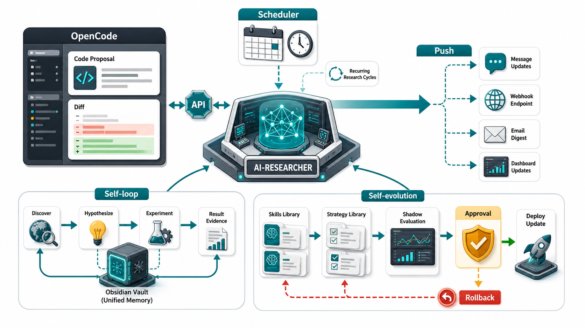
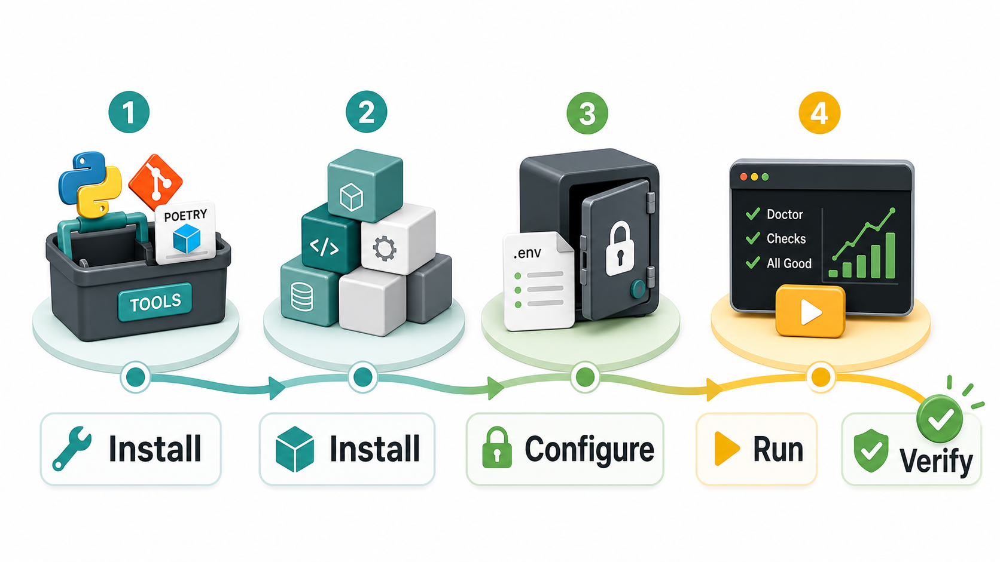
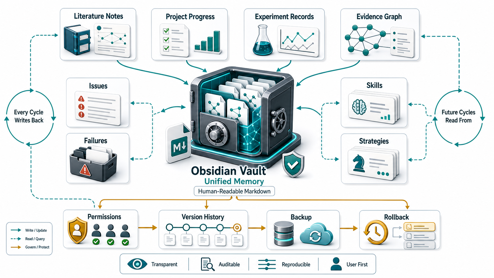
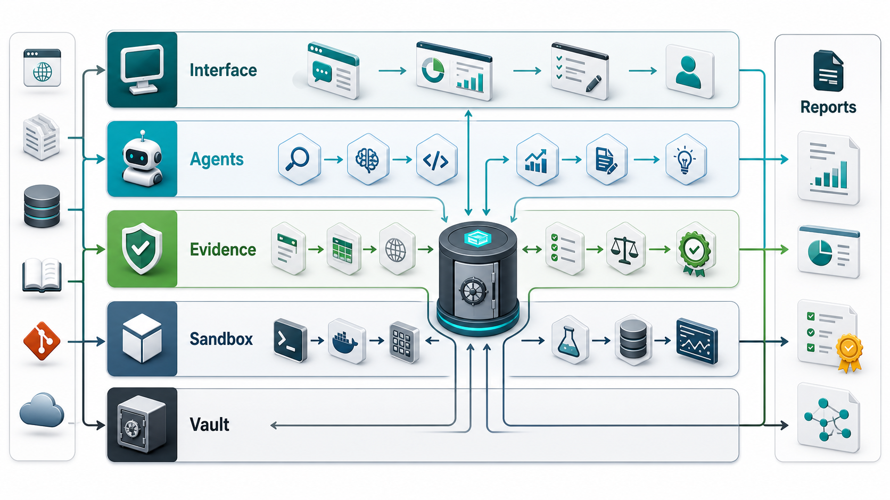
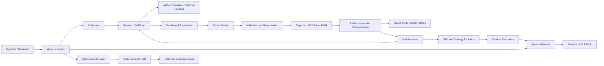
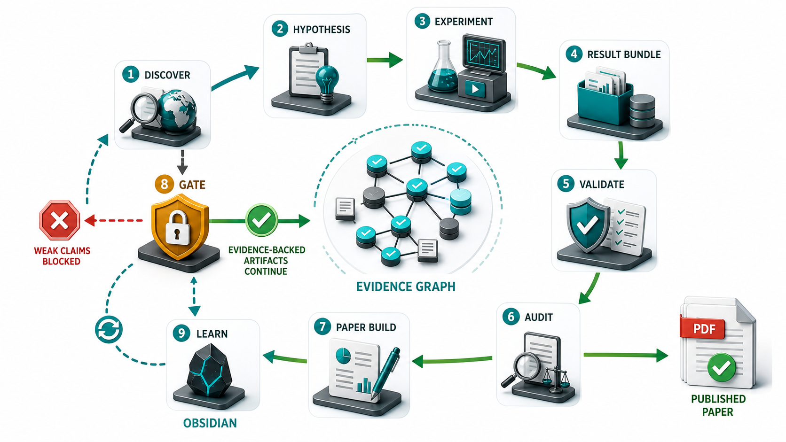

# AI-Researcher

[简体中文](README.zh-CN.md)

AI-Researcher is an always-on, evidence-first research operator. It can connect an external
OpenCode code-writing backend, run scheduled research cycles, push status updates through
operator channels, maintain an Obsidian-compatible knowledge vault, and turn repeated failures
or successes into governed skill and strategy updates.

It is not a paper-writing chatbot. The core loop is: discover real sources, create traceable
research tasks, run bounded experiments, validate results, build paper artifacts, block weak
claims, and write everything back into a human-readable knowledge base.



> Status: local MVP with tested research-loop components and integration contracts. The
> repository includes the Obsidian vault substrate, OpenCode integration manifest, OpenClaw
> channel runbook, scheduled `serve` / `autopilot` entrypoints, public-source literature
> retrieval, real benchmark demos, validation and reporting gates, LaTeX paper builds, and
> controlled self-evolution scaffolding. It is not yet a production multi-user service, and it
> must not claim CCF-B/Q3 publishability unless the publication audit and physical evidence gate
> pass on the real cycle artifacts.

## What It Does

| Capability | What exists now | Main commands and files |
|---|---|---|
| OpenCode backend connection | Uses OpenCode as an external code-drafting backend while AI-Researcher keeps validation, approval, memory, and commit authority. | `poetry run airesearcher code-agents opencode init`, `integrations/opencode/code-agent.json` |
| Scheduled self-loop | Runs recurring research cycles for discovery, experiment, validation, review, audit, paper build, and follow-up issue creation. | `poetry run airesearcher serve`, `poetry run airesearcher autopilot --watch` |
| Periodic push and approval | Records OpenClaw channel install metadata and maps dangerous actions to an AI-Researcher approval queue. | `poetry run airesearcher channels openclaw init`, `.airesearcher/runtime-approvals.json` |
| Obsidian knowledge core | Stores literature, project progress, evidence, issues, failures, skills, strategy cards, review notes, and rollback history as linked Markdown. | `autoresearch-vault/`, `poetry run airesearcher obsidian-setup` |
| Evidence gates | Blocks paper or release claims when run records, validation reports, reproduction checks, reviews, publication audits, paper builds, or PDFs are missing or weak. | `publication-audit`, `paper-build`, `evidence-gate` |
| Controlled self-evolution | Writes candidate skill and strategy updates, then requires validation, human approval, shadow evaluation, and rollback paths before promotion. | `skill-evolve`, `skill-polish-audit`, strategy cards in the vault |

## Quick Install



Prerequisites:

- Python 3.10+
- Git
- Poetry
- Optional: OpenCode, if you want AI-Researcher to hand off code-writing tasks
- Optional: Obsidian, if you want to browse the vault visually

Install the project:

```bash
git clone <your-fork-or-repo-url>
cd AIResearch
poetry install
poetry run airesearcher doctor
```

Create local configuration:

```bash
poetry run airesearcher deploy-setup
```

The guided setup asks for provider label, API base URL, model name, API key, and optional
WeChat or Feishu channel settings. Secrets are written to `.env`; non-secret settings stay in
`config.yaml`. The root `.env` file is ignored by git and must never be committed.

If you prefer manual setup:

```bash
cp .env.example .env
```

Then set:

```text
AUTORESEARCH_LLM_BASE_URL=...
AUTORESEARCH_LLM_MODEL_NAME=...
AUTORESEARCH_LLM_API_KEY=...
```

Initialize the Obsidian vault:

```bash
poetry run airesearcher obsidian-setup --vault autoresearch-vault --project-id autoresearch-system
```

Run a local smoke check:

```bash
poetry run airesearcher run-demo --demo tabular_baseline
```

Run a real public benchmark demo:

```bash
poetry run airesearcher run-demo --demo pendigits_centroid_baseline --timeout-seconds 60
```

Start the always-on operator:

```bash
poetry run airesearcher serve --permission-mode approve-dangerous
```

In another terminal, inspect and approve queued actions:

```bash
poetry run airesearcher runtime list
poetry run airesearcher runtime approve latest --approved-by operator
```

## OpenCode Integration

AI-Researcher treats OpenCode as a code-writing backend, not as the final authority. OpenCode can
draft a diff; AI-Researcher captures that diff, runs validation, records the outcome, updates the
vault, and only then allows the work to move toward commit or release.

Initialize the integration contract:

```bash
poetry run airesearcher code-agents opencode init
poetry run airesearcher code-agents opencode list
```

This writes or refreshes `integrations/opencode/code-agent.json`. The manifest documents:

- how to call OpenCode through `opencode run`, `opencode serve`, or `opencode acp`;
- recommended permission defaults for shell, edit, webfetch, and websearch actions;
- how generated diffs are accepted only after AI-Researcher validation gates pass;
- where provider credentials may live;
- why OpenCode source code is not vendored into this repository.

Recommended operating model:

1. AI-Researcher creates or selects a bounded task scope.
2. OpenCode drafts the code change in that scope.
3. AI-Researcher captures the generated diff and artifacts.
4. Focused tests, lint, type checks, live smoke tests, publication gates, or evidence gates run as needed.
5. Accepted findings, failures, and follow-up tasks are written into `Agent.md`, `Problem.md`, and `autoresearch-vault/`.
6. A commit is created only after the relevant gates pass.

## Scheduled Self-Loop and Push

The recurring loop is designed for a local machine or server that stays online.

```bash
poetry run airesearcher autopilot --watch --cycles 0 --interval-seconds 86400
```

Each cycle can perform:

1. source cooldown preflight;
2. online literature refresh from ArXiv and OpenAlex, with Semantic Scholar optional;
3. source-backed similarity and novelty checks;
4. broad inspiration refresh from non-scholarly sources;
5. local demo or real public benchmark experiment;
6. command-line reproduction rerun;
7. optional live LLM evidence review;
8. publication audit;
9. LaTeX paper build;
10. physical evidence gate;
11. Obsidian review, issue, failure, skill, and strategy updates;
12. local follow-up state merge.

For push-style operation, initialize the OpenClaw channel manifest:

```bash
poetry run airesearcher channels openclaw init
poetry run airesearcher channels openclaw list
```

The generated `integrations/openclaw/channels.json` is a runbook for mounting communication
channels such as Feishu/Lark, WeChat, WeCom, Telegram, Slack, Teams, and webhook-style adapters
inside an OpenClaw deployment. Channel plugins are not vendored here. Their secrets must stay in
OpenClaw credentials, `.env`, or a platform secret store.

Map operator messages such as `/approve` to:

```bash
poetry run airesearcher runtime approve latest --state .airesearcher/runtime-approvals.json --approved-by <operator>
```

## Obsidian Knowledge Vault



`autoresearch-vault/` is the system's canonical memory substrate. It is both a plain Markdown
folder that humans can inspect and a machine-readable state layer that future cycles can query.

The vault is not optional decoration. It is where the system stores the context that makes
self-looping and self-evolution auditable.

### What Goes Into The Vault

| Vault area | Purpose |
|---|---|
| `exploration/` | Global topics, methods, datasets, failure patterns, reusable skills, and strategy cards. |
| `projects/<project-id>/knowledge/` | Literature notes, source-backed facts, method cards, and dataset cards for a specific project. |
| `projects/<project-id>/experiments/` | Experiment records, configs, commands, run IDs, metrics, and artifact links. |
| `projects/<project-id>/evidence/` | Claim-to-evidence links, validation status, source artifacts, and audit references. |
| `projects/<project-id>/issues/` | Review findings, blockers, missing evidence, failed checks, and follow-up tasks. |
| `projects/<project-id>/experience/` | Failure cases, lessons learned, reusable skill candidates, and strategy observations. |
| `projects/<project-id>/paper/` | Paper-build summaries, review notes, citation package notes, and reproducibility context. |

### Management Mechanisms

- Markdown files use YAML frontmatter so entries are readable in Obsidian and structured enough
  for agents.
- Wiki-links and backlinks connect papers, hypotheses, experiments, evidence, failures, skills,
  and strategy cards.
- Topic indexes make repeated retrieval and future-cycle context lookup deterministic.
- Permission checks prevent project agents from writing outside their allowed project area.
- Denied writes and approval gates become audit events instead of silent failures.
- Version history, backups, and rollback support make knowledge evolution reversible.
- Issues and failures are first-class memory objects, so the next cycle can start from known
  blockers rather than prompt-only reminders.
- Skill cards and strategy cards are promoted only after validation, shadow evaluation, approval,
  and rollback planning.

The intended rhythm is simple: every cycle writes back, and future cycles read from the same
vault before proposing new work.

## System Architecture





## Evidence, Audit, and Paper Gates



AI-Researcher intentionally refuses to treat a polished report as a publication-ready result.
For strong claims, the system expects physical artifacts:

- cycle summary;
- literature and similarity evidence;
- first run record;
- validation report;
- evidence map;
- reproduction rerun record;
- evidence-constrained review;
- publication audit;
- LaTeX build JSON;
- compiled PDF;
- paper-quality report.

Run the main gates manually when you need to inspect a completed cycle:

```bash
poetry run airesearcher publication-audit runs/autopilot/<cycle-id>/cycle-summary.json --target ccf-b
poetry run airesearcher paper-build runs/autopilot/<cycle-id>/demo/<demo-id>/report/report.md --template-id generic-article-one-column
poetry run airesearcher evidence-gate runs/autopilot/<cycle-id>/cycle-summary.json --publication-audit runs/autopilot/<cycle-id>/publication-audit.json --paper-build-json runs/paper-build/<cycle-id>/paper-build.json
```

## Self-Evolution

Self-evolution is controlled, not free-form self-modification.

Use `skill-evolve` to write a candidate skill card:

```bash
poetry run airesearcher skill-evolve \
  --parent-skill-id skill_evidence_bound_review \
  --issue-ref projects/autoresearch-system/issues/example_issue \
  --change-summary "Tighten the evidence bundle before live review." \
  --proposed-action "Attach run-record evidence before review." \
  --validation-check "Held-out review has zero unsupported reproduction claims."
```

Use `skill-polish-audit` before promotion:

```bash
poetry run airesearcher skill-polish-audit \
  --skill-id <candidate_skill_id> \
  --peer-ref https://github.com/LearnPrompt/luban-skill \
  --live-evidence-ref runs/skill-polish/demo-validation.json \
  --install-ref .opencode/skills/ai-researcher-evidence-gate/SKILL.md \
  --release-ref autoresearch-vault/exploration/skills/rejected/demo_rejections.md
```

Promotion requires real evidence, bounded edits, rollback awareness, and human review. Strategy
changes follow the same idea: propose, evaluate offline, run in shadow mode, approve, deploy
gradually, and roll back if the reward or safety metrics regress.

## Common Commands

| Goal | Command |
|---|---|
| Check local install | `poetry run airesearcher doctor` |
| Configure model and channels | `poetry run airesearcher deploy-setup` |
| Initialize Obsidian vault | `poetry run airesearcher obsidian-setup --vault autoresearch-vault --project-id autoresearch-system` |
| Initialize OpenCode backend contract | `poetry run airesearcher code-agents opencode init` |
| Initialize OpenClaw channel runbook | `poetry run airesearcher channels openclaw init` |
| Run toy demo | `poetry run airesearcher run-demo --demo tabular_baseline` |
| Run real benchmark demo | `poetry run airesearcher run-demo --demo pendigits_centroid_baseline --timeout-seconds 60` |
| Start always-on runtime | `poetry run airesearcher serve --permission-mode approve-dangerous` |
| Run daily autopilot loop | `poetry run airesearcher autopilot --watch --cycles 0 --interval-seconds 86400` |
| List runtime approvals | `poetry run airesearcher runtime list` |
| Approve latest queued action | `poetry run airesearcher runtime approve latest --approved-by operator` |
| Run local quality gate | `python scripts/check.py` |

## Repository Layout

```text
.
├── autoresearch-vault/              # Obsidian-compatible knowledge memory
├── docs/assets/readme/              # README illustrations
├── integrations/opencode/           # OpenCode backend contract
├── integrations/openclaw/           # Push/channel integration runbook
├── runs/                            # Local run artifacts
├── src/autoresearch/                # Python package
├── tests/                           # Unit, smoke, property, integration tests
├── .kiro/specs/auto-research-system # Executable implementation plan
├── Agent.md                         # Required agent change log
├── Problem.md                       # Problem, blocker, and risk log
├── config.yaml                      # Non-secret runtime config
└── pyproject.toml
```

## Boundaries

AI-Researcher is designed to be autonomous where evidence exists and conservative where evidence
is missing.

- It does not automatically publish or submit papers.
- It does not store API keys in git.
- It does not treat OpenCode-generated diffs as accepted code until AI-Researcher gates pass.
- It does not promote skill or strategy updates without validation, approval, and rollback paths.
- It does not claim publication readiness from toy demos or paper-shaped Markdown alone.
- It is not yet a production multi-user product; deployment and channel integrations need operator
  review.

## Documentation

- [Research Plan](AutoResearch_System_Research_Plan.md): research scope, architecture, agent model, verification model, risk matrix, and roadmap.
- [Execution Plan](AutoResearch_System_Execution_Plan.md): phased implementation plan, milestones, schemas, testing strategy, cost model, and release gates.
- [Implementation Tasks](.kiro/specs/auto-research-system/tasks.md): detailed executable task list.
- [Release Gate Checklist](docs/release-gate.md): checks before release tags, demos, or production-ready claims.
- [Agent Change Log](Agent.md): required change log for every coding agent.
- [Problem Log](Problem.md): blocker, risk, and defect register.
- [Third-Party Notices](THIRD_PARTY_NOTICES.md): license and attribution notes for inspirations and integrations.

## Contributing

See [CONTRIBUTING.md](CONTRIBUTING.md) for the full development workflow.

Before changing files:

1. Read [AGENTS.md](AGENTS.md).
2. Check [.kiro/specs/auto-research-system/tasks.md](.kiro/specs/auto-research-system/tasks.md).
3. Review open items in [Problem.md](Problem.md).
4. Make the smallest change that satisfies the task.
5. Run the relevant verification command.
6. Append your change summary to [Agent.md](Agent.md).

## License

AI-Researcher is licensed under the [Apache License 2.0](LICENSE). The SPDX identifier is
`Apache-2.0`. See [NOTICE](NOTICE) and [THIRD_PARTY_NOTICES.md](THIRD_PARTY_NOTICES.md) for
attribution and third-party reference notes.
