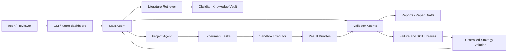

# AI-Researcher

[Simplified Chinese](README.zh-CN.md)

AI-Researcher is an early-stage Python platform for evidence-first automated computational research. The long-term goal is to orchestrate a constrained, auditable research loop: literature search, knowledge modeling, hypothesis generation, experiment design, sandboxed execution, result validation, paper drafting, review simulation, and controlled strategy evolution.

> Status: local MVP scaffold with tested research-loop components. The repository includes the executable task plan, Obsidian vault substrate, provider-agnostic deployment setup, local demo loop, literature/similarity retrieval foundations, validation/reporting modules, and release-preparation checks. It is not yet a production multi-user service.

## Why This Exists

Most automated research demos start with writing. This project starts with evidence. A result should only become a claim when the system can trace it back to a real run, configuration, metric file, source artifact, and validation status.

The core product idea is an Obsidian-compatible unified knowledge base stored under the project-root `autoresearch-vault/` directory. It acts as both human-readable research memory and machine-readable evolution substrate. Literature notes, project progress, issues, experiment records, failures, skills, evidence links, and strategy versions all live in one linked Markdown vault so the system can self-loop and self-improve without hiding its reasoning in an opaque database.

The first usable milestone is not a fully autonomous scientist. It is a minimal trusted research loop that can run a small computational experiment, collect outputs, validate them, and produce a reproducible Markdown report.

## Core Principles

- Evidence before claims.
- Reproducibility before autonomy.
- Human approval before high-cost, high-risk, or public actions.
- Sandboxed execution by default.
- Obsidian-compatible Markdown vault under `autoresearch-vault/` as the shared memory for research, failures, skills, and strategy evolution.
- Online literature and similar-work discovery are required at project start and during scheduled refresh; the vault stores source-backed summaries, not fabricated claims.
- Every experiment records run ID, commit, config hash, data hash, metrics, logs, artifacts, and cost.
- Every agent change is logged in [Agent.md](Agent.md).
- Every discovered blocker or risk is tracked in [Problem.md](Problem.md).

## Target Architecture



## Roadmap

| Phase | Focus | Outcome |
|---|---|---|
| Phase 0 | Governance and engineering baseline | Agent rules, problem log, Obsidian vault contract, schemas, config, logging, smoke tests, minimal CLI |
| Phase 1 | Minimal trusted loop | Obsidian knowledge base, literature search, experiment execution, validation, and Markdown report |
| Phase 2 | Research assistant | Multi-agent workflow, evidence graph, paper draft, citation checks, review simulation |
| Phase 3 | Self-loop platform | Obsidian-backed candidate pool, scheduler, failure library, skill cards, monitoring, rollback |
| Phase 4 | Controlled self-evolution | Obsidian-backed strategy cards, offline replay, golden tests, shadow evaluation, gray release |
| Phase 5 | Product platform | Web dashboard, multi-user permissions, plugin system, deployment, compliance audit |

The executable task plan lives in [.kiro/specs/auto-research-system/tasks.md](.kiro/specs/auto-research-system/tasks.md).

## Repository Layout

```text
.
├── AutoResearch_System_Research_Plan.md
├── AutoResearch_System_Execution_Plan.md
├── AGENTS.md
├── Agent.md
├── autoresearch-vault/
├── Problem.md
├── README.md
├── README.zh-CN.md
├── pyproject.toml
├── src/
│   └── autoresearch/
└── .kiro/
    └── specs/
        └── auto-research-system/
```

## Development Setup

Prerequisites:

- Python 3.10+
- Poetry
- Git

Install dependencies:

```bash
poetry install
```

First-deploy setup:

```bash
poetry run autoresearch deploy-setup
```

The guided setup asks for the LLM provider label, API base URL, model name, API key, and optional WeChat/Feishu channel credentials. API keys and channel secrets are written only to `.env`; `config.yaml` stores non-secret model and channel metadata plus environment variable names. If `.env.example` is missing, the CLI creates it as a public non-secret template.

If you prefer to fill the model configuration manually, copy `.env.example` to `.env` and set `AUTORESEARCH_LLM_BASE_URL`, `AUTORESEARCH_LLM_MODEL_NAME`, and `AUTORESEARCH_LLM_API_KEY`. You can also set `SEMANTIC_SCHOLAR_API_KEY` for higher Semantic Scholar Graph API limits. The root `.env` file is intentionally ignored by git and must never be committed.

For scripted deployment:

```bash
poetry run autoresearch deploy-setup \
  --config config.yaml \
  --env-path .env \
  --provider openai-compatible \
  --base-url https://api.example.com/v1 \
  --model-name your-model-name \
  --api-key your-api-key \
  --wechat --wechat-webhook-url https://wechat.example/hook \
  --feishu --feishu-webhook-url https://feishu.example/hook \
  --non-interactive
```

Project slash command templates:

```bash
poetry run autoresearch slash-commands init
poetry run autoresearch slash-commands list
```

This creates project-scoped TOML templates under `.autoresearch/commands/`, including `/research:refresh-literature`, `/research:similarity-check`, `/research:run-demo`, and `/research:status`.

Online discovery commands:

```bash
poetry run autoresearch literature-refresh --vault autoresearch-vault --cache .cache/literature --max-queries 1 --max-results-per-source 1
poetry run autoresearch similarity-check --candidate-file candidate.json --vault autoresearch-vault --cache .cache/literature --project-id my_project
```

Both commands use real literature APIs by default, load optional literature API keys from `.env`, apply conservative Semantic Scholar rate limiting with 429 circuit breaking, preserve per-source fetch errors, and write guarded Obsidian summaries that keep unsupported outcomes as `unknown` or `pending verification`.

Live LLM smoke and output quality gate:

```bash
poetry run autoresearch llm-smoke --config config.yaml --env-path .env --output runs/llm-smoke/latest.json
```

This calls the configured OpenAI-compatible model, requires structured JSON output, checks evidence-policy language, verifies no API key leakage, and writes a local quality report under `runs/`.

LLM-as-reviewer with local evidence:

```bash
poetry run autoresearch llm-review \
  --subject runs/manual-live/demo/tabular-baseline/report/report.md \
  --evidence runs/manual-live/demo/tabular-baseline/validation/validation-report.json \
  --evidence runs/manual-live/demo/tabular-baseline/evidence/evidence-map.json \
  --config config.yaml \
  --env-path .env \
  --output runs/llm-review/latest.json \
  --max-tokens 1600
```

The reviewer can use the configured live model, but the deterministic gate requires every finding to cite provided local evidence IDs such as `evidence_1`; missing or unknown evidence references fail below the quality threshold. Reasoning models may need the higher review token budget shown above.

Run the local quality gate:

```bash
python scripts/check.py
```

This mirrors the default CI gates: `poetry run ruff check src tests`, `poetry run mypy src`, and `poetry run pytest tests/smoke tests/unit`. The default `test_cli.py` and `test_imports.py` smoke checks are local installation/import checks; only the explicitly named live smoke tests below contact external APIs.

Run live smoke tests after `.env` is configured:

```bash
AUTORESEARCH_LIVE_APIS=1 poetry run pytest tests/smoke/test_llm_live.py tests/smoke/test_literature_live.py tests/smoke/test_literature_refresh_live.py tests/smoke/test_similarity_live.py -vv
```

## Documentation

- [Research Plan](AutoResearch_System_Research_Plan.md): research scope, architecture, agent model, verification model, risk matrix, and long-term roadmap.
- [Execution Plan](AutoResearch_System_Execution_Plan.md): phased implementation plan, milestones, schemas, testing strategy, cost model, and release gates.
- [Kiro Requirements](.kiro/specs/auto-research-system/requirements.md): original requirements for the Obsidian knowledge base, agent evolution, knowledge evolution, and project permissions.
- [Kiro Design](.kiro/specs/auto-research-system/design.md): original design details for Obsidian vault structure, knowledge APIs, access control, and implementation priorities.
- [Implementation Tasks](.kiro/specs/auto-research-system/tasks.md): detailed executable task list.
- [Agent Change Log](Agent.md): required change log for every coding agent.
- [Problem Log](Problem.md): issue, blocker, and risk register.
- [Changelog](CHANGELOG.md): unreleased release notes, migration notes, and known problems.
- [Release Gate Checklist](docs/release-gate.md): required checks before release tags, demos, or production-ready claims.

## Contributing

See [CONTRIBUTING.md](CONTRIBUTING.md) for the full setup, task workflow, testing, and review guide.

Before changing files:

1. Read [AGENTS.md](AGENTS.md).
2. Check the current task in [.kiro/specs/auto-research-system/tasks.md](.kiro/specs/auto-research-system/tasks.md).
3. Review open items in [Problem.md](Problem.md).
4. Make the smallest change that satisfies the task.
5. Run the relevant verification command.
6. Append your change summary to [Agent.md](Agent.md).

## License

AI-Researcher is licensed under the [Apache License 2.0](LICENSE). The SPDX identifier is `Apache-2.0`. See [NOTICE](NOTICE) for attribution.
