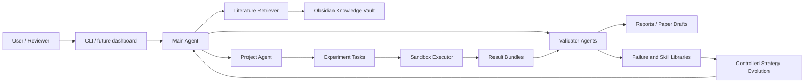

# AI-Researcher

[Simplified Chinese](README.zh-CN.md)

AI-Researcher is an early-stage Python platform for evidence-first automated computational research. The long-term goal is to orchestrate a constrained, auditable research loop: literature search, knowledge modeling, hypothesis generation, experiment design, sandboxed execution, result validation, paper drafting, review simulation, and controlled strategy evolution.

> Status: planning and scaffold. The project currently contains the product and execution plans, a Python package skeleton, and detailed implementation tasks. The runnable CLI, test suite, and trusted MVP loop are Phase 0 and Phase 1 work, not completed features.

## Why This Exists

Most automated research demos start with writing. This project starts with evidence. A result should only become a claim when the system can trace it back to a real run, configuration, metric file, source artifact, and validation status.

The core product idea is an Obsidian-compatible unified knowledge base stored under the project-root `autoresearch-vault/` directory. It acts as both human-readable research memory and machine-readable evolution substrate. Literature notes, project progress, issues, experiment records, failures, skills, evidence links, and strategy versions all live in one linked Markdown vault so the system can self-loop and self-improve without hiding its reasoning in an opaque database.

The first usable milestone is not a fully autonomous scientist. It is a minimal trusted research loop that can run a small computational experiment, collect outputs, validate them, and produce a reproducible Markdown report.

## Core Principles

- Evidence before claims.
- Reproducibility before autonomy.
- Human approval before high-cost, high-risk, or public actions.
- Sandboxed execution by default.
- Obsidian-compatible Markdown vault under `autoresearch-vault/` as the shared memory for research, failures, skills, and strategy evolution.
- Every experiment records run ID, commit, config hash, data hash, metrics, logs, artifacts, and cost.
- Every agent change is logged in [Agent.md](Agent.md).
- Every discovered blocker or risk is tracked in [Problem.md](Problem.md).

## Target Architecture



## Roadmap

| Phase | Focus | Outcome |
|---|---|---|
| Phase 0 | Governance and engineering baseline | Agent rules, problem log, Obsidian vault contract, schemas, config, logging, smoke tests, minimal CLI |
| Phase 1 | Minimal trusted loop | Obsidian knowledge base, literature search, experiment execution, validation, and Markdown report |
| Phase 2 | Research assistant | Multi-agent workflow, evidence graph, paper draft, citation checks, review simulation |
| Phase 3 | Self-loop platform | Obsidian-backed candidate pool, scheduler, failure library, skill cards, monitoring, rollback |
| Phase 4 | Controlled self-evolution | Obsidian-backed strategy cards, offline replay, golden tests, shadow evaluation, gray release |
| Phase 5 | Product platform | Web dashboard, multi-user permissions, plugin system, deployment, compliance audit |

The executable task plan lives in [.kiro/specs/auto-research-system/tasks.md](.kiro/specs/auto-research-system/tasks.md).

## Repository Layout

```text
.
├── AutoResearch_System_Research_Plan.md
├── AutoResearch_System_Execution_Plan.md
├── AGENTS.md
├── Agent.md
├── autoresearch-vault/
├── Problem.md
├── README.md
├── README.zh-CN.md
├── pyproject.toml
├── src/
│   └── autoresearch/
└── .kiro/
    └── specs/
        └── auto-research-system/
```

## Development Setup

Prerequisites:

- Python 3.10+
- Poetry
- Git

Install dependencies:

```bash
poetry install
```

Run the local quality gate:

```bash
python scripts/check.py
```

This mirrors the default CI gates: `poetry run ruff check src tests`, `poetry run mypy src`, and `poetry run pytest tests/smoke tests/unit`.

## Documentation

- [Research Plan](AutoResearch_System_Research_Plan.md): research scope, architecture, agent model, verification model, risk matrix, and long-term roadmap.
- [Execution Plan](AutoResearch_System_Execution_Plan.md): phased implementation plan, milestones, schemas, testing strategy, cost model, and release gates.
- [Kiro Requirements](.kiro/specs/auto-research-system/requirements.md): original requirements for the Obsidian knowledge base, agent evolution, knowledge evolution, and project permissions.
- [Kiro Design](.kiro/specs/auto-research-system/design.md): original design details for Obsidian vault structure, knowledge APIs, access control, and implementation priorities.
- [Implementation Tasks](.kiro/specs/auto-research-system/tasks.md): detailed executable task list.
- [Agent Change Log](Agent.md): required change log for every coding agent.
- [Problem Log](Problem.md): issue, blocker, and risk register.
- [Release Gate Checklist](docs/release-gate.md): required checks before release tags, demos, or production-ready claims.

## Contributing

Before changing files:

1. Read [AGENTS.md](AGENTS.md).
2. Check the current task in [.kiro/specs/auto-research-system/tasks.md](.kiro/specs/auto-research-system/tasks.md).
3. Review open items in [Problem.md](Problem.md).
4. Make the smallest change that satisfies the task.
5. Run the relevant verification command.
6. Append your change summary to [Agent.md](Agent.md).

## License

No license has been selected yet. Do not assume external redistribution rights until a license is added.
