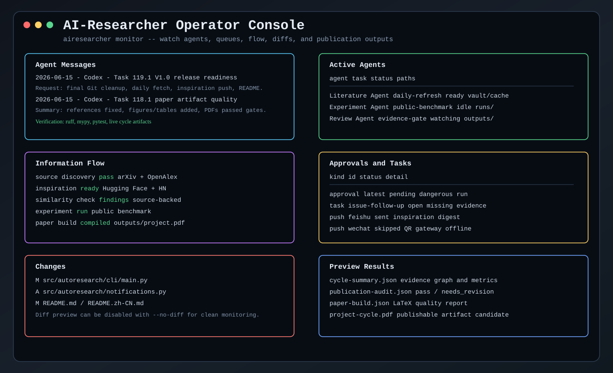

# AI-Researcher

[English](README.md)

AI-Researcher 是一个 V1.0 本地/服务器端的证据优先自动科研操作系统。它可以长期运行，自动发现真实资料，抓取灵感，执行有边界的实验，验证结果，构建 LaTeX/PDF 论文产物，并把长期记忆写回 Obsidian 兼容的 Markdown 知识库。

它不是“让大模型写一篇像论文的文章”的聊天机器人。它的核心是一个可审计科研闭环：真实检索、可复现实验、证据门禁、评审门禁、论文级产物和受控自进化。



## V1.0 范围

V1.0 是单操作者的本地/服务器版本，可以在部署后挂在工作站或服务器上持续运行。它还不是多用户 SaaS，也不会自动投稿。

| 模块 | V1.0 行为 |
| --- | --- |
| 引导式部署 | `airesearcher setup` 会引导选择模型供应商、base URL、模型名、API key、微信扫码或飞书 App 凭据、默认开启的真实通道自检、vault 路径、集成 manifest 和 slash 模板。 |
| 常驻自循环 | `airesearcher serve` 和 `airesearcher autopilot --watch` 支持每日循环：联网文献、灵感抓取、实验、评审、审计、论文构建和 follow-up。 |
| 灵感推送 | `--push-inspiration` 会通过 setup 配好的微信/飞书通道推送灵感摘要；缺少可送达状态时记录为 `skipped`，不会假装成功。 |
| Obsidian 记忆 | `autoresearch-vault/` 存储文献、灵感、实验、证据、issue、失败、skill、strategy 和论文摘要。 |
| 研究计划门禁 | 用户确认研究方向后，`airesearcher research-plan` 会先把可执行研究计划写入 vault，并在 `outputs/<project-id>/research-plan/` 下生成 LaTeX/PDF，之后才允许代码 Agent 做实验。 |
| 闭环 campaign | 每个已确认方向会被初始化为 protocol-as-code campaign：明确目标、预算、候选空间、基线、停止条件、DOE/证据增益候选选择、闭环指标和可回滚质量门禁。 |
| 论文产物 | Markdown 经验与归档在 vault 中；PDF、TeX、manifest 等发布产物在 `outputs/<project-id>/` 中。 |
| 代码 Agent | 支持把 OpenCode 作为外部代码起草后端，但验证、审批、提交和回滚权仍在 AI-Researcher。 |
| Agent profile | `airesearcher agents profile write` 和 `agents profile import` 可以把自定义 skill 与 MCP server 绑定到某个 Agent；`serve` / `autopilot` 可以通过可重复的 `--agent-profile <json>` 加载这些 profile，并写入 cycle 证据。 |
| 通信适配器 | OpenClaw 风格通道只作为 runbook 元数据保留，不把第三方插件源码混进仓库。 |
| 发表门禁 | CCF-B/三区级别声明必须绑定真实来源、实验记录、复现检查、审计、PDF 构建和 evidence gate。 |

## 安装

准备环境：

- Python 3.10+
- Node.js 20+
- Git
- 可选：Obsidian，用于可视化浏览知识库
- 可选：OpenCode，用于外部代码生成任务

```bash
git clone <your-repo-url>
cd AIResearch
python -m pip install -e .
npm install
npm run doctor
```

Python CLI 和 npm 启动器调用的是同一个系统：

```bash
airesearcher version
node ./bin/airesearcher.mjs version
```

## 首次部署

运行引导式配置：

```bash
npm run setup
# 或
airesearcher setup
```

向导会依次引导：

1. 选择 DeepSeek、OpenAI-compatible、SiliconFlow 或自定义供应商。
2. 确认 `AUTORESEARCH_LLM_BASE_URL`。
3. 填写 `AUTORESEARCH_LLM_MODEL_NAME`。
4. 填写 `AUTORESEARCH_LLM_API_KEY`。
5. 可选配置微信扫码通道，或用 App ID/App Secret 配置飞书/Lark。
6. 如果启用了通信通道，确认默认立即发送的真实送达自检，或显式跳过。
7. 初始化 `autoresearch-vault/`。
8. 写入 `integrations/` 下的集成 runbook。
9. 写入 `.airesearcher/commands/` 下的本地 slash command 模板。

向导会把本地密钥和通道状态写入 `.env`，用户不需要手动编辑这个文件。公开模板在 `.env.example`。不要提交真实 API key、webhook URL、app secret、chat ID、会话或 token。

推荐通道配置：

- 飞书/Lark：在 `airesearcher setup` 中选择 App ID + App Secret 模式。如果已经知道 home chat ID，可以在 setup 阶段填写；否则后续通过 adapter/gateway 与机器人对话后再绑定 home channel。通道状态完整后，向导默认会在退出前发送真实送达自检。
- 微信/Weixin：选择 QR setup。交互式向导会在写完配置后立刻启动二维码适配器 setup 命令并等待扫码/登录结果；如果已经知道 OpenClaw 消息 target，可以在 setup 阶段填写，否则配对后运行 `airesearcher channels bind-target --channel wechat --target <target>`。非交互脚本默认只记录配置状态，除非额外传入 `--run-wechat-qr-setup`。当 QR 登录和 target 都准备好后，setup 默认会发送与 24h 推送门禁相同的真实自检。
- Webhook URL 仍作为已有 incoming webhook 部署的兼容 fallback。

引导式 setup 会询问是否立即发送通道送达自检，并在启用通道时默认选择发送。脚本化部署可以传入 `--run-channel-test`，要求所有启用通道都返回 `sent`，否则写入 JSON 证据后失败；也可以传入 `--skip-channel-test` 延后。若自检发现缺少 WeChat OpenClaw target 或 Feishu home chat ID，CLI 会打印对应的 `channels bind-target` 命令，操作者不需要手动编辑 `.env`。若选择延后，进入无人值守前请运行同一条自检：

```bash
npm run channel:test -- --channel feishu --require-sent
# 或
airesearcher channels test --channel feishu --require-sent
# 微信 QR 部署在配对 target 后也可以做真实送达自检：
airesearcher channels test --channel wechat --require-sent
```

随后运行严格上线前门禁：

```bash
npm run prelaunch
# 或
airesearcher readiness --push-inspiration --require-channel-config --require-channel-sent
```

它会在启动 24h 循环前生成 `.airesearcher/readiness/report.json`，检查每日循环、vault、输出目录、模型 API、操作者通道配置和最近一次通道自检送达证据是否就绪。若有缺失，报告会写入 `next_actions`，给出可执行的修复命令。
报告里的计划日循环命令会使用带审批门禁的 `serve` runtime，而不是更底层的直接 `autopilot` 入口。

也可以非交互式部署：

```bash
airesearcher setup \
  --provider openai-compatible \
  --base-url https://api.example.com/v1 \
  --model-name your-model \
  --api-key sk-... \
  --no-wechat \
  --no-feishu \
  --non-interactive
```

## 启动 24h 常驻系统

V1.0 推荐入口：

```bash
npm run serve
```

等价于：

```bash
airesearcher serve --permission-mode approve-dangerous --push-inspiration
```

`serve` 默认持续运行。它会检查审批队列，执行已批准的 cycle，每次 cycle 间隔默认 `86400` 秒，并记录灵感摘要推送状态。
在 `approve-dangerous` 模式下，每一次 cycle 尝试都会生成独立审批请求；只有明确希望无需逐轮审批地无人值守运行时，才使用 `allow-all`。
等待输出和 `runtime list` 会显示逐轮 `action_id`，方便操作者确认正在审批的是哪一轮 cycle。

常驻研究循环默认使用 `pendigits_variance_calibrated_prototypes`，也就是 UCI Pendigits 真实公开 benchmark 路径，包含方法对齐的文献检索和不少于 1,000 行验证数据。`--demo tabular_baseline` 只建议用于很小的本地 smoke。

另开一个终端审批第一轮危险动作：

```bash
airesearcher runtime list
airesearcher runtime approve latest --approved-by operator
```

长时间运行的循环也可以把各阶段心跳写入本地状态文件。`runtime heartbeat check`
会检测过期阶段和重复进度签名，并在卡住时要求检查、修复或转向；该报告只证明
运行健康状态，不能证明科研结论、引用、工具调用、创新性或发表就绪。

如果这是完全可信的本地机器，也可以使用：

```bash
airesearcher serve --permission-mode allow-all --push-inspiration
```

只有当你确认联网检索、本地实验、LLM 评审、vault 写入和 output 写入都可以无需逐轮审批时，才使用 `allow-all`。

## 每日抓取和灵感推送

不需要审批服务包装时，可以直接启动每日 autopilot：

```bash
airesearcher autopilot --watch --cycles 0 --interval-seconds 86400 --push-inspiration
```

可以给常驻运行入口绑定单个或多个 Agent profile：

```bash
airesearcher agents profile write \
  --agent-id literature-agent \
  --role project_agent \
  --stage literature \
  --stage similarity \
  --skill source-tracing=autoresearch-vault/_system/templates/skill-card.md \
  --skill-policy source-tracing:approved_runtime \
  --mcp "page-agent=npx -y page-agent" \
  --mcp-tool page-agent:browser.search \
  --mcp-tool page-agent:browser.open \
  --mcp-approval page-agent:approve_dangerous \
  --mcp-env-key page-agent:PAGE_AGENT_TOKEN \
  --output .airesearcher/agents/literature-agent.json

airesearcher agents profile validate \
  .airesearcher/agents/literature-agent.json \
  --env-path .env \
  --output .airesearcher/agents/literature-agent-readiness.json

airesearcher serve \
  --agent-profile .airesearcher/agents/literature-agent.json \
  --agent-profile .airesearcher/agents/reviewer-agent.json
```

团队复用时也可以把同一个 profile 写成 JSON/YAML/TOML bundle，然后导入成标准 profile JSON：

```yaml
agent_id: literature-agent
role: project_agent
thinking_mode: scientific
publication_target: ccf-b-or-sci-q2
assigned_stages: [literature, similarity, research_plan]
thinking_contract_additions:
  - Prefer falsifiable research claims over software architecture metaphors.
skills:
  - skill_id: source-tracing
    source: autoresearch-vault/_system/templates/skill-card.md
    import_policy: approved_runtime
mcp_servers:
  - server_id: page-agent
    command: npx -y page-agent
    allowed_tools: [browser.search, browser.open]
    approval_policy: approve_dangerous
    env_keys: [PAGE_AGENT_TOKEN]
```

```bash
airesearcher agents profile import literature-agent.yaml \
  --output .airesearcher/agents/literature-agent.json
```

这些 profile 会写入 `cycle-summary.json`、`review-evidence-context.json` 和 operator monitor。可选的 `--stage` 会把某个 profile 绑定到 `literature`、`similarity`、`research_plan`、`loop_campaign`、`experiment`、`review`、`publication_audit`、`evidence_gate` 等闭环阶段，使审计记录能看到每个 Agent 的科研责任边界。`cycle-summary.json` 还会写入 `stage_runtime_contexts`，`review-evidence-context.json` 还会写入 `stage_agent_contexts`，下游阶段 worker 只能消费分配给该阶段的受控 skill/MCP 上下文。它们不能绕过证据、复现、评审、论文构建和发布门禁；LLM reviewer 也会把 profile 和 stage context 视为流程元数据，而不是科学结果、工具已调用、创新性或发表就绪的证明，本地 reviewer 质量门禁也会拦截这类误用。运行时 profile context 会带有 `context_kind=agent_profile_process_metadata` 和机器可读 evidence policy，后续阶段不用从散文里推断这条边界。

`--skill-policy <skill_id>:read_only_context|shadow_evaluation|approved_runtime` 用于声明某个已绑定 skill 对 Agent 的影响范围；`--mcp-approval <server_id>:read_only|approve_dangerous|allow_all` 和 `--mcp-env-key <server_id>:ENV_KEY` 用于声明单个 MCP server 的审批策略和所需环境变量名。这些 flag 必须引用同一条命令中已经绑定的 skill 或 MCP server。`--mcp-env-key` 只保存大写环境变量名，不保存密钥值。

在无人值守运行前先执行 `agents profile validate`，用于检查本地 skill 源路径和必需的 MCP 环境变量名是否存在。readiness 报告会进入运行时 profile context、`cycle-summary.json`、`review-evidence-context.json`、monitor 行和 CLI 状态输出。它只验证 profile 输入，不证明 MCP 工具已经真实调用、外部 skill 内容已经安全，也不能作为科学 claim 的证据。

多 Agent 部署前运行 `agents profile set-validate <profiles...>`。它会生成面向 CCF-B/SCI 二区研究闭环的 stage coverage matrix，检查每个 profile 的 readiness，阻断 literature、research_plan、experiment、reproduction、citations、review 等职责缺口，并提示 `allow_all` MCP 绑定或未分配阶段的 profile。这个检查只证明团队配置和责任边界可运行，不能证明科学结论或发表就绪。

当已加载的 profile 指向本地 skill 文件，或指向包含 `SKILL.md` 的目录时，运行时会把有界 skill 摘要写入阶段上下文，并记录 `status`、`sha256`、字节数/字符数、`max_chars` 和截断标记。紧凑 profile summary 只记录来源和状态，`stage_runtime_contexts` 与 `stage_agent_contexts` 才携带分配给 worker 的有界内容。非本地来源只保留引用；本地文件如果包含疑似密钥文本，会标记为 `blocked`，不会把内容写入 artifact。可以运行 `agents profile inspect --materialize-skills --base-dir . <profile.json>` 预览某个 Agent 实际会收到的上下文。

MCP 绑定还会生成 `mcp_runtime_contracts`。contract 会记录命令哈希、允许的工具、审批策略、所需 env key 名称，以及是否需要运行时审批或隔离的 operator 授权。它不会记录 env 值，也仍然只是流程元数据：MCP contract 只能证明该 Agent 被允许使用什么工具，不能证明工具已经真实调用，也不能证明科研结果成立。

当 MCP worker 真正调用工具时，需要用 `agents mcp-evidence add` 额外写入 JSONL ledger。该 ledger 只保存请求/响应 artifact 的路径和 SHA-256、调用状态、审批关联和非敏感结果摘要，不内嵌原始 payload；`agents mcp-evidence validate` 会把每条记录和所属 Agent profile 的 MCP allowlist 交叉校验。它只能证明某个 Agent 记录过某次工具调用，不能替代实验、文献、复现或审稿证据。

`autopilot` 和 `serve` 使用同一个默认公开 benchmark；可以通过 `--demo <id>` 切换到其他 benchmark，或用 `--demo tabular_baseline` 跑快速 toy fixture。

每一轮 cycle 可以执行：

1. 来源冷却和 preflight 检查。
2. ArXiv 和 OpenAlex 文献刷新，Semantic Scholar 作为可选低优先级来源。
3. 有来源支撑的相似工作和创新性检查。
4. 用户确认方向后的研究计划生成与门禁。
5. 闭环 campaign 初始化与 DOE/主动学习候选选择。
6. Hugging Face 和 Hacker News 灵感抓取。
7. 本地 demo 或真实公开 benchmark 实验。
8. 命令行复现实验检查。
9. 可选真实 LLM 证据评审。
10. 生成包含 AF、EF、复现误差、元数据完整率、失败恢复率和证据覆盖率的 loop report。
11. publication audit。
12. LaTeX 论文构建。
13. physical evidence gate。
14. Obsidian review、issue、skill、strategy 写入。
15. scheduler follow-up 合并。
16. 可选微信/飞书灵感摘要推送。

Campaign artifact 会作为 protocol-as-code 处理。`loop-campaign.json` 会记录 data sources、baselines、protocol artifacts、候选 arm、optimizer policy、optimizer state、指标、质量门禁、`contract_validation` 和确定性的 `stop_decision`。`contract_validation` 会检查 campaign 是否声明 objective、metric、budget、data sources、baselines、protocol artifacts、candidate space、stop criteria、approval policy、evidence requirements，以及 LLM proposal 不能绕过或覆盖门禁的规则。第一轮必须是 DOE 基线；后续轮次会写入主动学习/UCB-like 分数表，包含 exploitation、uncertainty、cost、risk、冻结维度惩罚和 `llm_override_allowed=false`。失败的 loop 不能无限盲目重试：如果元数据、证据、复现、预算、审批、协议契约或连续失败检查阻断下一步，loop report 必须写清楚被冻结的维度，以及再次运行候选前需要完成的修复动作。release gate 和 publication audit 还会要求 `contract_validation.passed=true`。

Strategy promotion 也使用同一组 Loop Engineering 指标：AF、EF、metadata completeness、reproduction delta、failure recovery 和 evidence coverage 在进入灰度发布前都不能退化。

V1.0 的广域灵感抓取仍以 API 为优先，便于复现和限频。PageAgent 风格的浏览器网页获取会作为后续适配器参考，用来覆盖没有稳定 API 的公开页面；正式启用前必须通过 robots/ToS、限频、隔离浏览器 profile、快照证据、动作日志和审批门禁。

单次灵感抓取并推送：

```bash
airesearcher inspiration-refresh \
  --query "autonomous research agents datasets" \
  --vault autoresearch-vault \
  --output runs/inspiration/latest.json \
  --push \
  --push-channel feishu
```

如果所选通道缺少送达所需状态，JSON 输出会记录 `skipped`，不会声称已经送达。飞书 App 凭据在配置 home chat ID 后可以直接发送摘要；微信扫码送达依赖 QR adapter 会话处于可用状态。

## 操作台监控

```bash
npm run monitor
# 或
airesearcher monitor
```

监控台会显示最近 Agent 消息、活跃文件声明、已加载 Agent profile、发布关键 cycle 阶段、审批队列、follow-up 任务、git diff 和 output 预览。流程表会展开 source preflight、文献刷新、研究计划、闭环 campaign、novelty/similarity、相关工作、引用包、实验、复现、评审、发表审计、论文构建、证据门禁、follow-up 和 deliverables，并绑定对应 artifact 路径与 paper-quality 状态。

| 参数 | 作用 |
| --- | --- |
| `--watch` | 持续刷新操作台。 |
| `--refresh-seconds <n>` | 设置刷新间隔。 |
| `--no-diff` | 隐藏 diff 预览，保持监控界面干净。 |
| `--cycle-summary <path>` | 指定查看某个 cycle summary。 |
| `--outputs-dir <path>` | 预览自定义输出目录。 |

## Slash Commands

如果需要重新生成模板：

```bash
airesearcher slash-commands init
airesearcher slash-commands list
```

slash 命令后面的文本会作为 `{{args}}` 传入模板。

| Slash 命令 | 常见参数 | 执行动作 |
| --- | --- | --- |
| `/research:serve` | 无 | 启动 `approve-dangerous` 常驻服务并开启灵感推送。 |
| `/research:approve` | `latest` 或 `<request-id>` | 审批队列中的危险动作。 |
| `/research:autopilot` | 可选说明 | 启动带证据门禁的每日自循环。 |
| `/research:refresh-literature` | 可选主题 | 联网刷新 ArXiv/OpenAlex 文献。 |
| `/research:inspiration-refresh` | 查询文本 | 抓取非学术灵感来源并可推送摘要。 |
| `/research:similarity-check` | candidate 上下文 | 对候选课题做相近工作交叉检索。 |
| `/research:research-plan` | candidate JSON + project id | 把确认方向后的研究计划写入 Obsidian 和 `outputs/`。 |
| `/research:run-demo` | demo id | 执行本地 demo 或公开 benchmark。 |
| `/research:publication-audit` | cycle summary 路径 | 审计发表准备度。 |
| `/research:publication-stability` | 多个 cycle summary | 检查跨 cycle、模板和数据集的稳定性。 |
| `/research:paper-build` | 报告路径或模板 id | 构建 LaTeX/PDF 论文产物。 |
| `/research:evidence-gate` | cycle summary 路径 | 运行物理证据门禁。 |
| `/research:issue-followups` | project id | 把 vault 中开放 issue 列成 scheduler 任务。 |
| `/research:session-claim` | task/path 信息 | 协调多个 Agent 的文件声明。 |
| `/research:obsidian-setup` | project id | 刷新安全的 vault 资产。 |
| `/research:skill-evolve` | skill 证据 | 创建受控 skill 进化候选。 |
| `/research:skill-polish-audit` | skill id | 在 promotion 前审计 skill card。 |
| `/research:skill-watchlist` | 无 | 将外部科研 skill 候选写入 Obsidian 隔离观察清单。 |
| `/research:agent-profile` | agent id + skill/MCP refs | 为指定 Agent 创建受控自定义 skill/MCP profile。 |
| `/research:channel-adapters` | 无 | 写入可选通信 adapter runbook。 |
| `/research:channel-test` | `wechat` 或 `feishu` | 发送 setup 通道自检消息。 |
| `/research:readiness` | 无 | 在 24h 常驻运行前写入部署就绪检查报告。 |
| `/research:code-agent-backends` | 无 | 写入 OpenCode 后端集成契约。 |
| `/research:scansci-pdf` | 无 | 写入 OA-first PDF 获取 manifest。 |
| `/research:status` | 无 | 查看本地 operator 状态提示。 |

## 常用 CLI 参数

常用 npm 快捷入口：

| Script | 含义 |
| --- | --- |
| `npm run setup` | 引导式首次部署。 |
| `npm run channel:test -- --channel feishu --require-sent` | 对已配置通道做真实送达自检。 |
| `npm run readiness -- --no-push-inspiration` | 不要求操作者推送通道的本地 readiness 报告。 |
| `npm run prelaunch` | 严格上线前门禁：模型、vault、每日循环、通道配置和送达证据。 |
| `npm run serve` | 启动带审批门禁和灵感推送的 24h operator。 |
| `npm run monitor` | 打开 operator 监控台。 |

| 命令 | 参数 | 含义 |
| --- | --- | --- |
| `setup` | `--provider`, `--base-url`, `--model-name`, `--api-key` | 供应商无关的大模型配置。 |
| `setup` | `--wechat --wechat-qr` | 微信/Weixin 扫码适配器配置；交互式 setup 会启动扫码流程，非交互脚本可额外使用 `--run-wechat-qr-setup`；扫码状态写入 `.airesearcher/channels/wechat/setup-status.json`。 |
| `setup` | `--wechat-openclaw-target` | 可选 OpenClaw 微信消息 target，用于 QR 模式下真实通道自检和摘要推送。 |
| `setup` | `--feishu --feishu-app-id --feishu-app-secret` | 飞书/Lark App 凭据配置；`--feishu-home-chat-id` 可开启直接摘要推送。 |
| `setup` | `--wechat-webhook-url`, `--feishu-webhook-url` | 给已有 incoming webhook 部署使用的 fallback。 |
| `setup` | `--run-channel-test`, `--skip-channel-test`, `--channel-test-output` | 在 setup 阶段发送或延后送达自检；交互式 setup 默认发送，失败会先写 JSON 证据，再非零退出。 |
| `channels bind-target` | `--channel wechat [--target <target>]` | 微信 QR 配对后绑定 OpenClaw target，不需要手动编辑 `.env`；省略 `--target` 会交互询问。 |
| `channels bind-target` | `--channel feishu [--target <chat-id>]` | 机器人对话产生 home chat ID 后绑定飞书/Lark 推送目标；省略 `--target` 会交互询问。 |
| `serve` | `--permission-mode approve-dangerous|allow-all` | 危险动作审批或全自动运行。 |
| `serve` | `--approval-poll-seconds 30` | 等待危险 cycle 审批时的轮询间隔；和每日 cycle 间隔分开。 |
| `serve` / `autopilot` | `--demo pendigits_variance_calibrated_prototypes` | 默认公开 benchmark；`tabular_baseline` 仅建议用于 smoke。 |
| `serve` / `autopilot` | `--interval-seconds 86400` | 每日循环间隔。 |
| `serve` / `autopilot` | `--cycles 0` | watch 模式下无限运行。 |
| `serve` / `autopilot` | `--push-inspiration` | 把灵感摘要推送到 setup 配好的操作者通道。 |
| `serve` / `autopilot` | `--max-queries`, `--max-results-per-source` | 检索广度。仅 smoke 时降低。 |
| `serve` / `autopilot` | `--max-tokens` | 可选 LLM reviewer 输出上限。默认不设置，适配长上下文模型。 |
| `serve` / `autopilot` | `--agent-profile <profile.json>` | 加载某个 Agent 的 skill/MCP profile，并写入 cycle summary、review evidence 和 monitor；可重复传入多个。 |
| `inspiration-refresh` | `--env-path .env` | 单次推送时加载 setup 写入的通道凭据。 |
| `inspiration-refresh` | `--push`, `--push-channel`, `--push-timeout-seconds` | 单次灵感摘要推送。 |
| `channels test` | `--channel`, `--require-sent`, `--output` | 发送 setup 通道自检并记录 `sent`、`failed` 或 `skipped`。 |
| `readiness` | `--push-inspiration`, `--require-channel-config`, `--require-channel-sent`, `--output` | 写入无人值守每日循环的上线前检查报告。 |
| `agents profile write` | `--agent-id`, `--stage`, `--skill`, `--skill-policy`, `--mcp`, `--mcp-tool`, `--mcp-approval`, `--mcp-env-key`, `--vault`, `--project-id` | 把自定义 skill、MCP server、可选闭环阶段责任和单 Agent 工具策略绑定给某个 Agent；MCP tool 必须显式白名单，密钥值仍保留在环境变量中。 |
| `agents profile import` | `.json/.yaml/.toml` bundle、`--output`、`--vault`、`--project-id` | 把可复用声明式 Agent bundle 转成 `validate`、`inspect`、`serve` 和 `autopilot` 都能加载的标准 profile JSON；默认科研思维契约会保留，bundle 只追加补充项。 |
| `agents profile validate` | profile JSON 路径、`--env-path`、`--base-dir`、`--output` | 检查本地 skill 源路径和必需的 MCP 环境变量名；写出 readiness JSON，缺少必需输入时非零退出。 |
| `agents profile set-validate` | profile JSON 路径、`--required-stage`、`--env-path`、`--base-dir`、`--output` | 将多个 Agent 的 skill/MCP profile 作为研究阶段覆盖矩阵整体校验；必需阶段缺失、重复 Agent、readiness 失败或缺少科研/证据优先思维契约时非零退出。 |
| `agents profile inspect` | profile JSON 路径、`--materialize-skills`、`--base-dir`、`--max-skill-chars` | 输出该 Agent 会收到的运行时上下文，包括 MCP runtime contracts；可选择附带有界本地 skill 内容、哈希和截断元数据。 |
| `agents mcp-evidence add/list/validate` | `--profile`、`--ledger`、`--project-id`、`--cycle-id`、`--server-id`、`--tool-name`、请求/响应 artifact | 记录并校验带哈希的 MCP 工具调用证据；只能证明某个 Agent 记录过某次工具调用，不能证明科研结论成立。 |
| `research-plan` | `--candidate-file`, `--project-id`, `--vault`, `--output-dir` | 在方向确认后生成 Markdown/TEX/PDF 研究计划。 |
| `research-plan` | `--no-compile-pdf` | CI 结构检查用；正常运行应编译 PDF。 |
| `paper-build` | `--template-id` | 选择注册的 LaTeX 模板。 |
| `runtime approve` | `latest` 或 request id | 审批等待中的危险动作。 |
| `runtime heartbeat write` | `--run-id`, `--stage`, `--progress`, `--artifact-ref`, `--state` | 记录长任务某个阶段的一次进度心跳。 |
| `runtime heartbeat check` | `--state`, `--stale-after-seconds`, `--stall-repetition-threshold`, `--output` | 写出心跳 watchdog 报告；发现过期或卡住阶段时非零退出。 |

## 输出和仓库卫生

以下本地运行产物默认被 git 忽略：

- `.env`
- `.airesearcher/`
- `.cache/`
- `runs/`
- `artifacts/`
- `outputs/`

仓库应该只保留源码、测试、文档、集成 manifest、模板、许可证声明和安全的 Obsidian vault 脚手架。生成的 PDF 和大型运行包留在本地 `outputs/`，除非发布流程明确复制到其它地方。

## Obsidian 知识库

`autoresearch-vault/` 是系统的记忆底座，不是装饰目录。它存储：

- 文献和来源摘要；
- 非学术来源灵感笔记；
- 指定给单个 Agent 的自定义 skill 和 MCP profile；
- 项目进展和实验记录；
- evidence map 和验证摘要；
- review findings 和 follow-up issue；
- failure patterns；
- 可复用 skill card；
- 带 shadow evaluation 和 rollback 的 strategy card；
- paper-build 摘要和 Markdown 归档。

后续 cycle 会先读取同一个 vault，再提出新任务。因此自循环和自进化不是靠 prompt 记忆，而是靠可审计、可版本管理的 Markdown 记忆。

## 论文产物

Markdown 记录和项目归档留在 `autoresearch-vault/`。面向发表的产物会复制到：

```text
outputs/<project-id>/
```

通过门禁的 cycle 可以包含：

- vault 中的 `research-plan/research-plan.md`
- `research-plan/research-plan.tex`
- `research-plan/research-plan.pdf`
- `research-plan/research-plan.json`
- `loop-campaign/loop-campaign.json`
- `loop-campaign/loop-report.md`
- `<project-id>-<cycle-id>.pdf`
- 生成的 `.tex`
- `paper-build.json`
- `publication-audit.json`
- `evidence-gate.json`
- `cycle-summary.json`
- manifest `.json` 和 `.md`

不能因为 PDF 存在就声称论文可发表。发表级声明必须来自同一 cycle 的闭环 campaign 质量门禁、publication audit 和 evidence gate 通过结果。

## 外部参考与许可证

AI-Researcher 参考了多个开源项目的设计思路或生态集成方式，包括 HKUDS AI-Researcher、AutoResearch、Horizon 风格每日刷新、AutoResearchClaw、SkillOpt、OpenClaw 通道插件、OpenCode、Hermes Agent、Luban Skill 风格指南、SimpleMem/Omni-SimpleMem、SkillClaw、LightAgent/LightFlow、Meta-Harness、oh-my-openagent/LazyCodex、PageAgent、Auto-Empirical Research Skills、paper-craft-skills、citation-management 和 Deep-Research-skills。外部 skill、harness-search 或来源适配器线索会先通过 `airesearcher skill-watchlist` 进入 Obsidian 隔离观察清单；在许可证、安全、真实证据和回滚门禁通过之前，不会安装、复制或 promotion。

Meta-Harness 风格的启发只进入受控自进化路径：先写 domain spec，固定 base model 和工具边界，归档候选源码、分数和执行 trace，隔离 search set 与 held-out 评估，并且只允许通过 AI-Researcher 现有的 shadow evaluation、evidence gate 和 rollback 流程后再提升。

LightAgent 风格的启发只进入轻量编排和诊断路径：显式步骤依赖、步骤内重试、可选 trace events，以及 trace、项目记忆、反思记忆、委派状态进入 Obsidian 前的严格分层和来源过滤。

这些项目的许可证和是否纳入源码的状态记录在 [THIRD_PARTY_NOTICES.md](THIRD_PARTY_NOTICES.md)。本仓库不 vendor OpenClaw、OpenCode、Hermes Agent、AutoResearchClaw、Meta-Harness、LightAgent、oh-my-openagent/LazyCodex、PageAgent、任何第三方通道插件源码或第三方 skill 内容。

## 开发

改代码前请先读 [AGENTS.md](AGENTS.md)。当前可执行任务计划在 [.kiro/specs/auto-research-system/tasks.md](.kiro/specs/auto-research-system/tasks.md)。

常用检查：

```bash
python -m ruff check src tests
python -m mypy src/autoresearch
python -m pytest tests/smoke tests/unit -q
```

## 文档

- [研究计划](AutoResearch_System_Research_Plan.md)
- [实施计划](AutoResearch_System_Execution_Plan.md)
- [实现任务](.kiro/specs/auto-research-system/tasks.md)
- [发布门禁清单](docs/release-gate.md)
- [Agent 改动日志](Agent.md)
- [问题日志](Problem.md)
- [第三方声明](THIRD_PARTY_NOTICES.md)

## 许可证

AI-Researcher 使用 [Apache License 2.0](LICENSE)。署名信息和第三方参考说明见 [NOTICE](NOTICE) 与 [THIRD_PARTY_NOTICES.md](THIRD_PARTY_NOTICES.md)。
