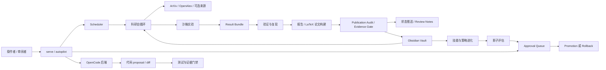

# AI-Researcher

[English](README.md)

AI-Researcher 是一个证据优先、可常驻运行的自动科研操作系统。它的重点不是“让模型写一篇像论文的文本”，而是把真实来源检索、OpenCode 代码生成、定时自循环、Obsidian 知识库、结果验证、论文构建、推送通知、人工审批和受控自进化连成一条可审计的工程链路。

一句话理解：AI-Researcher 可以定时发现研究线索，把需要写代码的任务交给 OpenCode 起草，把实验和审查结果写回 Obsidian，并在证据不足时自动阻断论文级声明。


> 当前状态：本地 MVP 和核心研究闭环组件已具备测试覆盖。仓库包含 Obsidian vault 底座、OpenCode 集成契约、可选通道 adapter runbook、`serve` / `autopilot` 常驻入口、公开来源文献检索、真实 benchmark demo、验证与报告门禁、LaTeX 论文构建和受控自进化脚手架。它还不是生产级多用户服务；除非真实 cycle artifact 通过 publication audit 和 physical evidence gate，否则不能声称达到 CCF-B/三区期刊可发表水平。

## 它现在能做什么

| 能力 | 当前已有内容 | 入口 |
|---|---|---|
| 自动连接 OpenCode | 把 OpenCode 当作外部代码起草后端；OpenCode 写 proposal/diff，AI-Researcher 负责验证、审批、记忆和最终接收。 | `airesearcher code-agents opencode init`，`integrations/opencode/code-agent.json` |
| 定时自循环 | 周期性执行文献刷新、相似工作检查、实验、复现、评审、发表级审计、论文构建和 follow-up 写入。 | `airesearcher serve`，`airesearcher autopilot --watch` |
| 定期推送与审批 | 记录可选通道 adapter 元数据，并把危险动作映射到 AI-Researcher 的 approval queue。 | `airesearcher channels adapters init`，`.airesearcher/runtime-approvals.json` |
| OA 优先 PDF 源 manifest | 把 ScanSci PDF 记录为可选后端，但默认只允许开放获取/合法来源；绕过型或受限来源必须审批。 | `airesearcher pdf-sources scansci-pdf init`，`integrations/scansci-pdf/pdf-source.json` |
| Obsidian 核心知识库 | 把文献、项目进展、实验、证据、issue、失败、技能、策略、review 和回滚历史都写成可读 Markdown。 | `autoresearch-vault/`，`airesearcher obsidian-setup` |
| 证据门禁 | 缺少 run record、validation、复现、review、audit、paper build 或 PDF 时，阻断发表级声明。 | `publication-audit`，`paper-build`，`evidence-gate` |
| 受控自进化 | 把重复失败和成功模式沉淀为 skill/strategy 候选，但 promotion 需要验证、影子评估、人工审批和回滚路径。 | `skill-evolve`，`skill-polish-audit`，vault 中的 strategy cards |

## 普通用户快速安装


需要先准备：

- Python 3.10 或更高版本
- Git
- Node.js 20+（如果使用 npm 风格入口）
- 可选：OpenCode，用于让 AI-Researcher 自动委托代码编写任务
- 可选：Obsidian，用于可视化浏览知识库

安装项目：

```bash
git clone <your-fork-or-repo-url>
cd AIResearch
python -m pip install -e .
npm install
airesearcher doctor
```

启动首次部署配置向导：

```bash
airesearcher setup
# 或
npm run setup
```

这个向导会先让用户选择模型供应商预设，再确认或修改 API base URL 和 model name，然后填写 API key，并可选填写微信/飞书 webhook 或 app 凭据。随后它会初始化 `autoresearch-vault/`、`integrations/` 下的 runbook/manifest，以及本地 slash command 模板。它不会安装第三方代码后端或通道插件。真实密钥只写入 `.env`；`config.yaml` 只保存非密钥配置。根目录 `.env` 已被 git 忽略，不能提交。

如果想手动配置：

```bash
cp .env.example .env
```

然后填写：

```text
AUTORESEARCH_LLM_BASE_URL=...
AUTORESEARCH_LLM_MODEL_NAME=...
AUTORESEARCH_LLM_API_KEY=...
```

初始化 Obsidian 知识库：

```bash
airesearcher obsidian-setup --vault autoresearch-vault --project-id autoresearch-system
```

先跑一个本地 demo：

```bash
airesearcher run-demo --demo tabular_baseline
```

再跑一个真实公开 benchmark demo：

```bash
airesearcher run-demo --demo pendigits_centroid_baseline --timeout-seconds 60
```

启动常驻运行：

```bash
airesearcher serve --permission-mode approve-dangerous
```

完整 cycle 结束后，面向用户的论文产物会发布到 `outputs/<project-id>/`。LaTeX 编译成功时，这里会包含 `<project-id>-<cycle-id>.pdf`，以及指向手稿、publication audit、evidence gate、related-work inspection 和 cycle summary 的 manifest。

另开一个终端查看和批准待审批动作：

```bash
airesearcher runtime list
airesearcher runtime approve latest --approved-by operator
```

## 自动连接 OpenCode

AI-Researcher 的 OpenCode 集成不是把 OpenCode 源码复制进仓库，也不是让 OpenCode 直接决定合并。它采用的是“外部代码起草后端 + AI-Researcher 验证接收”的模式。

初始化 OpenCode 集成契约：

```bash
airesearcher code-agents opencode init
airesearcher code-agents opencode list
```

这会写入或刷新 `integrations/opencode/code-agent.json`。该文件记录：

- 如何通过 `opencode run`、`opencode serve` 或 `opencode acp` 调用 OpenCode；
- shell、edit、webfetch、websearch 等动作的建议权限；
- OpenCode 生成的 diff 为什么只能作为 proposal；
- AI-Researcher 在接收前要运行哪些验证门禁；
- provider credentials 应该放在哪里；
- 为什么不能把 OpenCode 源码 vendor 到本仓库。

推荐工作流：

1. AI-Researcher 创建或选择一个有边界的任务范围。
2. OpenCode 在这个范围里起草代码改动。
3. AI-Researcher 捕获 diff 和产物。
4. 根据改动风险运行测试、lint、类型检查、真实 API smoke、publication gate 或 evidence gate。
5. 通过或失败的证据写入 `Agent.md`、`Problem.md` 和 `autoresearch-vault/`。
6. 只有相关门禁通过后，才允许进入 commit 或 release。

## 定时自循环与定期推送

AI-Researcher 可以作为本地机器或服务器上的常驻研究 operator。

```bash
airesearcher autopilot --watch --cycles 0 --interval-seconds 86400
```

一轮 cycle 可以包括：

1. 来源冷却状态 preflight；
2. ArXiv / OpenAlex 真实文献刷新，Semantic Scholar 可选；
3. 有来源支撑的相似工作和 novelty 检查；
4. 非学术来源的 broad inspiration refresh；
5. 本地 demo 或真实公开 benchmark 实验；
6. 命令行复现实验 rerun；
7. 可选真实 LLM 证据评审；
8. 发表级质量审计；
9. LaTeX 论文构建；
10. physical evidence gate；
11. Obsidian review、issue、failure、skill 和 strategy 写入；
12. 本地 follow-up state 合并。

初始化可选推送通道 adapter runbook：

```bash
airesearcher channels adapters init
airesearcher channels adapters list
```

生成的 `integrations/channels/adapters.json` 用来记录可选上游消息 adapter，例如飞书/Lark、微信、企业微信、Telegram、Slack、Teams、webhook 等通道。有些 adapter 最初写给其他生态使用；AI-Researcher 不安装、不 vendor、不直接运行它们。密钥应保存在 `.env` 或平台 secret store。

把通信软件里的 `/approve` 映射到：

```bash
airesearcher runtime approve latest --state .airesearcher/runtime-approvals.json --approved-by <operator>
```

这样系统可以定期推送状态、阻塞原因和审批请求，但高风险动作仍由人确认。

## PDF 来源后端

AI-Researcher 可以把 ScanSci PDF 记录为可选 PDF 获取后端，但默认策略是 OA-first / legal-only。manifest 允许的默认来源包括 publisher-direct open access、arXiv、PubMed Central、Unpaywall、OpenAlex、DOAJ、CORE 和 Europe PMC。Sci-Hub、LibGen、WebVPN/CARSI、Tor、Cloudflare bypass、带凭据的图书馆代理等路径必须走人工审批和许可证审查。

```bash
airesearcher pdf-sources scansci-pdf init
airesearcher pdf-sources scansci-pdf list
```

## Obsidian 核心知识库与管理机制


`autoresearch-vault/` 是 AI-Researcher 的核心记忆底座。它既是人能直接打开阅读的 Markdown vault，也是机器能检索、更新、回滚和复用的结构化状态层。

这不是“附带的笔记目录”。自循环和自进化都依赖它：每一轮运行写回 vault，下一轮运行再从 vault 读取上下文、失败、技能、策略和证据。

### Vault 里放什么

| 区域 | 作用 |
|---|---|
| `exploration/` | 跨项目主题、方法、数据集、失败模式、可复用技能和策略卡。 |
| `projects/<project-id>/knowledge/` | 单项目文献笔记、来源事实、方法卡和数据集卡。 |
| `projects/<project-id>/experiments/` | 实验记录、配置、命令、run ID、指标和产物链接。 |
| `projects/<project-id>/evidence/` | claim 到 evidence 的映射、验证状态、来源 artifact 和审计引用。 |
| `projects/<project-id>/issues/` | review findings、blocker、缺失证据、失败检查和后续任务。 |
| `projects/<project-id>/experience/` | 失败案例、经验沉淀、候选 skill 和 strategy observations。 |
| `projects/<project-id>/paper/` | paper-build 摘要、review note、citation package note 和复现上下文。 |

### 管理机制

- 每个 Markdown 条目带 YAML frontmatter，既方便 Obsidian 阅读，也方便程序解析。
- Wiki-links 和 backlinks 连接文献、假设、实验、证据、失败、技能和策略。
- Topic index 帮助后续 cycle 稳定地找回相关上下文。
- Permission check 限制 Project Agent 只能写入自己的 project zone。
- 被拒绝的写入和需要审批的动作会变成 audit event，而不是悄悄失败。
- Version history、backup 和 rollback 让知识库进化可以回退。
- Issue 和 failure 是一等对象，下一轮 cycle 可以直接从已知 blocker 继续。
- Skill card 和 strategy card 只有在验证、影子评估、审批和回滚路径齐全时才允许 promotion。

最重要的节奏是：每轮写回，后续读取；成功沉淀成技能，失败沉淀成任务，策略变更必须可回滚。

## 系统结构设计




## 证据、审计与论文门禁


AI-Researcher 不把“看起来像论文的报告”当成可发表成果。强声明必须绑定真实物理产物：

- cycle summary；
- 文献和相似工作证据；
- 第一次 run record；
- validation report；
- evidence map；
- 复现实验 rerun record；
- evidence-constrained review；
- publication audit；
- LaTeX build JSON；
- 编译出的 PDF；
- paper-quality report。

手动检查一个完成 cycle：

```bash
airesearcher publication-audit runs/autopilot/<cycle-id>/cycle-summary.json --target ccf-b
airesearcher paper-build runs/autopilot/<cycle-id>/demo/<demo-id>/report/report.md --template-id generic-article-one-column
airesearcher evidence-gate runs/autopilot/<cycle-id>/cycle-summary.json --publication-audit runs/autopilot/<cycle-id>/publication-audit.json --paper-build-json runs/paper-build/<cycle-id>/paper-build.json
```

如果证据不足，系统应该留下可执行 follow-up，而不是把弱结果包装成论文级 claim。

## 受控自进化

自进化不是让系统随意改自己。AI-Researcher 的自进化对象主要是 skill、workflow、retrieval policy、validation policy 和 strategy card，而且必须经过验证和回滚设计。

写入候选 skill：

```bash
airesearcher skill-evolve \
  --parent-skill-id skill_evidence_bound_review \
  --issue-ref projects/autoresearch-system/issues/example_issue \
  --change-summary "Tighten the evidence bundle before live review." \
  --proposed-action "Attach run-record evidence before review." \
  --validation-check "Held-out review has zero unsupported reproduction claims."
```

promotion 前运行 skill polish audit：

```bash
airesearcher skill-polish-audit \
  --skill-id <candidate_skill_id> \
  --peer-ref https://github.com/LearnPrompt/luban-skill \
  --live-evidence-ref runs/skill-polish/demo-validation.json \
  --install-ref .opencode/skills/ai-researcher-evidence-gate/SKILL.md \
  --release-ref autoresearch-vault/exploration/skills/rejected/demo_rejections.md
```

策略进化也遵循同样规则：先提出候选，再离线评估，再影子运行，再人工审批，再灰度上线；如果 reward、安全、复现或证据完整性退化，就回滚。

## 常用命令

| 目标 | 命令 |
|---|---|
| 检查本地安装 | `airesearcher doctor` |
| 引导式首次部署 | `airesearcher setup` 或 `npm run setup` |
| 只配置模型和通道 | `airesearcher deploy-setup` |
| 只初始化 Obsidian vault | `airesearcher obsidian-setup --vault autoresearch-vault --project-id autoresearch-system` |
| 初始化 OpenCode 后端契约 | `airesearcher code-agents opencode init` |
| 初始化通道 adapter runbook | `airesearcher channels adapters init` |
| 初始化 ScanSci PDF 来源 manifest | `airesearcher pdf-sources scansci-pdf init` |
| 运行 toy demo | `airesearcher run-demo --demo tabular_baseline` |
| 运行真实 benchmark demo | `airesearcher run-demo --demo pendigits_centroid_baseline --timeout-seconds 60` |
| 启动常驻 runtime | `airesearcher serve --permission-mode approve-dangerous` |
| 运行每日 autopilot | `airesearcher autopilot --watch --cycles 0 --interval-seconds 86400` |
| 查看 Agent、队列、diff 和产物预览 | `airesearcher monitor` 或 `npm run monitor` |
| 查看待审批动作 | `airesearcher runtime list` |
| 批准最新动作 | `airesearcher runtime approve latest --approved-by operator` |
| 本地质量门 | `python scripts/check.py` |

## 仓库结构

```text
.
├── autoresearch-vault/              # Obsidian 兼容知识记忆
├── docs/assets/readme/              # README 插图
├── integrations/opencode/           # OpenCode 后端契约
├── integrations/channels/           # 可选消息 adapter runbook
├── runs/                            # 本地运行产物
├── src/autoresearch/                # Python package
├── tests/                           # 单元、冒烟、性质和集成测试
├── .kiro/specs/auto-research-system # 可执行实施计划
├── Agent.md                         # Agent 必填改动日志
├── Problem.md                       # 问题、阻塞和风险日志
├── config.yaml                      # 非密钥运行配置
└── pyproject.toml
```

## 边界

AI-Researcher 的默认立场是：有证据的地方自动化，缺证据的地方阻断并留下任务。

- 不会自动投稿或公开发布论文。
- 不会把 API key 写入 git。
- 不会把 OpenCode 生成的 diff 直接当作已接受代码。
- 不会在没有验证、审批和回滚路径时 promotion skill 或 strategy。
- 不会用 toy demo 或“像论文的 Markdown”声称发表级成果。
- 还不是生产级多用户产品；部署和通信通道需要操作者审阅。

## 文档

- [研究计划](AutoResearch_System_Research_Plan.md)：研究范围、架构、Agent 模型、验证机制、风险矩阵和路线图。
- [实施计划](AutoResearch_System_Execution_Plan.md)：阶段计划、里程碑、schema、测试策略、成本模型和发布门槛。
- [实现任务](.kiro/specs/auto-research-system/tasks.md)：详细可执行任务清单。
- [发布门槛清单](docs/release-gate.md)：创建发布标签、演示或生产可用声明前的检查。
- [Agent 改动日志](Agent.md)：所有编码 Agent 必须更新的变更日志。
- [问题日志](Problem.md)：问题、阻塞和风险记录。
- [第三方声明](THIRD_PARTY_NOTICES.md)：设计参考和集成的许可证与署名说明。

## 贡献方式

完整开发流程见 [CONTRIBUTING.md](CONTRIBUTING.md)。

修改文件前：

1. 阅读 [AGENTS.md](AGENTS.md)。
2. 查看 [.kiro/specs/auto-research-system/tasks.md](.kiro/specs/auto-research-system/tasks.md)。
3. 检查 [Problem.md](Problem.md) 中的未关闭问题。
4. 用最小改动完成任务。
5. 运行相关验证命令。
6. 将改动摘要追加到 [Agent.md](Agent.md)。

## 许可证

AI-Researcher 使用 [Apache License 2.0](LICENSE) 发布。SPDX 标识为 `Apache-2.0`。署名信息和第三方参考声明见 [NOTICE](NOTICE) 与 [THIRD_PARTY_NOTICES.md](THIRD_PARTY_NOTICES.md)。
