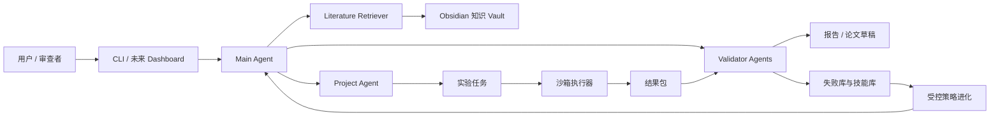

# AI-Researcher

[English](README.md)

AI-Researcher 是一个早期 Python 项目，目标是构建“证据优先”的自动化计算科研平台。长期目标是编排一个受限、可审计的科研闭环：文献检索、知识建模、假设生成、实验设计、沙箱执行、结果验证、论文草稿、模拟审稿，以及受控策略进化。

> 当前状态：规划与脚手架阶段。仓库目前包含研究计划、实施计划、Python 包骨架和详细任务清单。可运行 CLI、测试套件和可信 MVP 闭环属于 Phase 0 与 Phase 1 任务，尚不是已完成能力。

## 项目为什么存在

很多自动科研演示从“写作”开始。这个项目从“证据”开始。一个结果只有在能追溯到真实运行、配置、指标文件、源产物和验证状态时，才能进入论文或报告中的 claim。

这个项目的核心产品想法是一个兼容 Obsidian 的统一知识库，固定放在项目根目录的 `autoresearch-vault/` 目录下。它既是人类可读的科研记忆，也是机器可读的自循环、自进化底座。文献笔记、项目进度、问题、实验记录、失败、技能、证据链接和策略版本都写入同一个 Markdown 双链 vault，系统才能在不依赖黑盒数据库的前提下持续复盘和改进。

第一个可用里程碑不是完全自治的科学家，而是一个最小可信科研闭环：能够运行一个小型计算实验，收集产物，验证结果，并生成可复现的 Markdown 报告。

## 核心原则

- 先证据，后结论。
- 先可复现，后自动化。
- 高成本、高风险、对外发布动作必须人工审批。
- 默认沙箱执行。
- 项目根目录 `autoresearch-vault/` 下兼容 Obsidian 的 Markdown vault 是研究、失败、技能和策略进化的共享记忆。
- 项目启动和定时刷新都必须联网检索文献与相近工作；vault 只沉淀有来源支撑的总结，不能沉淀虚构 claim。
- 每个实验记录 run ID、commit、配置 hash、数据 hash、指标、日志、产物和成本。
- 每个 Agent 改动必须写入 [Agent.md](Agent.md)。
- 每个发现的问题、阻塞或风险必须写入 [Problem.md](Problem.md)。

## 目标架构



## 路线图

| 阶段 | 重点 | 产出 |
|---|---|---|
| Phase 0 | 项目治理与工程基线 | Agent 规则、问题台账、Obsidian vault 契约、schema、配置、日志、冒烟测试、最小 CLI |
| Phase 1 | 最小可信闭环 | Obsidian 知识库、文献检索、实验执行、验证、Markdown 报告 |
| Phase 2 | 自动化研究助手 | 多 Agent 工作流、证据图谱、论文草稿、引用校验、模拟审稿 |
| Phase 3 | 自循环平台 | 基于 Obsidian 的候选方向池、调度器、失败库、技能卡、监控、回滚 |
| Phase 4 | 受控自进化 | 基于 Obsidian 的策略卡、离线回放、金集测试、影子评估、灰度发布 |
| Phase 5 | 产品化平台 | Web Dashboard、多用户权限、插件系统、部署、合规审计 |

详细可执行任务见 [.kiro/specs/auto-research-system/tasks.md](.kiro/specs/auto-research-system/tasks.md)。

## 仓库结构

```text
.
├── AutoResearch_System_Research_Plan.md
├── AutoResearch_System_Execution_Plan.md
├── AGENTS.md
├── Agent.md
├── autoresearch-vault/
├── Problem.md
├── README.md
├── README.zh-CN.md
├── pyproject.toml
├── src/
│   └── autoresearch/
└── .kiro/
    └── specs/
        └── auto-research-system/
```

## 开发环境

前置条件：

- Python 3.10+
- Poetry
- Git

安装依赖：

```bash
poetry install
```

运行本地质量门禁：

```bash
python scripts/check.py
```

该命令与默认 CI 检查保持一致：`poetry run ruff check src tests`、`poetry run mypy src` 和 `poetry run pytest tests/smoke tests/unit`。

该命令是当前本地开发和默认 CI 的硬性检查入口。

## 文档

- [研究计划](AutoResearch_System_Research_Plan.md)：研究范围、架构、Agent 模型、验证机制、风险矩阵和长期路线。
- [实施计划](AutoResearch_System_Execution_Plan.md)：阶段计划、里程碑、schema、测试策略、成本模型和发布门槛。
- [Kiro 需求](.kiro/specs/auto-research-system/requirements.md)：Obsidian 知识库、Agent 进化、知识自动演化和项目权限的原始需求。
- [Kiro 设计](.kiro/specs/auto-research-system/design.md)：Obsidian vault 结构、知识 API、访问控制和实现优先级的原始设计。
- [实现任务](.kiro/specs/auto-research-system/tasks.md)：详细可执行任务清单。
- [Agent 改动日志](Agent.md)：所有编码 Agent 必须更新的改动日志。
- [问题台账](Problem.md)：问题、阻塞和风险记录。
- [发布门禁清单](docs/release-gate.md)：创建发布标签、演示或生产可用声明前必须完成的检查。

## 贡献方式

修改文件前：

1. 阅读 [AGENTS.md](AGENTS.md)。
2. 查看 [.kiro/specs/auto-research-system/tasks.md](.kiro/specs/auto-research-system/tasks.md) 中的当前任务。
3. 检查 [Problem.md](Problem.md) 中的未关闭问题。
4. 用最小改动完成任务。
5. 运行相关验证命令。
6. 将改动摘要追加到 [Agent.md](Agent.md)。

## 许可证

AI-Researcher 采用 [Apache License 2.0](LICENSE) 许可证发布。SPDX 标识为 `Apache-2.0`。
