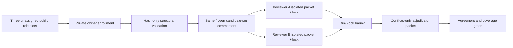

# Benchmark-validity result-blind human-review handoff

## Decision

The benchmark-validity census cannot treat repeated Agent runs as independent
scientific reviewers. Task `263.6.7.2.2` therefore freezes exactly two real
reviewer roles and one distinct adjudicator role before formal search or
critical coding. All three public slots remain unassigned until the project
owner supplies accountable natural persons through private evidence.

This is a measurement and responsibility boundary, not an anti-automation
position. Automation is allowed to verify schemas, content hashes, role
separation, pairwise-distinct opaque person identifiers, receipt binding, and
stage order. It cannot establish natural-person status, truthfulness,
qualification, legal independence, conflict disclosure, or informed consent.

## Private/public evidence split

The private owner record contains seven fields: identity, qualification,
conflict disclosure, consent, independence, accepted scope, and timestamp.
None may enter the repository. The public research object contains only
hash-only receipts bound to the immutable protocol, handoff, role requirement,
packet template, role, and opaque person identifier.

An empty or structurally valid receipt is not authorization. Human enrollment
still requires owner verification and an explicit approval event.

## Blinding and lock order

Reviewer A cannot see reviewer B's draft or lock, and vice versa. Both locks
must bind the same protocol, handoff, candidate-set hash, exact packet template,
and their own assignment receipt. The adjudicator is a third person and receives
only conflict fields after both locks. Adjudication cannot repair missing
coverage or failed pre-adjudication agreement.

## Formal evidence

Package: `runs/manual-live/task2636722-human-review-handoff-v2/`

- report: `c070839d39aa9b5a5b18af170e4b7c8690faf342399c1c98a2ef13ecba0f17b7`;
- handoff: `2abc9296b2b14471ad8236e1d91b501f9c6c320950a3552ac771409b4df9fa18`;
- projection: `bf9298474bddd74dc274984c474e5d27b92f8cea578b7a2963b6f1841976c3f5`;
- replay: `17c57008cdf404c1ecbe74ab670773775d881dc6811d709dca53532ca1c1d259`;
- source: `c643266e298d2bc7e39f643a9cd0ddb5420a7ae1892afa9b9f131220304c15f5`;
- runner: `dd4666051fe2f9c0548712cac884994832540f56549874f5af8277be78ed1c63`;
- manifest: `1060176b4d23cf13ca5cbde23d8f664adfdc9334048adbd7737d2926abf6c6a1`.

The package reproduces in two clean Python installations. Identity,
assignment, reviewer-lock, adjudicator-access, formal-search, screening,
critical-coding, Admission-Card, outcome, and model-call counts remain zero.
Formal census, publication, release, and submission are false.

## Remaining publishability boundary

The project owner must now privately enroll two independent reviewers and one
different adjudicator, retain the original evidence outside Git, submit only
bound hash receipts, and explicitly authorize Task `263.6.7.3`. The complete
28-query census, recall test, family/revision deduplication, dual coding,
agreement/coverage gates, and frozen synthesis have not yet happened.

## Related

- [[benchmark-validity-pagination-erratum-2026]]
- [[benchmark-validity-result-blind-harness-2026]]
- [[benchmark-validity-systematic-mapping-protocol-2026]]
- [[../projects/ai_researcher_system/progress/task-263-6-7-2-2-human-review-handoff]]
