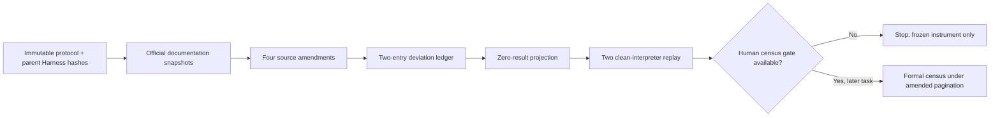

# Benchmark-validity pre-extraction API pagination erratum

## 1. Decision

The original Task `263.6.7.1` protocol remains immutable. Before any formal
query or non-pilot extraction, Task `263.6.7.2.1` froze an additive erratum
bound to that protocol and to the exact Task `263.6.7.2` Harness commit,
source, report, projection, and manifest.

The erratum resolves two pre-result findings:

1. Crossref returns a cursor even on its last page, so exhaustion must use a
   short page (`items < rows`) rather than an empty cursor.
2. DBLP documents `q`, `f`, `h`, `c`, and a 1,000-hit cap, but its official
   search syntax does not document a year-field filter. The previously planned
   year-qualified fallback is therefore not executable as a defensible exact
   partition.

No research result was consulted to select either correction.

## 2. Frozen source rules

| Source | Frozen behavior | Failure behavior |
|---|---|---|
| arXiv | Keep the original `start` plus `totalResults` rule | Empty page while more results are declared fails closed |
| OpenAlex | Start `cursor=*`; follow `meta.next_cursor`; exhaust only on null cursor plus empty results | Non-empty page without continuation is partial |
| Crossref | Start `cursor=*`; continue full pages with `message.next-cursor`; stop when `items < rows` | Full page without cursor is partial/error |
| DBLP | Keep exact frozen `q`, `f=0`, `h=1000`, `c=0`; post-filter returned metadata year | `@total >= 1000` is retained partial and stops; no invented `year:` query |

Primary documentation:

- Crossref cursor guidance:
  <https://www.crossref.org/documentation/retrieve-metadata/rest-api/tips-for-using-the-crossref-rest-api/>
- DBLP API parameters: <https://dblp.org/faq/13501473.html>
- DBLP query syntax: <https://dblp.org/faq/1474589.html>
- OpenAlex cursor paging:
  <https://developers.openalex.org/guides/page-through-results>

Each page is retained as exact raw bytes with retrieval time, final-URL hash,
body hash, required/absent marker verification, and a content-addressed path.

## 3. Why the DBLP stop is the valid correction

An undocumented `year:` token could be interpreted as ordinary free text and
match a title or venue rather than a structured publication-year field. Even
if it returned plausible records, it would not prove that the four year
partitions were exhaustive or disjoint. The evidence-first response is to
retain the capped response, label it partial, and stop prospectively.

This prevents the Loop from optimizing query syntax after seeing result
counts. It also keeps Graph provenance truthful: a capped-source node remains
an explicit limitation instead of being silently converted into a complete
search claim.

## 4. Result-blind implementation boundary

The frozen runner rejects benchmark outcomes, model outputs, screening
decisions, Admission Cards, and downstream permissions. Formal-search,
bibliographic-record, screening, and Admission-Card counts are all zero;
benchmark-outcome access, candidate-model calls, actual human identities,
publication claim, release, and submission are false.

## 5. Formal evidence

Package: `runs/manual-live/task2636721-pagination-erratum-v2/`

- report:
  `3fefa90f73c5e6990f1817c0a06f33707b8a5e553f344a321cab18451f50310b`;
- erratum:
  `f0ffc351a43eb8ac0176cca787ad53f9af4e343cc2554aca068a20215f81d571`;
- result-free projection:
  `b36624099cdda8030548068290596c41411b8e4bbc15611e3db519b2add79e7c`;
- replay certificate:
  `f2e83a372927b8dbebec5c48974c7b6a46d997205d8a67eaf2fe9de2c97d98c8`;
- frozen runner:
  `c0b2ee4d56286d807fd2f7a4c18d0174127fdf4dd7a70594e6a28b8a110b1b58`;
- erratum source:
  `1d3e3e364a6f3a247d8e5000f78ccc9b55f6bdcd03a096f58f2ac2321c5155d4`;
- integrated Harness source:
  `f22c9bbc2a528d2ae9ab58a96ca4ddcdb4cc26fb0158deba458251d4e22fe227`;
- manifest:
  `a62d742e9466369eb5e573871b413e6c71a9aee3fff1a1e44d178593facc3ffd`.

Two distinct clean Python installations reproduced the exact projection. The
live smoke fetched only the four documentation pages and issued no formal
bibliographic query. An idempotent loader rerun recursively rehashed the whole
package.

## 6. Remaining publishability boundary

Closing API semantics does not produce a paper-level scientific result. Task
`263.6.7.3` still requires two real independent reviewers and a distinct
adjudicator, the complete 28-query census and citation chaining, formal
known-item recall, at least 20 non-pilot families, locked dual coding,
agreement and evidence-coverage gates, and the frozen descriptive/sensitivity
analysis. A capped DBLP query or any failed human/sample/recall/coverage gate
must end as a registered partial or diagnostic negative.

## Related

- [[benchmark-validity-result-blind-harness-2026]]
- [[benchmark-validity-systematic-mapping-protocol-2026]]
- [[graph-harness-loop-open-science-2026]]
- [[../projects/ai_researcher_system/progress/task-263-6-7-2-1-pagination-erratum]]
