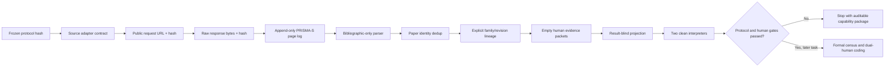

# Benchmark-validity result-blind search Harness

## 1. Outcome

Task `263.6.7.2` turns the immutable Task `263.6.7.1` protocol into a
result-blind retrieval and evidence-preparation instrument. It can query and
parse bibliographic metadata, retain exact raw responses, reconstruct an
append-only search history, deduplicate papers, cluster explicit benchmark
family/revision lineage, evaluate frozen known-item sentinels, and create empty
human-coding packets.

It cannot inspect benchmark outcomes, make a screening or family decision,
create a Benchmark Admission Card, assign a human identity, run a candidate
model, execute the formal 28-query census while a protocol compatibility
blocker exists, or authorize a scientific/publication claim.

The formal status is `ready-for-capability-only`.

## 2. What the real API check established

The opt-in live smoke sent one bibliographic CORE-Bench probe to each of arXiv,
Crossref, DBLP, and OpenAlex. All four current response shapes were parsed and
their exact response bytes were retained. Four raw responses produced four
bibliographic-only records, with zero retry.

This is an instrument capability result, not a literature result:

- formal search executions: `0`;
- formal known-item recall claims: `0`;
- screening decisions: `0`;
- Admission Cards: `0`;
- benchmark outcomes accessed: `false`;
- candidate-model calls: `false`.

The first live attempt failed correctly after Crossref returned HTTP 200 but no
`next-cursor`: the capability request had not started cursor paging with
`cursor=*`. The raw response and append-only failure log were retained in the
v1 directory. Adding the documented cursor initialization fixed the capability
probe; it did not alter the frozen formal protocol or reinterpret the failed
attempt.

## 3. Protocol/API incompatibility discovered before extraction

Current official Crossref guidance says cursor paging should start with
`cursor=*`, that `next-cursor` may still be returned on the final page, and
that exhaustion is identified when the item count is below `rows`:

<https://www.crossref.org/documentation/retrieve-metadata/rest-api/tips-for-using-the-crossref-rest-api/>

The frozen protocol instead says to follow `next-cursor` until it is empty.
These rules are not equivalent. The Harness therefore records
`crossref-last-cursor-termination-mismatch` as a formal blocker and implements
the current parser behavior without pretending that it is already authorized
for the frozen census.

DBLP officially caps the publication search API at 1,000 hits. The protocol
predeclares a 2023/2024/2025/2026 split if the cap is reached, but the exact
year-qualified backend queries are not frozen:

<https://dblp.org/faq/13501473.html>

OpenAlex's current deep-paging guidance confirms an initial `cursor=*` followed
by `meta.next_cursor`:

<https://developers.openalex.org/guides/page-through-results>

The correct response is an additive, pre-extraction erratum bound to the
original protocol hash—not a silent code change and not a post-result protocol
rewrite. This is tracked as Task `263.6.7.2.1` and `P-20260731-032`.

## 4. Harness architecture

- Graph Engineering stores request→response→record→paper→family→revision
  lineage without converting graph nodes into statistical units.
- Harness Engineering separates API capability, formal search, parsing,
  screening, coding, analysis, and claim authorization.
- Loop Engineering makes a parse error, capped source, protocol deviation, or
  human-gate failure a retained terminal state instead of a prompt-level retry
  until success.
- Open Science binds raw bytes, timestamps, headers, hashes, logs, schemas,
  environments, failures, and empty packets in one recursively checked package.

## 5. Why this still is not a publishable benchmark-validity result

The Harness solves instrument reliability and provenance. It does not yet
solve retrieval completeness, sample adequacy, semantic/legal coding,
inter-rater reliability, evidence coverage, or the preregistered descriptive
analysis. A real paper-level claim still requires:

1. the additive pagination erratum before the first formal extraction;
2. execution of all frozen searches and citation chaining;
3. formal known-item recall at least 0.90;
4. at least 20 additional non-pilot benchmark families;
5. two real independent reviewers plus a distinct adjudicator;
6. agreement and evidence-coverage gates;
7. exact frozen descriptive/sensitivity analysis and independent review.

If those gates fail, the legitimate endpoint is an open search/card resource or
a bounded diagnostic negative. More Agent loops cannot substitute for the
missing independent evidence and human responsibility.

## 6. Formal evidence

Successful package:

`runs/manual-live/task263672-benchmark-validity-harness-v2/`

- report: `fbb2a633bb57f0bb9f9f1471b58e8b4b8367098923f07c052d712758cbef9a10`;
- projection: `30bdad36006badccca89f335ff092e34c2c7f3a5a4586e5aba982689c7ba8b2d`;
- replay certificate:
  `29ed35c21eeeea9abf3e6256b717d963d3b8fd797326cd56acd17069b31b77f8`;
- journal snapshot:
  `03ecc8776f4e995aa932db3d6d2be9300b287c4dce3f43f0c66d132745233f71`;
- frozen runner:
  `46a30b615a3a85cae1493340f17fd3914927ac3952db869fa5dfd7912852fb45`;
- manifest:
  `688599b0b46c1502c79e9046f53dd96183989f6fcba8134bc8491d26eef18b3f`.

Two distinct clean Python environments produced the same result-blind output
contract. The loader rehashes every raw, bibliographic, log, report, schema,
projection, replay, and Markdown artifact.

## Related

- [[benchmark-validity-systematic-mapping-protocol-2026]]
- [[graph-harness-loop-open-science-2026]]
- [[../projects/ai_researcher_system/progress/task-263-6-7-2-benchmark-validity-harness]]
