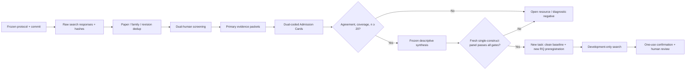

# AI Scientist 基准有效性系统映射：发表级研究路径的前瞻协议

## 摘要

AutoResearch 现在的主要失败已经不是“不会真实运行”。系统能检索文献、执行代码、保存失败、冻结
Graph/Harness/Loop、复演实验、生成论文和 Open Science 包。真正缺口是：没有一个新的科学研究对象
同时具备足量独立单位、逐来源权利、确定性 primary endpoint、强基线、有界算力和未被开发过程接触的
reserve。Task `263.6.6` 对四个官方候选的前置审计已经证明，公开 task 数量不能直接当作统计样本量，
公开仓库也不能直接当作数据许可或 sealed test。

因此 Task `263.6.7.1` 没有继续寻找“第五个容易跑的 benchmark”，而是把真正瓶颈转成一项可发表的
meta-research 问题：**AI Scientist / scientific-agent benchmark 到底有多少能支撑独立、合法、客观、
可复现且未污染的研究结论？** 本任务在读取任何新的 benchmark record 前冻结系统映射协议。正式状态
为 `frozen-pre-extraction`，检索执行、非 pilot 提取、benchmark outcome access 和 candidate-model
call 均为 0。

## 1. 为什么真实执行仍达不到可发表级

“能跑”到“可发表”之间不是一个连续分数，而是一个非补偿合取：

`Novelty ∧ ConstructValidity ∧ IndependentUnits ∧ Rights ∧ ObjectiveMeasurement ∧`
`StrongBaseline ∧ BoundedCompute ∧ SealedConfirmation ∧ Reproducibility ∧ HumanResponsibility`

本项目已经用真实证据排除了几个误诊：

1. **不是缺 Paper Agent。** Task 260 Route B 已经能通过内部论文、证据和独立复现门，说明写作后端
   可以形成 systems-paper candidate；它仍需人类判断新颖性、署名、许可和 venue。
2. **不是缺更长 Loop。** 已揭示面板上的继续适配只会增加 adaptive overfitting。Task 263.6.2 的
   完整技术重放既不利又在真实 workload deadline 上失去 exact replay，合法动作是停止旧 claim。
3. **不是 task 太少。** AutoSDT 的 5,148 条任务在来源聚类和许可过滤后最多对应 1,002 个
   labelled repositories；CORE-Bench 的 270 条任务实际只有 90 篇 paper；任务扩增不是新科学来源。
4. **不是公开就能用。** 软件许可证、上游内容权利、本地执行、派生、再分发和 sealed outcome 是
   不同问题；缺一项不能由 GitHub/Hugging Face 页面可见性补偿。
5. **不是 Reviewer 分数不够高。** Ideation–Execution Gap、MLRC-Bench 和本地确认结果共同说明，
   idea/reviewer score 与实际执行效果、独立确认和发表判断之间存在结构性断裂。[13]

所以当前“真实不可产出”的准确表述是：**系统真实地产出了许多可信阴性、无效和停止证据，但尚未获得
一个足以支持新机制因果主张的 scientific substrate。** 这是科研质量控制成功，不是软件没有输出。

## 2. 从相关研究借鉴什么

| 研究线索 | 借入系统的具体规则 | 不允许的外推 |
|---|---|---|
| PRISMA 2020 / PRISMA-S [1–2] | 保存数据库、完整检索式、日期、分页、原始响应、去重和每条排除理由 | 一张 PRISMA 图不自动证明检索完整 |
| Systematic Mapping [3] | 先冻结 taxonomy，再按 construct/year/maturity 做描述性地图 | 不把异质 benchmark 求一个“总效果” |
| BenchmarkCards / Benchmark Transparency [4–5] | 用结构化 card 记录 purpose、source、metric、limits、rights、responsibility | 文档完整不等于 benchmark 有效 |
| AI Scientist-v2 / Co-Scientist [6–7] | tree/tournament 只在 development 扩展候选，外部实验或独立面板压缩候选 | Agent 自评或 workshop 结果不代表主会/主刊发表能力 |
| Kosmos [8] | claim→literature→code→result 逐项溯源，长期运行保留 world-model 状态 | traceability 不等于 correctness |
| AstaBench / PaperBench / CORE-Bench [9–11] | Harness、task、evaluator、baseline、cost、failure、paper/capsule lineage 分开 | rubric/LLM judge、difficulty 或 attempt 不能冒充独立单位 |
| POPPER [12] | 结果前冻结 falsifier、error-control、promotion 和 stop；允许全部失败 | 不循环到获得有利结果为止 |
| FAIR4RS / PROV-O / RO-Crate [14–16] | exact revision/hash、Entity–Activity–Agent、环境、许可、失败和人类决策一起封装 | Open Science 不创造权利、新颖性或效应 |

这些工作共同支持的不是“取消科学家”，而是把机器擅长的广度、执行和记录放进可审计边界，由确定性
环境、独立确认和人类责任做不可补偿的终局门。

## 3. 冻结研究问题

1. **RQ1 — 伪样本量：** AI Scientist benchmark 的 headline task count 在按独立科学来源重计后
   收缩多少？
2. **RQ2 — 完整准入：** fixed-revision release 分别有多少通过 revision、lineage、四类 rights、
   deterministic endpoint、非决定性 LLM/human judge、strong baseline、bounded compute、seal 和
   contamination gate？有多少通过完整合取？
3. **RQ3 — 失败结构：** admission failure 与 missing evidence 在 construct、year、publication
   maturity 中如何分布？排除既有已知项或改变 lineage sensitivity 后结论是否保持？

这些都是描述性/治理性问题。本研究不估计某个 critic、Graph、Agent 数量或 Loop 算子的因果效果。

## 4. 前瞻性样本和检索

### 4.1 研究单位

- study unit：一个 `fixed-revision benchmark release`；
- independence unit：一个 `unique benchmark family`；
- task、seed、attempt、difficulty、Agent vote、同 family 的旧 revision：嵌套观测；
- 当前 AutoSDT-5K、ScienceAgentBench、CORE-Bench、QRData：protocol-development pilot；
- primary cohort：至少 20 个**额外** non-pilot family；
- total map：primary cohort 加 pilot secondary calibration，不把 pilot 叫作 independent confirmation。

一个 family 只选择 2026-07-31 截止前最新可固定的 release 进入横截面主分析；旧版本进入 longitudinal
relation table。这样既保留版本历史，又不把同一 task pool 的多次发布当成更多样本。

### 4.2 检索冻结

- 日期：2023-01-01 至 2026-07-31；
- 开放索引：arXiv、OpenAlex、Crossref、DBLP；
- 构念：literature discovery、scientific programming、data analysis、hypothesis validation、
  computational reproduction、experiment execution、full research lifecycle；
- 查询：每个索引绑定全部七个构念，共 28 条 source-specific query；
- 补充：对纳入论文只做一轮 backward references 和一轮 OpenAlex forward citations；
- recall：16 个 pre-protocol known-item sentinel 至少找回 90%；
- 若 DBLP 达到 1,000 上限，只允许按冻结的 2023/2024/2025/2026 年切分，不修改概念词；
- 所有 raw response 在去重前保存并哈希。

正式查询全文、请求参数、分页、间隔和重试已写入机器协议。Task `263.6.7.1` 没有执行这些查询，因而
协议提交时间早于新的筛选或提取。

## 5. Benchmark Admission Card

协议冻结 42 个字段和 12 个非补偿 gate。核心内容包括：

- release/family identity、paper/repository/dataset revision、artifact hash；
- headline task count、独立 source-group upper bound、lineage rule、compression ratio；
- local execution、software reuse、derivative creation、content redistribution 四种 rights；
- primary endpoint、metric、deterministic scorer command、LLM/VLM/human judge role；
- strongest baseline identity 和 exact command；
- dependency lock、CPU、GPU、cloud、privileged execution、download 和 wall-clock；
- split seal、outcome colocation、contamination policy；
- human responsibility、authorship、license、release 和 submission owner；
- 每一个决定对应的 primary evidence locator、revision、hash、retrieval time 和冲突记录。

证据状态固定为：`verified-pass`、`verified-fail`、`not-reported`、`unreachable`、`ambiguous`、
`conflicting`、`not-applicable`。只有第一种能通过 gate；只有有一手证据的 pass/fail 算 determinate
coverage。unknown 不是 false，也绝不能被自动补成 true。

## 6. 人类有效性边界

协议没有把 Agent 假装成两位编码者：

- 两位真实、相互独立的人类 reviewer 对 100% title/abstract、full text 和关键字段分别锁码；
- license、family/lineage、primary construct、独立单位、seal、outcome colocation 和 contamination
  必须双人编码；
- 第三位不同的人类 adjudicator 只在双边锁码后裁决，并记录依据；
- pre-adjudication exact agreement 必须至少 0.90；Cohen's kappa 可估时至少 0.80；无类别变化导致
  kappa 不可估时 exact agreement 必须 1.00；
- applicable critical evidence 的总体 coverage 至少 0.90，任何单字段至少 0.85；
- adjudication 不能把低一致性“修成通过”，也不能由系统自行给法律、署名或投稿结论。

当前尚未绑定三位真实人类身份。因此协议冻结成功，但正式筛选/关键提取仍由这个人类门阻止。

## 7. 冻结分析和停止

四个 primary endpoint 为：

1. 逐 gate `verified-pass / all eligible primary releases`，报告 n/N 与 95% Wilson interval；
2. 12 gate 全部通过的 complete-conjunction rate；
3. `headline task / independent source upper bound` 的 n、median、Q1、Q3、min、max，以及按 release
   cluster、10,000 次、seed `2636071` 的 median percentile bootstrap interval；
4. 每个 release 的 critical missing-evidence fraction 及按 release cluster 的 bootstrap interval。

按 construct、year、maturity、排除所有 pre-protocol known items、reported-versus-conservative unit、
complete-case 做预冻结 sensitivity；组内少于 5 时只给 raw count，不给不稳定 rate。

下列任一条件触发 `open-resource-or-diagnostic-negative`：

- 非 pilot family 少于 20；
- known-item recall 低于 0.90；
- 两个以上数据库在三次、七天窗口后仍不可用；
- 双人 agreement 或 evidence coverage 低于阈值；
- pilot 泄漏进 primary；
- task/seed/attempt/revision 被当作独立样本；
- 首条 non-pilot extraction 后修改 query、unit、codebook、endpoint 或 stop；
- candidate model、benchmark outcome 或有利 panel 被用于修改协议；
- 没有真实的两位 reviewer 和一位 adjudicator。

停止后的合法产物是检索日志、排除表、unknown/conflict 数据、cards 和诊断性资源；不能泛化成“全领域
没有合格 benchmark”，也不能转写为 Agent 机制有效/无效。

## 8. 系统级重构落点

- **Graph Engineering**：Evidence Graph 记录 claim/support/contradict；Scientific Lineage Graph 单独负责
  family/source grouping；Artifact Graph 绑定 revision/hash；Control Graph 记录 screening、adjudication 和
  stop。图节点数量不能用作独立样本量。
- **Harness Engineering**：搜索 adapter、raw-response store、dedup、card schema、baseline/scorer command、
  compute envelope 和 failure semantics 都是版本化 instrument；LLM judge 不能决定 primary pass。
- **Loop Engineering**：检索、screening、coding、adjudication、analysis 是固定状态机；citation chaining
  只有一轮；confirmation 不回流；协议变更产生新版本和 deviation，而不是覆盖旧规则。
- **Open Science**：协议、query、raw response、source revision、card、双人记录、analysis、negative 和
  environment 一起进入 PROV/RO-Crate；public view 仍由 human rights/release gate 控制。

## 9. 正式冻结证据

- frozen timestamp：`2026-07-31T09:38:52.843137Z`；
- protocol：`ed6088c225d5c7f7710ecb69507659003b5b97e06dc7c0ee005a81ed2712e8ed`；
- report：`0ed7f637ab10b10cc6b265c60020437255f64cc8d8a7259ad9eae9c9051a9408`；
- result-free projection：`e8628d484cfd3d5ead9dbb9b0e6610ca4f68adeebda4d0ef463bc3ac1d5e1881`；
- two-clean-interpreter replay certificate：
  `85e8ee4da9ea685b32f1896759e5235bec3e47fa59af8b12e0790f9026d9b93a`；
- frozen standard-library runner：
  `fb7c4f4e535a7168a89c48fc77a28772afd931e0cd61d2df29a6d62a6c8dee6f`；
- manifest：`9b99c6e4ccb43ea4982c546ebf6e18a34df63ae3f474ace3ed58ee2464a96b77`；
- formal local package：
  `runs/manual-live/task263671-benchmark-validity-protocol-freeze-v1/`。

两套 clean interpreter 的 environment hash 不同，但 projection 完全相同。七项 deterministic test 和
一项 opt-in clean-interpreter smoke 已通过。冻结包没有搜索结果、Admission Card 实例、benchmark
outcome、candidate model output、Research Question 或 confirmation panel。

## 10. 接下来的最短发表路径

短期保留两条互不污染的路线：

1. **Systems paper**：Task 260 Route B 进入独立人类 novelty/scope/authorship/license/venue review；
   贡献限定为 evidence-first research OS、failure semantics 和 reproducibility。
2. **Benchmark-validity paper**：先实现 result-blind source adapter、raw log、dedup 和 evidence-packet
   Harness；再由真实双人团队执行冻结 census。若 n、recall、agreement 或 coverage 失败，发表终点是
   方法和开放资源型 diagnostic negative。

机制研究继续暂停。即使系统映射找到一个合格 panel，也只允许创建下一项 clean-baseline/RQ
preregistration；不能在本研究中立即运行 critic、购买模型调用或打开 confirmation。

## 参考文献

1. Page et al. The PRISMA 2020 statement. *BMJ*, 2021. DOI: 10.1136/bmj.n71.
2. Rethlefsen et al. PRISMA-S. *Systematic Reviews*, 2021. DOI: 10.1186/s13643-020-01542-z.
3. Petersen, Vakkalanka, and Kuzniarz. Guidelines for systematic mapping studies in software
   engineering: an update. *Information and Software Technology*, 2015. DOI:
   10.1016/j.infsof.2015.03.007.
4. Sokol et al. BenchmarkCards. NeurIPS Datasets and Benchmarks, 2025.
5. Kovatchev and Lease. Benchmark Transparency. NAACL, 2024.
6. Yamada et al. The AI Scientist-v2. arXiv:2504.08066, 2025.
7. Gottweis et al. Accelerating scientific discovery with Co-Scientist. *Nature*, 2026.
8. Mitchener et al. Kosmos. arXiv:2511.02824, 2025.
9. Bragg et al. AstaBench. arXiv:2510.21652v2; ICLR, 2026.
10. Starace et al. PaperBench. ICML, 2025.
11. Siegel et al. CORE-Bench. arXiv:2409.11363; TMLR, 2025.
12. Huang et al. Automated Hypothesis Validation with Agentic Sequential Falsifications. ICML, 2025.
13. Si et al. The Ideation–Execution Gap. arXiv:2506.20803; ICLR, 2026.
14. Barker et al. Introducing the FAIR Principles for research software. *Scientific Data*, 2022.
15. W3C. PROV-O: The PROV Ontology. Recommendation, 2013.
16. Soiland-Reyes et al. Packaging research artefacts with RO-Crate. *Data Science*, 2022.

## 关联

- [[exploration/replacement-objective-data-tournament-2026]]
- [[exploration/publishability-recovery-ai-scientist-2026]]
- [[exploration/graph-harness-loop-open-science-2026]]
- [[projects/ai_researcher_system/progress/task-263-6-7-1-benchmark-validity-protocol-freeze]]
- [[projects/ai_researcher_system/index]]
