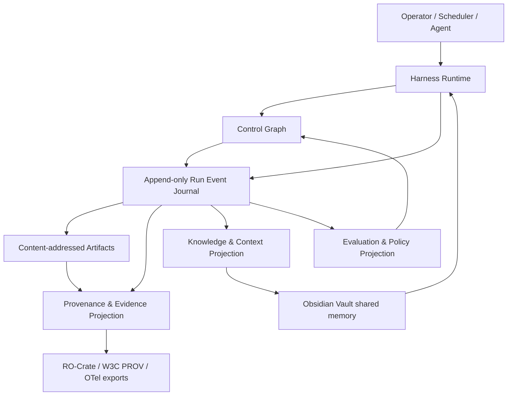

# AutoResearch vNext：Graph、Harness、Loop 与 Open Science 重构研究

> [!summary]
> AutoResearch 并不是缺少 Agent、Loop、Evidence 或 reproducibility 功能，而是这些能力被分别实现
> 在 workflow、competition、campaign、sprint、audit、evidence graph 与 vault 中，缺少统一、可回放、
> 可交换的运行时语义。vNext 不做“大爆炸重写”，而以一个内容寻址事件脊柱连接四个相互独立的图平面，
> 再用兼容适配器逐条迁移现有可信科研链。

## 1. 冻结问题与研究边界

本轮检索在修改实现之前冻结三个问题：

1. 2025—2026 年 evidence-first 自动研究系统需要哪些可验证的架构能力？
2. 当前仓库相对 Graph Engineering、Agent Harness、Loop Engineering 与 Open Science 的实际差距是什么？
3. 在不破坏现有哈希、负结果、审批门和 Obsidian 共享记忆的前提下，最短迁移路径是什么？

目标读者是项目所有者、技术负责人和后续实现 Agent。检索优先级为：规范与标准、官方运行时文档、
已发表论文、公开预印本、官方工程报告。2026 年预印本只作为新方向证据，不被当成已形成共识的标准。
“Graph Engineering”和“Loop Engineering”目前仍是快速演化术语；本计划只采纳其中可验证、可测试的
工程语义，不追随单一厂商命名。更新后的来源登记含 32 条规范、官方文档、论文或显式标注的预印本。

本轮明确不扩大以下边界：

- 不开放无限制实验执行、云 GPU 租赁、私有数据读取或自动投稿。
- 不让自进化修改安全、许可、审批、发表或结果判定规则。
- 不把某个图数据库、Agent SDK 或模型供应商变成系统真相来源。
- 不以更换框架代替科研有效性验证。

## 2. 交叉检索结论

### 2.1 Graph Engineering：需要四类图，不需要一个“万能图”

LangGraph 的当前官方运行时把 checkpoint、pending writes、thread、replay、fork、subgraph 和 interrupt
作为持久执行语义；Temporal 则把崩溃后恢复作为工作流运行时的基础保证。[S01][S02] 2026 年的
Structured Graph Harness 预印本把单体 Agent Loop 解释为一个不透明的单就绪单元调度器，并提出将
计划、执行、恢复分层；Execution Lineage 则强调稳定中间产物、显式依赖和按身份回放。[S03][S04]
Graph of Trace 把工具调用、代码执行和中间步骤实时组织成有向执行图，并在小规模专家评估中改善了
workflow 理解与可检查性；它支持可视化运行轨迹，但不能单独证明轨迹中的科学判断正确。[S29]

这些资料支持“显式图优于隐式对话状态”的方向，但并不支持把所有关系塞进同一个图。因此 vNext 使用：

1. **Control Graph**：节点、依赖、并行、条件、预算、审批、重试、停止、恢复和补偿。
2. **Provenance & Evidence Graph**：谁在何时用什么输入执行了什么活动，产生什么产物，哪些证据支持、
   反驳或限制哪些声明。
3. **Knowledge & Context Graph**：论文、概念、方法、数据集、假设、失败、技能、策略和来源锚定断言。
4. **Evaluation & Policy Graph**：任务、rubric、grader、门、权限策略、promotion、shadow、rollback 和
   适用范围。

四个平面可以互相引用稳定 ID，但拥有不同约束和生命周期。Control Graph 需要终止性与恢复语义；
Evidence Graph 需要来源、方向和验证状态；Knowledge Graph 允许不完整与时效性；Policy Graph 必须
fail closed。把它们合并会使控制边、知识关系和证据关系难以区分，也会让权限变更错误地污染科研事实。

### 2.2 Harness Engineering：模型只是系统的一部分

Meta-Harness 把 harness 定义为决定存储、检索和呈现什么信息的代码，并通过外循环搜索 harness；
Agentic Harness Engineering 进一步要求组件、经验和决策三类可观察性，使每次修改成为下一轮结果可
验证的预测。[S05][S06] AI Harness Engineering 将运行时职责拆为任务说明、上下文选择、工具访问、
项目记忆、任务状态、可观察性、失败归因、验证、权限、熵审计和干预记录十一项。[S07]

官方 Agent/Eval 工具也趋向同一结论：OpenAI Agents SDK 把 loop、handoff、guardrail、session、
human-in-the-loop 和 tracing 作为运行时原语；Inspect AI 将 dataset、agent、tool、sandbox、approval、
scorer、limits、trace 和 eval log 分离；Anthropic 的工程经验强调简单可组合 workflow、完整 trajectory、
最终环境 outcome 和多次 trial，而不是只评最终文本。[S08][S09][S10]

2026 年的 Code as Agent Harness 调研进一步把代码视为 reasoning、action、environment modeling 和
execution verification 的共同运行基底，并把“超越最终成功的评测、不完整反馈下的验证、无回归演化、
多 Agent 一致共享状态和高风险人工监督”列为 harness engineering 的核心未解问题。[S30] 另一项
scientific workflow 预印本将系统拆为 LLM semantic intent、validated deterministic DAG generator 和
专家编写 Skills 三层，把非确定性限制在意图抽取而不是 workflow 执行；这支持本项目继续使用结构化
certificate/skill 作为输入、确定性图作为执行真相。[S31]

因此 vNext 的 Harness 不是 prompt 模板，而是可版本化的 `HarnessSpec`：

- `task_contract`：输入、成功条件、禁止条件和停止条件；
- `context_policy`：允许来源、token/字节预算、压缩、重置和污染隔离；
- `model_policy`：provider-agnostic 模型能力、重试、结构化输出和费用边界；
- `tool_policy`：工具 schema、权限、sandbox、网络和副作用分级；
- `memory_policy`：Vault、短期状态、运行缓存和长期经验的读写边界；
- `verification_policy`：代码、统计、证据、复现和人工 gate；
- `observability_policy`：事件、trace、指标、错误和干预；
- `evaluation_policy`：task、trial、grader、outcome 与 promotion 规则。

### 2.3 Loop Engineering：循环必须有可证明的退出与因果链

当前研究 Agent 的最大风险不是“循环次数不够”，而是隐式循环可以反复改提示、改门槛或查看已揭示
holdout。Graph/Harness 资料共同要求把 planning、execution、recovery 分开，并把每次修改绑定到预测、
代码、执行和结果。[S03][S06] MCP Tasks 也把长任务表述为可查询、可取消、可延迟取回结果的持久状态机，
但该能力仍是实验性规范，不能直接成为核心依赖。[S11]

vNext 的 `LoopSpec` 必须声明：

- 状态与允许转移；
- 每个转移的前置条件、输出证据和幂等键；
- 时间、token、费用、尝试次数、并发和算力预算；
- 何时继续、重试、回滚、转向、请求审批或永久停止；
- 哪些开发数据可见，哪些确认性数据必须封存；
- 失败后必须改变的机制族或假设；
- promotion 所需的独立任务、重复、统计门和反证；
- 任何策略修改的 parent hash、预测、作用范围和回滚目标。

Loop Engine 只解释确定性规则和调度；模型可以提出候选，但不能自行判定门是否通过、扩大权限或把失败
重写成成功。

### 2.4 Open Science：从“文件齐全”升级为可交换的研究对象

W3C PROV-O 提供 Entity、Activity、Agent 及 used、wasGeneratedBy、wasDerivedFrom、
wasAssociatedWith 等可扩展溯源语义；PROV-AGENT 展示了把 prompt、response、decision 和 MCP
交互接入端到端工作流溯源的方法。[S12][S13] RO-Crate 1.3 使用 JSON-LD 描述研究对象，Workflow Run
RO-Crate 0.5 区分 prospective workflow 与 retrospective run provenance，并提供逐级更细的
Process/Workflow/Provenance Run Crate profile。[S14][S15]

Reasoning Provenance 预印本则区分了 checkpoint、普通 execution trace 与可查询的 intent、
observation、inference、plan revision、evidence chain 和 delegation authority；其经验性验证仍有限，
但该区分支持我们把 Decision/Validation/Evidence 作为 schema-level 记录，而不是事后从日志猜测。[S32]

开放科学不等于公开所有数据。UNESCO 的原则是 “as open as possible, as closed as necessary”；
FAIR4RS 要求软件拥有持久标识、版本、元数据、开放协议和可复用条件。[S16][S17] 因此 vNext 的发布包
采用分层导出：

- **内部完整包**：全部事件、受限来源引用、审批、失败和敏感字段的受控视图；
- **审稿/复现包**：可执行环境、数据许可允许的输入、workflow、参数、结果、日志和 provenance；
- **公开包**：经过脱敏、许可和人工批准的 RO-Crate、软件元数据、引用、贡献与供应链证明。

配套标准包括 CodeMeta、CITATION.cff、CRediT、DataCite、SWHID、SPDX 和 SLSA provenance。
[S18][S19][S20][S21][S22][S23][S24] 标准元数据能提高可发现性与可交换性，但不证明结果正确；结果
正确性仍由独立复现、统计和 evidence gate 决定。

### 2.5 最新科学 Agent 评测给出的警告

PaperBench 将 ICML 论文复现拆成 8,316 个 rubric 项；首批最佳 Agent 得分仍远低于人类基线。[S25]
2026 年更接近 AutoResearch 的评测也给出一致信号：

- SciAgentArena 约 200 个逐步验证任务中，Agent 在定义清楚的数据分析上较强，但在新颖洞察、自主探索
  和开放问题上仍不稳定。[S26]
- ResearchClawBench 的 40 个跨领域端到端任务中，最强系统均值仍约 21 分，错误集中在实验协议不匹配、
  证据不匹配和缺少科学核心。[S27]
- AutoResearchBench 的 deep/wide literature discovery 最佳结果仍约 9%，说明“搜到并理解正确文献”
  不能由通用浏览能力替代。[S28]

所以 vNext 的成功指标不是“Agent 跑得更久”，而是 protocol match、evidence match、scientific core、
replay fidelity、holdout integrity 和人工干预边界都有机器可核验记录。

## 3. 当前仓库差距审计

下表是架构成熟度启发式评分，不是产品性能分数。`1` 表示主要靠约定，`5` 表示统一契约、跨流程采用、
故障注入和导出验证均已完成。

| 维度 | 当前证据 | 当前 | vNext 目标 | 核心差距 |
|---|---|---:|---:|---|
| Control Graph | `agents/workflow.py` 固定线性 LangGraph；campaign/sprint 自建状态机 | 2 | 5 | 无统一节点/边/恢复/审批语义，LangGraph 未接 durable checkpointer |
| Harness | profiles、permissions、sandbox、provider config、runtime logs 已分散存在 | 3 | 5 | 无单一 `HarnessSpec` 与 episode package，修改效果难跨流程归因 |
| Loop Engine | experiment、competition、campaign、sprint 均有循环与 gate | 3 | 5 | 四套状态/持久化/停止语义重复，不能统一 replay/fork |
| Provenance Graph | hash helpers、audit JSONL、claim-evidence graph | 2 | 5 | 未覆盖 Entity/Activity/Agent、反证、决策、版本和时间语义 |
| Knowledge Graph | Vault、wiki-link、topic index、failure/skill/strategy cards | 3 | 5 | 人可读强，机器图 schema、来源锚定和 staleness 规则不统一 |
| Open Science | reproducibility package、paper dossier、hash manifest | 3 | 5 | 尚未验证 RO-Crate/WRROC/PROV/FAIR4RS 互操作 profile |
| Eval & Observability | pytest、gates、traces、metrics、paper audit | 3 | 5 | 无统一 task/trial/trajectory/outcome schema 与 OTel GenAI 导出 |
| Security & Governance | sandbox、permission、human approval、submission false | 4 | 5 | 工具风险与 Agentic threat taxonomy 尚未成为 graph policy |

最重要的结构性问题有五个：

1. `workflow.py` 看起来像图，但主要只推进阶段字符串；真实科研工作在其他服务中执行。
2. `competition/service.py`、`campaign/service.py` 和 `campaign/sprint.py` 分别拥有恢复逻辑，导致同一种
   pause/resume/fail/approve 语义需要重复证明。
3. `evidence/graph.py` 只表达 claim → evidence → source/artifact，无法回答“哪个活动、哪个 Agent、哪个
   版本、使用哪些输入生成了该证据”。
4. `observability/audit.py` 是可追加日志，但没有顺序、parent hash、幂等键和跨运行时事件 envelope。
5. `pyproject.toml` 仍约束 LangGraph/LangChain `^0.2.0`；直接升级到当前 1.x/1.2 能力会跨越明显的 API
   与 checkpoint 语义变化，必须先有 characterization tests 和兼容层。

## 4. vNext 目标架构：一条事件脊柱、四个图平面、两个存储真相



### 4.1 两个互补真相来源

- `autoresearch-vault/` 继续是**权限化项目记忆与人类可审阅知识的 canonical substrate**。文献笔记、
  假设、失败、技能、策略、项目状态和决策说明都必须进入 Vault。
- append-only event journal 是**单次运行发生了什么的 canonical runtime history**。它记录顺序、
  parent hash、actor、输入/输出 artifact、decision、approval 和状态转移。

事件 journal 生成 Vault 投影，但不能覆盖人工审阅注释；Vault 中可执行的策略或任务必须引用生成它的
事件/产物哈希。两者通过稳定 ID 和 hash 连接，互不冒充。

### 4.2 供应商中立内核

领域契约放在 `autoresearch.kernel`，不能暴露 LangGraph、Temporal、OpenAI、Anthropic 或具体模型类型：

```text
autoresearch/kernel/
  contracts.py       # RunEvent, GraphNode/Edge/Snapshot, HarnessSpec, LoopSpec
  journal.py         # append, idempotency, hash-chain, replay, fork
  control.py         # transition validation, budgets, approvals, recovery
  harness.py         # model/tool/context/memory/verification boundaries
  projections/
    provenance.py    # W3C PROV + agent/evidence specialization
    knowledge.py     # Vault/source-anchored knowledge projection
    evaluation.py    # tasks, trials, graders, gates, policies
  exporters/
    ro_crate.py
    opentelemetry.py
```

LangGraph 首先只是 `ControlRuntimeAdapter`；只有 characterization、resume、interrupt、subgraph、parallel
和 idempotency 测试通过后才升级依赖。若未来需要 Temporal，也只替换 runtime adapter，不改变科研
事件、Vault 或证据格式。

### 4.3 事件最小不变量

每个运行事件必须至少包含：

- `schema_version`、`event_id`、`run_id`、单调 `sequence` 和 UTC 时间；
- `event_type`、`status`、`actor`、`action`、`task_id`；
- `parent_event_id`、`parent_event_hash` 和自身 canonical JSON SHA-256；
- 输入/输出 artifact ID、decision/approval ID、幂等键；
- 可序列化 payload，不含 secret、原始个人联系信息或未授权私有数据；
- 对 schema、hash、父链、顺序、引用和终态的 fail-closed 验证。

Hash chain 只能证明记录未被静默改写，不能证明外部声明真实；真实性必须由 source snapshot、执行产物、
独立验证和人工责任共同建立。

## 5. 迁移原则

### 保留

- Obsidian Vault 目录、wiki-link、failure/skill/strategy cards 与权限规则；
- 现有负结果、holdout、gate、hash manifest 和 external-submission=false；
- provider-agnostic 配置、sandbox 和人类审批；
- EvidenceGraph、AuditLog、Campaign、Sprint 的公开接口，直到兼容测试证明可替换；
- 当前测试作为 characterization 基线。

### 适配

- `AuditEvent` 先双写/映射为 `RunEvent`，再停止独立语义扩张；
- EvidenceGraph v1 先作为新 provenance projection 的兼容视图；
- Campaign/Sprint 先发出标准事件，再逐阶段把状态转移交给 Control Graph；
- paper/reproducibility package 先附加 RO-Crate，不立即改变现有文件布局。

### 暂缓

- Neo4j、分布式队列、微服务拆分、多用户 RBAC、云控制面；
- 一次性 LangGraph 主版本升级；
- 自动 harness 自修改进入生产；
- 在未揭示 panel、权限或投稿 gate 上的任何“为了赶进度”放宽。

## 6. 分阶段重构计划

### 262.1 研究、差距审计与架构决策基线

交付本文件，同步研究计划、执行计划、Kiro 任务和问题日志；验证所有本地路径、任务 JSON 与引用可访问
性。此任务只决定迁移方向，不改变科研运行行为。

### 262.2 统一事件与四平面图契约

新增无外部运行时依赖的 Pydantic 契约、canonical hash 和图结构验证。覆盖重复 ID、悬空边、跨平面边、
无效父链、非 UTC 时间、payload 非 JSON、hash tamper 和 schema round-trip。生成 JSON Schema 供 Agent、
CLI 和未来 MCP 互操作。

**Gate K1**：契约单测、property tests、Ruff、Mypy 和全量回归通过；现有服务零行为变化。

### 262.3 Append-only journal、replay 与 fork

实现原子 append、单调 sequence、幂等键、parent hash、terminal seal、replay 和从 checkpoint 派生的新
fork。故障注入覆盖半写、重复提交、并发 writer、链篡改和损坏恢复；敏感字段必须在写入前拒绝或脱敏。

**Gate K2**：同一事件序列产生同一 lineage hash；篡改、断链、重复副作用和终态追加全部 fail closed。

### 262.4 HarnessSpec 与 episode package

统一 task/context/model/tool/memory/verification/permission/observability/evaluation policy。把一次运行导出为
task、trials、trajectory、outcome、grader、cost、intervention 和 artifact 的 episode package；先适配
本地 Qwen 与一个确定性 fixture，不扩大模型供应商范围。

**Gate H1**：同一任务可在 mock 与 live opt-in provider 上运行；权限、预算、模型不可用和 invalid schema
均产生可解释终态，不产生伪 fallback 科研结果。

### 262.5 LoopSpec 与 durable Control Graph

把 `observe -> diagnose -> propose -> screen -> preregister -> develop -> freeze -> unseen evaluate ->
adjudicate -> report` 表达为版本化 control graph。支持 subgraph、interrupt、approval、retry、
compensation、stop/pivot、resume 和 bounded parallelism。先用内部 deterministic executor 建立语义，
再以 LangGraph adapter 验证 checkpoint/interrupt。

**Gate L1**：崩溃恢复、幂等副作用、预算耗尽、人工拒绝、负结果转向和 revealed-holdout 阻断均通过。

### 262.6 Provenance/Evidence v2 与 Vault 知识投影

用 W3C PROV 的 Entity/Activity/Agent 作为基础，扩展 Claim、Evidence、Counterevidence、Decision、
Validation、Prompt/Response digest 和 ToolInvocation。提供 EvidenceGraph v1 兼容视图；Vault note
写入来源 ID、事件 ID、artifact hash、confidence、valid time 和 supersedes 链。

**Gate G1**：从一个真实 campaign round 回答“谁、何时、用何输入、哪段代码、生成哪项结果、支持/反驳
哪条 claim”，且删除或篡改任一关键节点都会阻断通过。

### 262.7 Open Science 互操作导出

生成并验证 RO-Crate 1.3、Workflow/Provenance Run Crate 0.5 和 PROV JSON-LD；同步 CodeMeta、
CITATION.cff、CRediT、DataCite 字段、SWHID、SPDX SBOM 与 SLSA provenance。公开导出继续经过许可、
隐私和人工发布 gate。

**Gate O1**：profile validator、离线复现、标识符/许可/贡献一致性和敏感信息扫描通过。

### 262.8 现有服务纵向迁移

按 `Competition -> Campaign -> Sprint` 顺序迁移。每个服务先做事件 shadow-write 和结果对比，再把一个
完整 vertical slice 交给新内核。每次迁移都要求旧/新 endpoint、gate、artifact 和 failure 语义一致，
不重跑或重解释已揭示 scientific panel。

**Gate M1**：characterization corpus 全通过，旧结果 hash 不变，新运行多出标准 event/provenance，
resume 和 terminal idempotency 不退化。

### 262.9 Evaluation、观测与安全矩阵

接入 OTel GenAI 语义但默认本地、脱敏；建立 task/trial/trajectory/outcome rubric。新增故障注入、prompt
injection、goal hijack、tool misuse、identity/privilege、supply-chain、unexpected code execution、
memory poisoning、runaway loop 和 evaluator bias 测试。以 PaperBench、SciAgentArena、
ResearchClawBench、AutoResearchBench 的失败分类设计本地小型回归集，外部大 benchmark 只做 opt-in。

**Gate E1**：任何 promotion 都同时满足 outcome、trajectory、evidence、security、cost 和重复试验门。

### 262.10 依赖升级、弃用与 vNext 发布

在兼容测试保护下升级 LangGraph/LangChain；记录 API/serialization/checkpoint migration。连续两个正式
vertical run 通过后，才弃用重复状态机和旧 audit/evidence 写路径。发布迁移指南、回滚点和 v1/vNext
兼容窗口。

**Gate R1**：全量测试、两个真实 opt-in smoke、独立复现、文档和 rollback rehearsal 通过；没有自动
外部发布或投稿。

## 7. 优先级与预计顺序

| 顺序 | 任务 | 主要风险 | 可回滚点 |
|---:|---|---|---|
| 1 | 262.2 contracts | 过度抽象 | 新包尚无调用方，直接移除 |
| 2 | 262.3 journal | 持久化错误 | 保留原状态文件，shadow-write |
| 3 | 262.4 harness | provider/tool 行为漂移 | 旧 adapter 仍为执行路径 |
| 4 | 262.5 control/loop | 恢复或副作用重复 | 单 vertical slice feature flag |
| 5 | 262.6/262.7 graphs/open science | 元数据膨胀、隐私泄漏 | 只生成附加导出 |
| 6 | 262.8 migration | 科研结果语义漂移 | 按服务逐一回切 |
| 7 | 262.9/262.10 hardening | benchmark 成本、依赖破坏 | opt-in 与 lockfile rollback |

首个实现任务是 262.2，不先升级 LangGraph，不先改 Campaign，不先引入图数据库。它建立后续每一步都
能复用和验证的最小语言，同时保持当前 261.2 科研任务、负结果和 sealed panel 完全不变。

## 8. 成功指标

### 运行时

- 100% 正式运行拥有连续、可验证的 event lineage；
- crash/retry 后重复外部副作用为 0；
- 所有 pause/approval/blocked/negative/failed/complete 终态可 replay；
- 每个 loop 都有明确预算和可机器验证的停止原因。

### 科研证据

- 每条核心 claim 同时能追到 source/experiment artifact、generating activity、software/model agent 和
  validation；
- counterevidence 与 negative result 不被覆盖；
- revealed holdout、开发集和确认集访问均成为 provenance 事件；
- 复现包能从 frozen inputs 重建关键 endpoint。

### Harness 与评测

- task、trial、trajectory、outcome 和 grader 分离；
- harness 变更必须声明预测，并由后续任务级结果验证；
- promotion 至少包含重复试验、uncertainty、failure slice、security 和 cost；
- live provider test 保持 opt-in，mock 不能替代首次真实 smoke。

### Open Science

- 研究包通过 RO-Crate/Workflow Run profile 验证；
- 软件、数据、workflow、环境、贡献、引用、许可和供应链元数据一致；
- 公开包不含 secret、私有路径、未授权数据或直接个人信息；
- “可交换”不被表述成“已复现”，“内部 gate 通过”不被表述成“可投稿/会录用”。

## 9. 反方审查与剩余不确定性

1. **图可能增加样板和延迟。** 对短任务保留函数式执行；只有需要恢复、审批、并行、追踪或复现的阶段
   才进入 durable graph。
2. **严格 DAG 可能限制探索。** Control Graph 可以在版本边界生成新图，但一次已冻结执行中的依赖不能
   被模型静默修改；探索自由放在“提出下一版本”，不放在“改写当前历史”。
3. **Hash chain 不是可信执行环境。** 它提供 tamper evidence，不提供硬件证明或外部事实真值；必要时
   以后可附签名或远程 attestation，但不进入当前 MVP。
4. **标准可能快速变化。** MCP Tasks、OTel GenAI 和 2026 预印本仍在演进；内部 contract 必须稳定，
   exporter/adapter 单独版本化。
5. **双写可能漂移。** shadow 阶段必须逐事件、逐终态比较；一旦不一致，新路径不得 promotion。
6. **开放科学可能与隐私/许可冲突。** 默认内部完整、公开最小，所有外发仍由 human approval 决定。
7. **当前 benchmark 仍不足以证明开放科研。** vNext 首先提升可审计性和可比较性，不宣称解决新颖性或
   独立科学发现。

## 10. 来源登记

### 运行时、图与 Harness

- [S01] LangChain, “LangGraph Persistence / Interrupts / Subgraphs,” official documentation, accessed
  2026-07-28. [Persistence](https://docs.langchain.com/oss/python/langgraph/persistence)
- [S02] Temporal, “Durable Execution,” official documentation, accessed 2026-07-28.
  [Temporal Documentation](https://docs.temporal.io/)
- [S03] Hu Wei, “From Agent Loops to Structured Graphs: A Scheduler-Theoretic Framework for LLM Agent
  Execution,” arXiv:2604.11378, 2026. Position paper; no production implementation or empirical result.
- [S04] Josh Rosen and Seth Rosen, “From Agent Loops to Deterministic Graphs: Execution Lineage for
  Reproducible AI-Native Work,” arXiv:2605.06365, 2026. Preprint with two controlled tasks.
- [S05] Yoonho Lee et al., “Meta-Harness: End-to-End Optimization of Model Harnesses,”
  arXiv:2603.28052, 2026.
- [S06] Jiahang Lin et al., “Agentic Harness Engineering: Observability-Driven Automatic Evolution of
  Coding-Agent Harnesses,” arXiv:2604.25850v4, 2026.
- [S07] Hailin Zhong and Shengxin Zhu, “AI Harness Engineering: A Runtime Substrate for Foundation-Model
  Software Agents,” arXiv:2605.13357, 2026. Design framework/preprint.
- [S08] OpenAI, “OpenAI Agents SDK,” official documentation, accessed 2026-07-28.
  [Agents SDK](https://openai.github.io/openai-agents-python/)
- [S09] UK AI Security Institute, “Inspect AI,” official documentation, accessed 2026-07-28.
  [Inspect](https://inspect.aisi.org.uk/)
- [S10] Anthropic, “Building effective agents” and “Demystifying evals for AI agents,” official engineering
  reports, 2024/2026. [Agent patterns](https://www.anthropic.com/engineering/building-effective-agents)
- [S11] Model Context Protocol, “Tasks,” specification 2025-11-25. Experimental.
  [MCP Tasks](https://modelcontextprotocol.io/specification/2025-11-25/basic/utilities/tasks)

### Provenance 与 Open Science

- [S12] W3C, “PROV-O: The PROV Ontology,” W3C Recommendation, 2013.
  [PROV-O](https://www.w3.org/TR/prov-o/)
- [S13] Renan Souza et al., “PROV-AGENT: Unified Provenance for Tracking AI Agent Interactions in Agentic
  Workflows,” IEEE e-Science 2025; arXiv:2508.02866v3.
- [S14] Research Object Crate Community, “RO-Crate 1.3,” Recommendation, 2026-06-22.
  [RO-Crate](https://www.researchobject.org/ro-crate/1.3/)
- [S15] Workflow Run RO-Crate Community, “Workflow Run RO-Crate profiles 0.5,” 2024.
  [Profiles](https://www.researchobject.org/workflow-run-crate/profiles/0.5/)
- [S16] UNESCO, “Recommendation on Open Science,” 2021.
  [Recommendation](https://unesdoc.unesco.org/ark:/48223/pf0000379949)
- [S17] RDA FAIR for Research Software WG, “FAIR Principles for Research Software,” 2022.
  DOI: 10.15497/RDA00068.
- [S18] CodeMeta Project, “CodeMeta,” official crosswalk and JSON-LD vocabulary.
  [CodeMeta](https://codemeta.github.io/)
- [S19] Citation File Format, “CITATION.cff 1.2.0,” official specification.
  [CFF](https://citation-file-format.github.io/)
- [S20] NISO, “CRediT Contributor Roles Taxonomy,” ANSI/NISO Z39.104-2022.
  [CRediT](https://credit.niso.org/)
- [S21] DataCite, “DataCite Metadata Schema 4.7,” 2026-03-03.
  [Schema](https://schema.datacite.org/)
- [S22] Software Heritage, “SoftWare Hash IDentifiers,” ISO/IEC 18670:2025.
  [SWHID](https://www.swhid.org/)
- [S23] SPDX, “SPDX Specification 3.0.1,” official specification.
  [SPDX](https://spdx.github.io/spdx-spec/v3.0.1/)
- [S24] SLSA, “Provenance v1.2,” official specification.
  [SLSA provenance](https://slsa.dev/spec/v1.2/provenance)

### 科学 Agent 评测

- [S25] OpenAI, “PaperBench: Evaluating AI’s Ability to Replicate AI Research,” 2025.
  [PaperBench](https://openai.com/index/paperbench/)
- [S26] Tianyu Liu et al., “Benchmarking AI Agents for Addressing Scientific Challenges Across Scales
  (SciAgentArena),” arXiv:2606.12736, 2026.
- [S27] Wanghan Xu et al., “ResearchClawBench: A Benchmark for End-to-End Autonomous Scientific Research,”
  arXiv:2606.07591v5, 2026.
- [S28] Lei Xiong et al., “AutoResearchBench: Benchmarking AI Agents on Complex Scientific Literature
  Discovery,” arXiv:2604.25256, 2026.

### 2026 补充：可检查 Graph、代码 Harness 与科研 Workflow

- [S29] Tianci Gao et al., “Graph of Trace: Visualizing Execution Traces of Scientific Agent,”
  arXiv:2606.15116, 2026. [arXiv](https://arxiv.org/abs/2606.15116)
- [S30] Xuying Ning et al., “Code as Agent Harness,” arXiv:2605.18747, 2026.
  [arXiv](https://arxiv.org/abs/2605.18747)
- [S31] Bartosz Balis et al., “From Research Question to Scientific Workflow: Leveraging Agentic AI
  for Science Automation,” arXiv:2604.21910, 2026.
  [arXiv](https://arxiv.org/abs/2604.21910)
- [S32] Neelmani Vispute, “Reasoning Provenance for Autonomous AI Agents: Structured Behavioral
  Analytics Beyond State Checkpoints and Execution Traces,” arXiv:2603.21692, 2026.
  [arXiv](https://arxiv.org/abs/2603.21692)

### 10.1 Task 263.6 对 vNext 架构的实证反馈

首次确认的 `invalid_confirmation` 给四个平面提供了一个比成功演示更有价值的压力测试。Control
Graph 和 Harness 正确保留了 1,620 个 assignment、180 个 null control、失败语义、单次 reveal 和
独立 clean-room replay；Evidence/PROV 层使 primary 与 replay scientific projection 可精确比较；
Open Science 清单把冻结源码、输入、环境和报告绑定。因此系统没有把 69 个 null-control
`runner_nonzero_exit` 隐藏成普通低分。

缺口也很具体：现有 artifact/hash 验证能证明“字节和轨迹一致”，不能自动证明“跨 ARFF、CSV、JSON
边界的标签语义一致”。23 个 classification task 的数值 train label 与字符串 sealed test label
混合，稳定破坏 balanced-accuracy evaluator。vNext 因而需要在 scientific evaluator 前增加
`EvaluatorCompatibilityCertificate`，把 schema dtype、semantic label token、fit/eval class
vocabulary、metric input contract、null-control behavior、prediction replay 和双解释器一致性作为
不可补偿门。Graph 记录语义映射，Harness 强制证书与输入可见性，Loop 在证书失败时停止，Open
Science 保留 invalid endpoint；任何一层都不能单独声称“系统已会做可靠科学”。

### 10.2 Task 263.6.1 校准结果

上述 `EvaluatorCompatibilityCertificate` 已实现并通过。certificate 没有扫描或加载已消耗确认的
report、execution index、task bundle、primary result 或 replay result，只从 result-free freeze
取得候选声明、冻结 asset hash、两套 interpreter 和 package snapshot。四个合成 ARFF fixture 经真实
ARFF→CSV/JSON 边界覆盖 numeric-looking/string class、dense/sparse、quoted comma、mixed feature、
unseen test category 和 regression；九个有效配置在两个环境各重复两次，形成 144 个成功 F3 probe，
再加 4 个预期 candidate-domain invalid control 与 4 个物理无 labels 的 F2 probe。

这次结果给四平面职责一个可执行定义：

- Control Graph 只调度冻结 probe matrix 和 stop conjunction；
- Harness 强制 path confinement、label 可见阶段、失败域和 network-off environment；
- Evidence/PROV 绑定 1,242 个 source/config/input/log/result/schema/report artifact；
- Loop 在任何 null/evaluator/input integrity failure 或 replay delta 上停止；
- Open Science 明示这是 instrument calibration，不是 scientific confirmation。

15/15 gate 通过，四类非预期 failure count 均为 0，within-/cross-interpreter scientific replay 精确；
report hash 为 `e3709c8b834bfcc52ed7fb74389278e6c5a3e36d4bf13d32ddad7118f4aa797b`。
这证明 Graph/Harness 可以承载语义校准门，但不证明 `portfolio_memory` 有效。下一步仍只能是明确
`consumed-panel/technical/exploratory` 的 263.6.2，并由结果前 stop/advance rule 决定关闭主张还是
重新进入全新 opportunity/development 流程。

## 11. 关联

- 项目：[[projects/ai_researcher_system/index|AI-Researcher System Project]]
- 研究计划：`AutoResearch_System_Research_Plan.md`
- 执行计划：`AutoResearch_System_Execution_Plan.md`
- 任务：`.kiro/specs/auto-research-system/tasks.md` 中的 `262.*`
- 已知问题：`Problem.md` 中的 `P-20260728-024`
