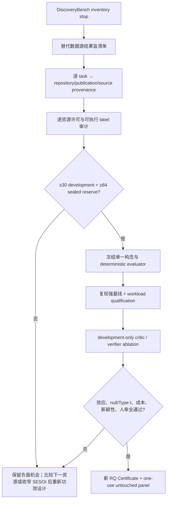

# 自动科研的可发表性瓶颈与 DiscoveryBench 独立单位审计

## 摘要

AutoResearch 已经能够真实执行检索、Graph、Harness、Loop、代码实验、证据封装和论文构建，但这些
能力只证明“流程发生过”，不自动形成可发表的科学贡献。Task 263.6.5 对上一轮入选的
Socratic falsification 路线执行了结果盲、stop-first 的数据资格审计：固定
`allenai/discoverybench@e54ec033049d3a0fd95d3c746919cc8c01c25781`。原始 answer-key 文件只
用于严格解码、整文件哈希和提取 `(dataset, metadataid, query_id)` 键；应用逻辑不检查、不投影、
不持久化 `gold_hypo` 字段值。审计还只使用目录树、对象标识、许可证和一手文献，不运行模型、critic
或科学结果。

189 个 provisional folder 经真实来源、raw/processed 关系和 synthetic semantic-tree lineage
聚类后只剩 107 个来源组。满足 30 个 development group 后，最多只剩 41 个潜在 reserve group；
即使把每个 synthetic folder 都宽松地当作独立单位，去除明显真实数据派生后，reserve 上限也只有
81，仍低于预注册的 84。两套隔离解释器零重试得到完全一致的投影。因此合法结论不是“继续实现四类
critic”，而是 `stopped-at-inventory`：当前 DiscoveryBench 路线在进入 evaluator 和模型实验前
已被独立单位门否决。

## 1. 冻结研究问题

在读取任何新 scientific outcome 前，本轮冻结三个问题：

1. provenance、license 和 derivation 聚类后，189 个目录能否保留至少 30 个 development group
   与 84 个完全未使用的 reserve group？
2. causal inversion、constraint violation、counterexample omission 与 unfalsifiable claim
   能否由生成规则确定标签，并由确定性程序评分，而不是依赖 LLM judge 或事后人工标签？
3. 在同一 model、tool、token、call、CPU、wall-clock 与 failure budget 下，full critic 能否在
   source-group 统计单位上优于 no-critic、rule/null 和单组件 critic？

第一个问题是不可补偿的前置条件。它失败后，问题 2、3 不得进入实现或取数。

## 2. 方法

### 2.1 检索与纳入边界

检索截止日为 2026-07-31。只使用论文原文、官方数据集页、官方仓库/API 和许可证原文。重点交叉
比较四类研究：

- data-driven discovery benchmark：DiscoveryBench、ScienceAgentBench、AutoSDT；
- validity/falsification mechanism：AHOIS、POPPER、SciAgentArena；
- scientific-agent harness：AstaBench；
- 可客观执行的替代构念：QRData、CORE-Bench。

论文提出的能力、仓库实际开放的资产、许可证允许的用途和本项目实测的独立单位分别记录，不能互相
替代。

### 2.2 统计单位

主设计沿用两侧 exact McNemar、`alpha=0.05`、power `0.80`、SESOI `+0.20` 与
`p10=0.30,p01=0.10`，需要 84 个独立 source group。30 个 development group 用于 evaluator、
baseline、workload 和 ablation，不能随后伪装成 untouched confirmation。

以下对象明确不是新的科学单位：

- 同一来源的 raw、processed、subset 或多 difficulty 目录；
- 同一 synthetic semantic tree 生成的多个任务；
- 同一 paper/repository 的多个函数或任务；
- seed、retry、interpreter、并发 lane 或重复运行；
- 多个 Agent 对同一底层实例的投票。

### 2.3 结果盲 inventory

冻结 runner 只接收 987 个 tree entry 的 path/type/object-id/size、real/synthetic answer-key 的
dataset name，以及 `30 + 84` 门槛。它不接收 CSV 的 `gold_hypo` 内容、数据文件内容、metadata
正文、模型输出或 development outcome。正式本地实现另外审计：

- 189 个 depth-four folder 的 real/synthetic、train/test 和 file object lineage；
- obvious raw/processed、subset 和跨 split family；
- synthetic `domain_tree_level` 名称所指向的 shared semantic tree；
- answer-key dataset-key 完整性；
- ODC-By database scope 与 AstaBench Apache-2.0 software scope。

同一规范输入在 Task 263.4.2 的两套冻结 clean interpreter 中独立运行，要求 exact projection、
retry `0` 和 scientific outcome access `false`。

## 3. 研究版图与主要分支

### 3.1 “端到端自动科研”与“可审计子任务”不是同一主张

DiscoveryBench 把数据驱动发现表达为从数据和 metadata 生成 hypothesis，但其主要 HMS 评价包含
模型 evaluator；同一 semantic tree 还能派生多个难度数据集。[1] 这适合研究 hypothesis discovery，
却不能直接提供本项目所需的确定性 binary fault endpoint。

ScienceAgentBench 主张在谈端到端自动化之前，先严谨评价科研工作流中的单项任务。其 102 个任务
来自 44 篇同行评议论文，统一输出为可执行 Python 程序，同时评价代码、执行结果和成本；最佳系统在
三次尝试下也只解决约三分之一任务。[6] 这支持“先验证科研编码能力”，但以论文为独立来源时最多
只有 44 个单位，不能单独支撑本轮 `30 + 84` 设计。

AutoSDT 自动构造 5,404 个科研编码任务，覆盖四个学科和 756 个 Python package，并报告 256 个
样本上的专家有效性/程序正确性检查。[7] 它提供了大规模、可执行 output 的替代方向，但 dataset
card 同时承认 317 个来源仓库没有许可证，并把它们“假定”为允许学术使用。[12] 本项目不能把这种
假定升级为可再分发的许可证据；下一轮必须逐 repository、逐 task 排除未授权来源。

### 3.2 Socratic critic 与 falsification 已有强 prior art

AHOIS 已把 causal questioning、constraint checking、counterexamples 和 falsification criteria
组合为 Socratic critic，并在一个高维物理平台上展示。[3] POPPER 把自动假设验证建模为 sequential
falsification，并显式关注 Type-I error。[4] SciAgentArena 又把 validity 和错误 premise 纳入
stepwise scientific-agent evaluation。[5]

所以本项目不能把“四个 critic 组件放在一起”本身当成新颖贡献。可能仍成立的增量必须是：

> 在许可清晰、客观可执行且具备足量独立来源的面板上，证明某个可复现 critic 机制在等预算强基线
> 上产生 source-group-level 的因果增量，并通过 null/Type-I、负载和 untouched confirmation。

如果数据资格不成立，增加 Agent、prompt 或 evaluator 都不会形成这个增量。

### 3.3 Harness 与 Open Science 是有效性基础设施，不是主效应

AstaBench 强调统一 scientific-agent interface、工具和评测套件。[2] 它能为 clean-room harness、
预算记录和失败语义提供软件边界，但 Apache-2.0 软件许可证不替代 DiscoveryBench 内容许可，也不
证明任一 critic 有科学效应。

同理，Evidence Graph、可重放 Loop、manifest、RO-Crate 和论文 PDF 是研究可信度的必要基础设施。
它们让失败可审计，却不能把样本相关性、无效 evaluator 或负效应改写为正贡献。

### 3.4 替代客观构念

QRData 含 411 个带数据表的统计/因果推理问题，答案准确率比自由文本 hypothesis 更接近客观端点；
但其来源横跨教材、在线材料和论文，仍须重建来源组与内容许可。[8]

CORE-Bench 含 270 个复现任务、来自 90 篇论文，并提供快速并行 evaluator。[9] 它非常适合验证
scientific reproducibility agent，但 90 篇论文仍低于 114 个独立单位，而且“复现实验”与
“发现并拦截科学 fault”不是相同构念。它更适合作外部有效性 benchmark 或与其他许可清晰来源组成
预先定义的多构念研究，而不是未经论证地拼接成一个主终点。

## 4. DiscoveryBench 审计结果

### 4.1 快照和 answer-key lineage

正式快照固定为：

- dataset：`allenai/discoverybench`；
- revision：`e54ec033049d3a0fd95d3c746919cc8c01c25781`；
- 987 entries：198 directories、789 files；
- 189 depth-four folders：14 real、175 synthetic；
- split：104 train、85 test；
- real answer key：239 rows、10 dataset names；
- synthetic answer key：200 rows、75 dataset names；
- 85/85 test folder 的 key lineage 完整；
- gold hypothesis 文本保留量：0。

两个 answer-key 文件分别严格解码为 `utf-8-sig` 和 `windows-1252`；没有使用 replacement
character 或静默丢字节。编码差异不影响本轮键级 lineage，但说明未来任何内容 evaluator 都必须
冻结 byte/encoding contract。

### 4.2 独立来源聚类

DiscoveryBench 论文明确说明 synthetic benchmark 从 semantic tree 生成多个 difficulty dataset，
并说明相同前缀的 real folders 可能共享底层数据或 raw/processed 关系。[1] 因此采用保守聚类：

- synthetic：按 `domain + semantic-tree` 聚类，175 个目录变成 99 个组；
- real：NLS family 合为一个组，meta-regression raw/processed 合为一个组，World Bank
  indicators/processed 合为一个组，其余按可核验来源聚类，共 8 个组；
- 总计：107 个 source group；
- train group：67；
- test group：41；
- train-only：66；
- test-only：40；
- cross-split：1（NLS）。

因此：

| 设计量 | 要求 | 审计结果 | 判断 |
|---|---:|---:|---|
| Development | 30 | 67 个 train-side group | 单独可满足 |
| Untouched reserve | 84 | 最多 41 | 失败 |
| 总独立单位 | 114 | 107 | 失败 |
| 乐观 reserve 上限 | 84 | 81 | 仍失败 |

“189 ≥ 114”是目录级幻觉；独立性审计后，主要功效设计不可行。

### 4.3 许可证边界

DiscoveryBench card 声明 ODC-By，仓库 LICENSE 文本也是 ODC Attribution License。该许可允许带
署名地使用/衍生 database，但明确排除 computer programs，并不自动清除 individual contents 的
版权或数据库之外权利。[10][11] 因而本轮只确认 database use；软件复用、内容公开再分发和发布仍
需要分别审核。

AstaBench 官方仓库许可证被识别为 Apache-2.0，可支持 clean-room software interface 思路；它不
许可 DiscoveryBench 数据内容，也不授权任何 gated benchmark payload。

## 5. 为什么“真实执行”仍不可发表

| 层级 | 当前系统已经做到 | 仍缺的发表条件 |
|---|---|---|
| Execution | 真检索、真运行、真失败、真工件 | 执行事实不是科学效应 |
| Graph/Harness/Loop | 有状态、证据、预算、恢复和重放 | 基础设施不能消除构念偏差 |
| Instrument | 可做确定性 schema/tamper/replay | 当前路线尚无合格 primary evaluator |
| Unit | 189 个可见目录 | 只有 107 个保守来源组，reserve 最多 41 |
| Effect | 可运行 future ablation | 前置 unit gate 已失败，不能合法估计效应 |
| Novelty | critic 机制可实现 | AHOIS/POPPER/SciAgentArena 已覆盖核心思想 |
| Open Science | 可封装 research object | 内容权利、独立验证、human review 尚未通过 |

因此根因不是“系统不会产出”，而是系统以前把可运行性、目录数、Agent 数、评价分数和论文工件误当成
可以互相补偿的证据。可发表性要求这些门同时成立。

## 6. 综合判断

本轮有三个重要综合结论：

1. **Benchmark availability 是分层变量。** 页面可访问、仓库公开、dataset card 有 license、
   task 有 gold、程序可执行、内容可再分发、统计单位独立，是六个不同事实。
2. **自动生成会放大伪样本量。** 同一 semantic tree、repository 或 publication 可生成很多任务；
   规模适合训练，不等于适合 inferential evaluation。
3. **最有价值的自动化行为是及时停止。** 在结果盲 inventory 阶段停止，避免了 provider credential、
   模型费用、prompt 选择和 outcome-driven metric 进入一个注定功效不足的研究。

正式投影 SHA-256 为
`8ec78def64fcdc4934d69cc8371d9c05a95c21299cde19ad8e00650bc46474f3`，
report 为
`a01303685e1aa4ee2d6ef19f75b5ca01cf3694bc58075008d78840d9bab1d75e`，
manifest contract hash 为
`8253096b08a8c44c6ec99ea9286872efe76b23f376ce63097ebebb561b6e7ed2`。

## 7. 优化后的研究路径

下一步不是放宽 84，也不是把 seed 算作样本，而是进入新的 objective-data opportunity
tournament：

候选不预设赢家：

| 候选 | 机会 | 必须先解决的风险 |
|---|---|---|
| AutoSDT-5K | 5,404 coding tasks、756 packages、repository URL、license 字段、可执行 program | 同 repository 多任务相关；317 个无许可证仓库不能靠“假定”；需逐 task 复现与资源预算 |
| ScienceAgentBench | 真实论文任务、程序/执行/成本评价、专家验证 | 44 个 publication group 单独功效不足；部分指标含人工 rubric |
| CORE-Bench | objective reproduction、270 tasks、并行 evaluator | 只有 90 个 paper group；复现构念不等于 Socratic fault detection |
| QRData | 411 个统计/因果问题，答案更客观 | source sheet 相关性、内容许可、答案执行性与科研真实性需审计 |
| 许可清晰的预注册组合面板 | 可跨 benchmark 达到来源数并检验外部有效性 | 必须先证明同一 primary construct、统一 evaluator 和无 source overlap，不能事后拼接 |

新 tournament 的先验门为：

- 先审计 license，不把 “public” 或 “academic-use assumption” 当授权；
- 先按 repository/publication/data lineage 聚类，再计算功效；
- primary endpoint 必须 executable/objective，LLM judge 只能作探索性 secondary measure；
- candidate source 必须产生至少 30 个 development 与 84 个完全 sealed reserve group；
- provider 配置和模型调用只在数据门通过后引入；
- 不读取旧 consumed panel，不创建 confirmation panel，不开始论文 claim。

## 8. 开放问题

1. repository 是否足以作为 AutoSDT 的独立单位，还是还需按 shared dataset、package、作者或生成模板
   进一步聚类？
2. 如何在不读取 reserve output 的前提下，证明每个 task 的 evaluator 可执行且不会泄漏 gold
   implementation？
3. GPL、custom、non-commercial 和无许可证来源分别允许本地研究执行、派生 benchmark、artifact
   再分发到什么范围？
4. Socratic critic 的新贡献应落在“invalid premise detection”“experiment promotion”还是
   “scientific code correctness”？三者不能在看到结果后互换。
5. 如果所有单一资源都不足 114 个独立单位，能否预先定义多 benchmark hierarchical design，而不
   把异质构念混成一个平均分？
6. 如何让独立人类 reviewer 在 reveal 前确认 novelty 和 scientific relevance，同时不泄漏
   reserve outcome？

## 9. 结论

相关自动科研论文的共同教训不是“Agent 已经可以替代科学家”，而是：先把任务拆到可客观评价的
科学子过程；让代码执行、环境或实验提供外部反馈；用 provenance 与许可证限定可复用边界；把
reproducibility、validity 和 failure retention 当一等结果。

Task 263.6.5 将这一原则落实为一次合法的负面决策。DiscoveryBench 仍是有价值的 discovery
benchmark，但不能支持当前 `30 + 84` 的独立 source-group Socratic study。路线在模型调用前停止，
没有 evaluator、baseline、RQ、panel、release 或 submission 被授权。下一步应寻找真正具备足量
独立来源、可执行标签和逐项许可证据的数据面板，而不是继续扩大流水线外观。

## 参考文献

1. Majumder et al. “DiscoveryBench: Towards Data-Driven Discovery with Large Language
   Models.” 2024/2025. https://arxiv.org/html/2407.01725
2. Allen Institute for AI. “AstaBench: Rigorous Benchmarking of AI Agents with a Scientific
   Research Suite.” 2025. https://arxiv.org/abs/2510.21652
3. “Socratic Agents for Autonomous Scientific Discovery in High-Dimensional Physical
   Systems.” 2026. https://arxiv.org/html/2606.26722
4. Huang et al. “POPPER: Automated Hypothesis Validation with Agentic Sequential
   Falsification.” ICML 2025. https://proceedings.mlr.press/v267/huang25n.html
5. “SciAgentArena: Benchmarking Scientific Agents with Stepwise Verification.” 2026.
   https://arxiv.org/abs/2606.12736
6. Chen et al. “ScienceAgentBench: Toward Rigorous Assessment of Language Agents for
   Data-Driven Scientific Discovery.” 2024/2025. https://arxiv.org/abs/2410.05080
7. Li et al. “AutoSDT: Scaling Data-Driven Discovery Tasks Toward Open Co-Scientists.”
   2025. https://arxiv.org/abs/2506.08140
8. Liu et al. “Are LLMs Capable of Data-Based Statistical and Causal Reasoning? Benchmarking
   Advanced Quantitative Reasoning with Data.” ACL Findings 2024.
   https://arxiv.org/abs/2402.17644
9. Siegel et al. “CORE-Bench: Fostering the Credibility of Published Research Through a
   Computational Reproducibility Agent Benchmark.” 2024.
   https://arxiv.org/abs/2409.11363
10. DiscoveryBench frozen dataset surface.
    https://huggingface.co/datasets/allenai/discoverybench
11. Open Data Commons Attribution License 1.0.
    https://opendatacommons.org/licenses/by/1-0/
12. AutoSDT-5K official dataset card and per-task source/license file.
    https://huggingface.co/datasets/osunlp/AutoSDT-5K

## 关联

- [[exploration/workload-qualified-ai-scientist-opportunity-tournament-2026]]
- [[exploration/publishability-recovery-ai-scientist-2026]]
- [[projects/ai_researcher_system/progress/task-263-6-5-socratic-inventory-stop]]
- [[projects/ai_researcher_system/index]]
