# AutoResearch 可发表性恢复：从单候选流水线到证据约束的科研组合搜索

> [!summary]
> 当前 AutoResearch 不是“不能真实产出”：Task 260 已形成通过全部确定性论文、证据与独立复现检查的
> 系统论文包，等待人类新颖性、署名、许可和 venue 决策；Task 259、260 Route A 与 261.2 则形成了
> 真实、可复核的科学阴性结果。真正的瓶颈位于科研前端：候选过少、过早承诺、没有功效驱动的机会门、
> 没有预算匹配的组合搜索，也没有把探索阶段的分支证据转化为可归因的策略比较。近期 AI Scientist
> 研究支持树搜索、锦标赛、结构化记忆、客观环境反馈和独立验证，但同时显示 workshop 成功、代码可
> 执行或 LLM 自评都不能推出主会/主刊可发表。下一条主线应是
> **问题证书 → 机会审计 → 强基线复现 → 多样候选组合 → 多保真筛选 → 独立确认 → Open Science**。

## 1. 冻结问题、边界与检索方法

本轮在修改科研路径前冻结三个问题：

1. 为什么现有系统能完成真实执行、证据链、复现包和论文构建，却仍频繁得不到可投稿的科学贡献？
2. 2024—2026 年 AI Scientist、自动实验与科学 Agent 工作中，哪些机制有实证支持，哪些只是宣传、
   预印本或代理指标？
3. 在不回看已揭示 holdout、不降低 Gate A/B、不用 LLM 自评替代科学门禁的前提下，最短的可发表性
   恢复路径是什么？

检索日期为 2026-07-29，覆盖四个独立视角：

- 主流端到端系统与真实实验验证；
- 复现、数据分析、机器学习研究和开放发现 benchmark；
- 统计方法、证伪、独立确认与开放科学；
- 2026 年组合搜索、环境工程、结构化科研证书和神经算子自动发现前沿预印本。

来源优先级为同行评审论文、官方论文页/会议论文集、作者原始预印本和官方代码库。预印本均显式标注，
不把作者系统的自评当作独立复制，也不把 workshop 接收、运行成功或生成 PDF 当成主会/主刊证明。
最终来源登记含 45 条可定位文献或标准，其中 36 条作为正文编号核心来源、9 条作为相邻 benchmark、
方法或批评性上下文。本轮不执行外部投稿，不租用云 GPU，不修改已揭示科学 panel、阈值或 Gate B。

## 2. 本地事实：系统已经产出，科学贡献门才是失败点

| 研究链 | 实际产物 | 通过的门 | 未通过或仍需人工的门 |
|---|---|---|---|
| Task 259 Gate A 与 recovery | 两个完整、哈希绑定、可恢复的官方矩阵阴性结果 | 执行、复现、失败保留、冻结统计 | 两次均未通过 system-level 科学效果门；Gate B 必须保持关闭 |
| Task 260 Route A | 两个新机制、两轮 240-cell 开发与独立 unseen 评估 | 开发效应、完整执行、无人工科研决策 | 两个 unseen CI 均跨零，不能声称新方法贡献 |
| Task 260 Route B | 210-cell 系统研究矩阵与完整 paper dossier | 系统贡献、证据、复现、论文质量、40/40 live sources | 人类新颖性、作者、许可、venue 和投稿批准 |
| Task 261.1 | 一条模型选题到 PDF 的 bounded-autonomy Sprint | 运行、任务级统计、PDF、自治审计 | 任务级 CI 下界未过零；文献只有一条，不能投稿 |
| Task 261.2 | 模型生成并执行的新机制、独立确认与 51/51 claim audit | 代码安全、开发筛选、确认执行、论文/复现完整性 | coverage `0.5833 < 0.60`，科学提交门为 false |

这组事实排除了三个常见误诊：

1. 不是 PDF、引用格式或 Open Science 包缺失。Task 260 和 261.2 的后端已经能稳定构建。
2. 不是“负结果不真实”。这些阴性结果正是未改阈值、未重复抽样直到通过的证据。
3. 不是再增加一个 Reviewer Agent 就能解决。主要失败发生在客观 unseen 指标和置信区间，而不是文本
   评审措辞。

## 3. 外部证据交叉检索

### 3.1 端到端系统：最强结果仍依赖边界、筛选或实验人类

Nature 2026 的 AI Scientist 研究采用调查、超参数搜索、研究议程和消融组成的树式实验。作者向当届
接受率为 70% 的 ICLR workshop 提交三篇人工筛选后的论文，其中一篇达到预计接收分数，另外两篇未过门，
三篇都未达到 ICLR 主会标准。[S01] AI Scientist-v2 的关键增量是 progressive agentic tree search、
实验管理和视觉反馈，而不是“写得更像论文”。[S02]

Google 的 AI Co-Scientist 使用 generate、debate、evolve、rank、proximity 与 meta-review 组成异步
锦标赛，并展示了生物医学实验验证；科学家仍定义目标、提供约束并解释结果。[S03] Robin 和 Virtual Lab
也在受限生物医学问题上连接了人类实验验证：前者把多 Agent 文献与数据分析接到湿实验，后者由人类提供
高层反馈并验证纳米抗体设计。[S04][S05] 这些工作支持“机器扩大候选空间 + 客观实验压缩空间”，不支持
取消领域专家。

Agent Laboratory 从人类想法开始，显示人类反馈可提高报告质量并降低成本；ResearchAgent 使用学术图和
实体存储生成 problem/method/experiment；Kosmos 用结构化 world model、长时并行 rollout 和逐句
代码/文献引用提高可追溯性。[S06][S07][S08] 但 Kosmos 的独立科学家审计仍只判定 79.4% 语句准确，
说明 traceability 不是 correctness。CodeScientist 进一步把论文审查、代码语义审查和复现实验分开；
19 个候选中只有 6 个通过其最低可靠性与增量新颖性门，超过一半候选发现被代码审查否决。[S24]
Data-to-paper 则把稿件数值反向追到代码和数据；它在简单回顾性问题上较可靠，问题复杂后仍需要人类，
支持把论文视为执行证据的只读视图，而不是研究真相来源。[S25]

与端到端写稿路线相比，ERA 主动把任务收窄为具有客观 quality metric 的 empirical software search：
它让 LLM 在 sandbox 中改写代码，用 tree search 在历史节点间探索/回退，并把外部论文想法与成功实现
重组后再以留出任务评分。[S29] 这比 narrative review 更接近可证伪实验，但 problem、data 和 metric
仍由人类预先给定，因此支持的是“可评分科研软件搜索”，不能外推为自主选题或一般科学发现。

### 3.2 从想法到执行：纸面新颖性会在真实实施中消失

2026 年 Ideation–Execution Gap 研究让 43 位专家分别投入约 100 小时执行随机分配的人类或 LLM
研究想法。LLM 想法原有的纸面优势在执行后显著下降，novelty、excitement、effectiveness 和 overall
评价的降幅都更大。[S26] 这与本地 Task 260/261 的“开发看似强、独立确认失败”是同一种结构：
idea/reviewer score 不能代替可执行性、效应和确认。

Execution-Grounded Automated AI Research 把 Implementer、Scheduler、GPU workers 和 measured reward
闭合成实验环境，并用 archive-based evolutionary search 迭代；作者报告它优于直接从执行奖励做 RL，
后者会 mode collapse、提高均值却不提高上界。[S27] FunSearch 在有客观 evaluator 的数学与算法问题上
用 program archive 和 islands 保持多样性，确实产生了新构造，但最困难问题只有少数 run 成功。[S28]
这些证据支持“客观 evaluator + archive + 多样性 + 大量忠实失败”，而不是线性 self-critique。

### 3.3 Benchmark：可执行、可复现、新颖、有效和可发表是不同变量

| Benchmark | 主要结果 | 不能外推的结论 |
|---|---|---|
| PaperBench | 从零复现 20 篇 ICML 论文、8,316 rubric 项；主结果最佳约 21.0%，3-paper 子集 48 小时人类 best@3 为 41.4%、o1 为 26.6% [S09] | 不测新想法；自动 judge 也不是确定性专家 |
| CORE-Bench | 即使作者代码与数据可用，Hard 最佳约 21.48% [S10] | 只覆盖已确认可复现、短时、低资源 CodeOcean 项目 |
| ScienceAgentBench | 102 个论文代码任务；Claude self-debug 32.4%，专家知识 34.3% [S11] | 只测短 Python 任务，不测选题、文献、新颖性和论文 |
| DiscoveryBench | 264 个真实、903 个合成发现任务；最佳约 25% [S12] | 已给数据与目标，仍未解决 p-hacking 和大型多模态工作流 |
| BLADE | GPT-4o 可执行分析可达 96%，但正确统计模型 coverage@10 低于 13% [S13] | “代码能跑”不等于科学分析成立 |
| MLRC-Bench | 7 个前沿 ML 竞赛；最佳只弥合顶尖人类差距的 9.3%；LLM 创新评分与实测效果 Spearman `-0.06` [S14] | LLM 自评不能成为 novelty/effect 门 |
| MLR-Bench | 201 个开放 ML 研究任务；论文可连贯成形，但被测 coding agent 在约 80% 情形产生虚构或未验证实验结果 [S30] | 文稿完整与实验真实性必须分开裁决 |
| MLE-bench | 75 个 Kaggle 任务；o1-preview+AIDE medal rate 16.9%，pass@8 34.1% [S15] | problem/data/metric 已给定，不是完整 R&D |
| RE-Bench | Agent 在 2 小时预算可领先人类，但 8/32 小时后人类反超 [S16] | 短时速度不能外推为长时科研控制能力 |
| AIRS-Bench v3 | 20 个无 baseline-code 的 ML 任务中，仅 4 个任务某些运行超过人类 SOTA [S17] | 仍给定 problem/data/metric，且存在 context overflow 与累计调试漂移 |

这些独立结果共同否定一个简单乘法：更多 token、更多 Agent 或更长 loop 并不自动变成更强科学贡献。
发表级结果是合取门：

`Novelty ∧ EmpiricalValidity ∧ Reproducibility ∧ EvidenceCoverage ∧ Robustness ∧ IndependentReview`

任一项为 false，其他项的高分不能补偿。

受控审计进一步把常见失败归纳为 benchmark 选择不当、data leakage、metric misuse 和 post-hoc
selection；完整 trace 与代码比只读最终论文更容易发现这些问题。[S31] 更广泛的验证综述也把
transparent verification，而不是规模化 hypothesis generation，视为 AI-driven discovery 的核心
瓶颈。[S32] 因此本项目的 Harness 必须保存 evaluator、split、预算、失败和选择轨迹，确认 runner
必须与开发轨迹隔离。

### 3.4 2026 前沿：可借鉴的是搜索和环境机制，不是未经复制的榜单数字

- MARS 把 Agent 视为成本约束的 MCTS 搜索策略，使用 Design–Decompose–Implement 和跨分支反思记忆；
  这支持预算感知、跨分支学习；当前 arXiv v3 注明已发表于 ICML 2026，但跨分支因果结论仍需独立
  复制。[S18]
- Arbor 使用显式 hypothesis tree、共享记忆和失败信号协调 planner、specialist 与 critic；这支持
  分支可见性，但性能结论仍需独立复制。[S19]
- AI Research Agents for MLE-bench 将 Agent 明确形式化为搜索策略，并比较 greedy、MCTS 和 evolutionary
  operator，说明搜索算子与执行 operator 的交互会改变结果。[S20]
- FirstResearch 提出 Research Question Certificate：primitives、assumptions、mechanism、tension、
  falsifiable hypothesis、minimal decisive test 和 failure update。它非常适合作为前端合同，但实验只含
  少量 Agent 主题、LLM judge 和 prompt-level baseline，不能直接当作科学有效性证明。[S21]
- EurekAgent 强调环境工程：权限、artifact、预算、客观反馈和人机边界；当前为 2026 预印本。[S22]
- 自动神经算子发现社区用 16 个实验室、20 次迭代、三种角色、低保真筛选和全保真 winner 复核，在五个
  问题和三种 seed 上运行 9,623 次模型调用。[S23] 它与本仓库 PDE 路线直接相邻，但仍有单模型、prompt
  偏向、有限 ablation、未全量全保真验证等局限，因此更适合作为“独立复制 + 因果角色消融 + 多保真
  校准”的新研究对象，而不是直接照搬其性能结论。
- AHOIS 把物理 critic 具体化为因果追问、约束检查、反例生成和证伪判据，并在真实多模光纤平台闭环
  实验；消融报告 Socratic interrogation 改善物理一致性、假设完整性、不确定性校准和实验计划有效性。
  [S37] 这支持把“反方 Agent”变成结果前可测试的干预，但该工作仍是单一物理平台的 2026 预印本，
  不能直接证明通用自主科学能力。

### 3.5 Open Science：把结果变成可交换研究对象，但不替代科学门

FAIR 原则明确覆盖数据、算法、工具和 workflow，要求持久标识、丰富元数据、清晰许可和详细
provenance；它解决的是第三方发现、访问、互操作和复用。[S33] W3C PROV-O 用 Entity、Activity、
Agent 及 generation/usage/derivation 关系提供跨系统 provenance 交换模型，[S34] RO-Crate 1.3 与
Workflow Run Crate 再把 workflow、软件、输入输出、环境和逐步运行封装为 JSON-LD research
object。[S35][S36]

三者共同支持本项目的 Graph/PROV/Open Science 导出，却不提供效应、功效、机制新颖性或独立确认。
因此 Open Science 层应忠实投影冻结协议、完整分支流和最终裁决；若科学 endpoint 为阴性或无效，
research object 也必须保持阴性或无效，不能因元数据完整而升级为发表贡献。

## 4. 根因分析：后端很强，前端搜索统计学不足

### 4.1 问题选择没有显式的“可判决性”门

现有候选生成主要从文献关键词、局限和数据集做聚类；Competition 再按静态 40/30/30 分数排序并选择
第一个通过 smoke 的候选。它没有在执行前回答：

- 最接近的强基线是否已经可以独立复现？
- 主 claim 的最小有意义效应是多少？
- 可获得的独立单位数能否给出足够功效或有信息量的区间？
- 是否存在真正不重叠的开发集和确认集？
- 预算是否足以探索多个机制族，而不是只跑一个幸运候选？
- 如果结果为阴性，它是否仍能产生有新颖诊断价值的研究贡献？

### 4.2 候选宽度太窄，且从开发成功过早跳到确认

- Task 259 在一次 Gate A 内冻结两个相近机制，recovery 再冻结两个机制；都没有组合层的 diversity、
  branch survival 或低/高保真相关性校准。
- Task 260 Route A 每轮只有一个机制，两个机制都在 development 有大幅正向效果，却在 unseen
  system-level CI 中崩溃。
- Task 261.2 只允许一个模型生成机制。停止而不“抽到通过为止”是正确治理，但这也证明单候选路径的
  科学命中率过低。

### 4.3 独立单位数由方便性决定，而不是由功效和异质性决定

Task 259/260 的系统级 CI 很宽，Task 261.2 只有六个确认任务。种子是任务内重复，不能冒充更多独立
科学单位。当前路径缺少 prospective power/sensitivity analysis，也没有在选题时把数据可获得性和
heterogeneity 纳入 hard gate。

### 4.4 “生成—评审—执行”没有形成可比较的搜索策略实验

当前日志能追踪一次候选为何失败，但还不能回答：

- 多样候选组合是否优于单路径 self-loop？
- 低保真排序与全保真终局是否校准？
- 跨分支记忆是否真的提高成功率，还是只增加 token 和相关错误？
- planner、reviewer、failure memory 和 Research Question Certificate 各自贡献多少？

这使 Harness/Loop 已经可审计，却尚未成为一项可证伪的科研贡献。

### 4.5 写作与 Open Science 只能保真，不能创造效应

论文、claim audit、RO-Crate、PROV 和独立 reproduction 会阻止夸大或篡改，但不能把
`0.5833 < 0.60` 写成通过。它们应继续作为末端硬门，研究资源应从反复润色转向前端机会选择、候选组合、
功效、客观反馈和确认性实验。

## 5. 应借鉴与不应借鉴

| 借鉴机制 | 本项目中的落点 | 不应借鉴的错误外推 |
|---|---|---|
| Research Question Certificate | 在任何代码/模型生成前冻结 mechanism、falsifier、minimal test、failure update | 证书完整不等于假设正确 |
| 异步锦标赛与 proximity 去重 | 候选族多样性、相似候选合并、保留反对证据 | Elo/LLM 排名不作为科学真值 |
| Progressive tree / MCTS / successive halving | 预算匹配的多分支、多保真筛选 | 不允许无限扩树或确认集回流 |
| Objective environment outcome | 指标、基线、统计和门全部由确定性程序计算 | Reviewer 文本或自评不能替代效果 |
| Structured world model / branch memory | 每个分支记录假设、delta、证据、失败、可迁移 lesson | 共享记忆不得包含 sealed holdout |
| Wet-lab/independent validation boundary | 对本项目对应为独立确认 panel 和 clean-room reproduction | 不把开发集、seed 重复当独立验证 |
| Open Science research object | 对所有分支、失败和最终端点生成可验证 package | 元数据互操作不等于科学复现或录用 |

## 6. 新研究路径：Certificate → Replication → Portfolio → Confirmatory

```mermaid
flowchart LR
    A["Time-cut literature map"] --> B["Research Question Certificate"]
    B --> C{"Opportunity hard gate"}
    C -->|fail| N["Negative opportunity record / pivot"]
    C -->|pass| R["Clean-room reproduction of strongest baseline"]
    R -->|fail| N
    R -->|pass| D["Diverse mechanism portfolio"]
    D --> E["Low-fidelity executable screen"]
    E --> F["Budget-aware successive halving / tree search"]
    F --> G["Full-fidelity development replication + ablations"]
    G --> H["Freeze one claim, code, power, panel, and stop rules"]
    H --> I["Independent confirmatory runner"]
    I --> J{"Conjunctive publication gate"}
    J -->|fail| K["Credible negative / new certificate"]
    J -->|pass| L["Clean-room reproduction + claim audit"]
    L --> M["Human novelty / authorship / venue / submission review"]
```

### 6.1 Research Question Certificate

每个候选问题必须在写实现前声明：

- primitives、assumptions、mechanism model 和与最近工作的 tension；
- 一个主 claim、明确的 falsifier 和失败后知识更新；
- 最小判决实验、primary metric、最小有意义效应和强基线；
- 数据、独立单位、功效/敏感性、开发/确认隔离和成本上限；
- 负对照、随机/规则 baseline、必需 ablation；
- 正向方法贡献、系统贡献或有诊断价值的阴性论文三种预注册 endpoint 之一。

### 6.2 机会硬门

只有同时满足以下条件才进入组合搜索：

1. 至少三条已验证的相邻工作，且有 nearest-work 差异矩阵；
2. 强基线可执行、许可清晰、数据可得，并有进入 novelty search 前的 clean-room 复现计划；
3. 客观 primary metric 与不可事后修改的 threshold；
4. 足够的独立单位或明示的区间精度/功效方案；
5. 开发集和确认集不重叠，确认集访问可审计；
6. 预算足以支持至少三个不同机制族和一条 null/rule-based arm；
7. publication endpoint 在结果前冻结；
8. 外部提交和公开发布仍为 false。

### 6.3 Replication-first

机会门通过后，系统先在干净环境复现最接近的强基线。复现包必须绑定论文 claim、代码、数据、环境、
命令、seed、原始预测和 endpoint，并由执行 evaluator 而非叙事 Reviewer 判断。若复现失败，研究任务
转为 reproduction diagnosis，不能在不可靠 baseline 上继续声称新颖提升。对一个新领域，至少完成一条
强 baseline 的 exact/within-tolerance reproduction；在后续扩展阶段再提高到三条。

### 6.4 多样候选组合与多保真搜索

首轮组合建议为 8—16 个候选，至少覆盖三个机制族；它不是 8—16 次独立“抽奖”，而是一棵受预算和
因果审计约束的搜索树：

1. **F0 合法/静态门**：来源、许可、代码安全、可证伪性、资源和数据分割。
2. **F1 最小可执行门**：单小任务、单 seed、低资源；只淘汰不可运行和明显无信号分支。
3. **F2 多任务开发门**：至少三独立开发单位、多个 seed、失败感知指标。
4. **F3 全保真开发门**：完整 baseline、ablation、uncertainty、成本和精确复现。
5. **Freeze**：只允许在事先规定的 survival rule 下选择 0 或 1 个主 claim 进入确认。

每级都保存被淘汰分支，校准低保真排名与后续真实结果。后续论文必须报告完整分支流，而不是只展示
winner。多次探索带来的选择偏差应通过预注册 survival rule、独立确认和必要的多重比较控制处理。

### 6.5 独立确认与 clean-room reproduction

- 确认 runner 不能读取探索 trajectory，只接收冻结代码、方法文档、环境和确认 panel。
- 独立单位数来自任务/系统/数据集，不用 seed 冒充。
- 所有 primary、secondary、negative-control 和 ablation 结果都保留。
- 只有预注册主 claim 可以触发正向 publication endpoint。
- clean-room runner 只根据方法包重建关键 endpoint；不一致时阻断主 claim。

### 6.6 人类角色

人类负责目标、伦理/安全、许可、资源批准、新颖性解释、作者责任、venue 与最终投稿；不得在运行后
偷偷改主 claim、阈值、panel 或科研结果。所有人工干预进入 Event Journal 和 provenance。

## 7. 推荐的可发表研究主线

### 7.1 第一优先：科研搜索策略的因果研究

主问题建议冻结为：

> 在相同预算、相同工具和相同客观 evaluator 下，Research Question Certificate +
> diversity-constrained portfolio + multi-fidelity successive halving，是否比 one-shot 和线性
> self-loop 更高概率产生可独立确认、证据完整的研究结果？

这是对现有 Task 260 系统论文的实质升级，而不是换标题。研究设计至少包含：

- budget-matched `one-shot`、`linear self-loop`、`portfolio`、`portfolio + cross-branch memory`；
- certificate、diversity、multi-fidelity、reviewer、memory 的因果 ablation；
- 多个独立研究任务和全量 failure slice；
- primary endpoint 为任务级 confirmed scientific success，而不是 LLM 分数；
- secondary endpoints 为 reproduction、unsupported claim、成本、低/高保真校准和人工干预；
- prospective power/sensitivity analysis、时间截断文献审计和完全冻结的确认 panel。

这条线复用 vNext Graph/Harness/Loop/PROV/Open Science 基础，计算成本可控，且直接填补当前最清晰的
科学空白。

### 7.2 第二优先：自动神经算子发现的独立复制与因果消融

在第一条主线证明搜索器本身有效后，再对 2026 自动神经算子社区研究做独立复制：

- 复现公开问题和强 baseline；
- 校准低保真筛选对全保真终局的排序偏差；
- factorial 区分 planner、reviewer、shared memory 和 portfolio diversity；
- 加入 rule-based/random/null arms 和未见 PDE families；
- 只在新的 Gate A 通过后讨论 RealPDEBench；绝不重开 Task 259 已揭示 Gate B。

这条线科学价值高，但需要独立 GPU 环境、更多计算和更严格的外部代码/许可审计，不能先于搜索器验证。

### 7.3 立即可交付但不自动投稿：Task 260 系统论文

Task 260 paper dossier 已经达到 `ready_for_human_submission_review`。它不应被误称为“没有产出”，也
不应由系统自行投稿。最短动作是人工做新颖性/venue/作者/许可审查；若审查认为贡献不足，则把本轮
portfolio 因果实验作为新证据，而不是继续润色旧 PDF。

## 8. 实施顺序与不可越过的门

| 任务 | 内容 | 完成判据 |
|---|---|---|
| 263.1 | 本报告、根因审计、来源登记和新任务树 | primary/official URL 实时核验；本地证据与任务图一致 |
| 263.2 | Research Question Certificate、Opportunity 与 Portfolio 合同 | schema、hash、hard gate、tamper、leakage、diversity、budget 测试 |
| 263.3 | 至少三条研究 track 的真实 opportunity tournament | 每条有 nearest-work、baseline smoke、power/cost、独立 panel 方案 |
| 263.4 | 复制强 baseline 并冻结搜索策略因果实验 | clean-room baseline 通过，task suite、预算和 confirmatory panel 未揭示 |
| 263.5 | 运行 budget-matched 多分支开发搜索 | 所有分支/失败/成本保留，低/高保真校准和 ablation 完整 |
| 263.6 | 独立确认与统计裁决 | 无 panel leakage、无事后改门、任务级 CI/功效与 exact reproduction |
| 263.7 | paper/Open Science package 与人工审查 | 合取门全通过或忠实阴性；外部投稿仍需显式人工批准 |

Task 263 不改变 Task 259 的 Gate B 状态，也不把 Task 260/261 已揭示数据重新变成 holdout。

### 8.1 Task 263.5 执行更新

Task 263.5 已把本报告提出的固定预算多分支、comparative memory、客观 evaluator、全失败保留和
任务级低/高保真校准真正落地。正式 v2 运行覆盖 12 candidates、9 policies 和 189 assignments，
唯一预注册策略 `portfolio_memory` 在 7 个开发任务上成功 6 个，较 `linear_self_loop` 多 1 个；
F1→F3 与 F2→F3 task-level Spearman 均为 `0.964286`，五项 survival conjunction 通过。

这个结果没有推翻本报告的反方约束：主比较 exact McNemar `p=1.0`，10 个次要比较经 Holm 校正后
均不显著。第一次完整矩阵还发现 numeric-only evaluator 无法处理一个 mixed-type task；系统保留该
无效阴性，绑定 failure lineage 后只修 evaluator，并复用原候选顺序。正式状态因此只是
`ready_for_confirmation`，不是“AI 已经会做科学”或“已可投稿”。详细证据见
[[projects/ai_researcher_system/progress/task-263-5-budget-matched-development-search]]；下一步只能在 60 个
未触碰确认任务上一次性裁决，不能根据确认结果换 arm、调阈值或改研究问题。

### 8.2 Task 263.6 首次确认更新

首次 one-use confirmation 已完成全部 1,620 个主 assignment、180 个 null control 和等量独立
clean-room replay，但合法终点是 `invalid_confirmation`，不是阳性或可信阴性。冻结主比较中，
`portfolio_memory` 为 26/60，`linear_self_loop` 为 28/60；risk difference `-0.033333`，保守
exact 95% interval `[-0.153229, 0.093699]`，exact McNemar `p=0.625`。CC18/CTR23 family effect
均为负，因此现有观察没有支持开发 winner 的独立优势。

invalid 的直接原因不是统计不显著，而是 null-control integrity。23 个 classification task 的 train
CSV target 被推断为数值，sealed test-label JSON 保留字符串；冻结 runner 由训练 LabelEncoder
反编码出的预测仍为数值，和字符串 truth 混合评分，69/180 次一致退出。clean-room 精确复制相同
scientific projection，证明系统的 Graph/Harness/Open Science 层成功保存并暴露了缺陷，却也说明
验证层仍缺少跨序列化边界的 label canonicalization certificate。

这次结果进一步支持本综述的核心判断：端到端生成论文或 workshop-level writeup 并不等于发表级
科学。真正瓶颈是客观 evaluator 的语义正确性、未触碰确认、失败可见性、统计与实际效应、独立复现和
人类新颖性审查的合取。恢复路径不是在已揭示的 60 个任务上继续调参，也不是只修 runner 后把同一
面板称为 fresh confirmation；应先构建两环境 evaluator compatibility certificate，再做明确标注的
consumed-panel technical replay 和预冻结 stop/advance decision。若修复后仍无方向正确且实际可行的
效应，停止该 claim 并返回 opportunity tournament；只有新机制、重新开发和全新独立 panel 才可再次
进入确认。详细证据见
[[projects/ai_researcher_system/progress/task-263-6-0-invalid-confirmation-diagnosis]]。

### 8.3 Task 263.6.1 evaluator certificate 更新

跨格式语义门已经真实落地，而不是只写进计划。新 runner 在 CSV 入口把 classification target 固定为
lexical string token，将 sealed F3 truth 映射进训练 vocabulary 后在同一整数空间评分；F1/F2
工作目录和 config 都没有 label artifact。fit/predict、input binding 和 objective scoring 现在分别
归入 candidate、input、evaluator failure domain，预期 invalid branch 会留下 candidate-domain artifact，
不再用一个 `runner_nonzero_exit` 混淆研究方法失败和测量系统失败。

正式 result-blind certificate 没有读取 v1 report、task bundle 或任何确认结果。它在两套 pinned
interpreter 中对四个 dense/sparse/quoted/mixed/unseen-category fixture、九个有效 learner/config 和
两次 exact repeat 执行 144 个 F3 probe，另有 4 个 invalid control 与 4 个 F2 label-isolation probe。
15/15 checks 通过；null-prior、unexpected candidate、evaluator 和 input integrity failure 均为 0；
within-role 与 cross-role scientific projection 精确一致。报告 hash 为
`e3709c8b834bfcc52ed7fb74389278e6c5a3e36d4bf13d32ddad7118f4aa797b`。

这一步说明从相关研究中真正可迁移的不是“再增加一个自评 agent”，而是把 evaluator 当成实验仪器做
校准：PaperBench/MLR-Bench 类复现失败要求 artifact-level verifier；Graph of Trace 和
Code-as-Harness 要求轨迹与权限边界；Co-Scientist/Robin/ERA 的客观反馈只有在 measurement contract
正确时才有意义。certificate 只允许进入 consumed-panel technical replay，不把现有不利主效应改成
可发表贡献。详细证据见
[[projects/ai_researcher_system/progress/task-263-6-1-evaluator-compatibility-certificate]]。

### 8.4 Task 263.6.2 technical replay 与停止裁决

已消耗面板上的 v2 重放完成 primary/replay 各 1,620 个 policy assignment 和 180 个 null control，
但两个解释器的 scientific projection 不相等，因此冻结编排器正确拒绝生成正式 technical report。
差异严格局限于 `openml-cc18-task-14970`、seed `3253`：同一个 `xgb-deep` F1 在 primary 成功、在
replay 到达 60 秒 deadline，进而使八个共享该 evaluation 的 policy trajectory 出现 8/1,620 个
投影差异；最终 selected candidate 和 task-success endpoint 没变也不能抹去中间搜索轨迹差异。
180 个 null projection 全部一致。

标签边界审计另记录 31 个 attestation anomaly：primary/replay 分别有 12/13 个 pre-F3 timeout
无法返回 `labels_accessed=false`，另各有 3 个 F3 timeout 虽绑定正确 label path/hash，却未返回
实际访问证明。它们不是 label leakage 的证据，而是冻结合取门所需证明不完整。这个结果说明小型合成
fixture certificate 只能校准语义，不能替代真实工作负载尾部、并发和 deadline 的资格认证。

由于 exact replay 失败，修复后数值只能作事故诊断：`portfolio_memory` 40/60，
`linear_self_loop` 43/60，risk difference `-0.05`，保守 exact 95% interval
`[-0.196505, 0.105569]`，exact McNemar `p=0.453125`；favorable/unfavorable 为 2/5，CC18 与
CTR23 family effect 分别为 `-0.048780`、`-0.052632`。此外 primary 保留 30 个非预期 candidate
failure 和 15 个 infrastructure timeout。即使忽略 replay mismatch，方向、实际效应、family
一致性和失败清洁度也都不允许推进。

系统已写入永久 `invalid_technical_replay` 事故对象，而不是挑选有利子集或再买 panel。incident hash
为 `f756ab01b1e7291875470e75d63e5fe668bf199a50659c041799e038578f9dd0`，36,521-artifact
manifest hash 为 `79bfb70fa5ded53686ada5deadb1e735450ad442a441867b93eef615a9c30fe6`。
`portfolio_memory` 发表主张关闭，263.6.3 不进入；下一路线固定为
`return_to_objective_opportunity_tournament`。详细证据见
[[projects/ai_researcher_system/progress/task-263-6-2-technical-replay-stop]]。

路径优化因此增加一个此前缺失的中间层：

`Instrument Calibration → Development-only Workload Qualification → Scientific Search →`
`Independent Confirmation → Open Science`

下一次机会锦标赛必须在任何新冻结前，用 development-only 的最慢 task/candidate strata 在两套
interpreter、计划并发和重复条件下校准 algorithmic compute budget 与 orchestration deadline；
若科学轨迹依赖 wall-clock 抖动则该机制不具确认资格。新 track 至少比较三类机制化问题：Kosmos 式
structured world model/evidence graph 对长程一致性与语句正确性的作用，AHOIS 式因果/约束/反例/
证伪 critic 对错误发现率的作用，以及 Robin/Virtual Lab 式外部客观反馈与明确人类责任边界。
每一项都必须有强 baseline、预注册消融、客观 evaluator、独立单位、功效、开放数据/许可和全失败保留；
可以全部失败，不能用 agent 自评或消耗面板数值选 winner。

## 9. 反方审查

1. **组合搜索可能只是更昂贵的多次尝试。** 因此必须预算匹配、预注册 survival rule、保留全部分支，
   并以独立确认而非 best development score 评判。
2. **多保真可能淘汰慢热方法。** 必须实测 F1/F2 与 F3 排名相关性，并保留 exploration quota。
3. **跨分支记忆可能传播错误。** lesson 必须绑定原始 branch evidence，sealed holdout 永不进入共享记忆；
   memory 还必须有无记忆 ablation。
4. **更多独立任务可能稀释领域深度。** 任务套件用于研究搜索策略；任何领域方法论文仍需领域特定强
   baseline、理论或机制解释和专门确认。
5. **自动 benchmark 仍可能被污染或游戏化。** 使用时间截断来源、隐藏 evaluator、clean-room runner、
   fault cases 和人工审查；公开 benchmark 分数不能单独解锁投稿。
6. **阴性结果仍可能不可发表。** 只有预先定义、具有新颖诊断价值、充分功效并完整报告的阴性 endpoint
   才能成为论文贡献；普通失败进入 Vault 和后续组合学习，不强行写成论文。

## 10. 结论

- **RQ1：为什么达不到可发表级？** 后端已经能真实执行、审计、复现和构建论文；当前科学主张先在 v1
  暴露测量语义缺陷，修复后又呈不利方向并在真实工作负载 deadline 上失去精确重放。没有有效、独立、
  方向正确且可复现的主效应，论文写作质量无法补偿。
- **RQ2：近期 AI Scientist 工作真正证明了什么？** 树搜索、锦标赛、结构化记忆、客观环境反馈和人机
  实验边界能改善流程；尚无可靠证据证明完全自主系统能稳定完成自主选题到主会/主刊发表。
- **RQ3：最短恢复路径是什么？** 当前 claim 已停止。下一轮先做全新问题的机会锦标赛，在 instrument
  calibration 与科学搜索之间新增 development-only workload qualification，再做预算匹配的多样
  组合、结果前证伪 critic、未揭示 panel、clean-room reproduction 和人类终审；不得给旧 claim
  购买新面板。

## 11. 来源登记

### 端到端 AI Scientist 与真实实验

- [S01] Lu et al., “Towards end-to-end automation of AI research,” *Nature*, 2026.
  [Nature article](https://www.nature.com/articles/s41586-026-10265-5)
- [S02] Lu et al., “The AI Scientist-v2: Workshop-Level Automated Scientific Discovery via Agentic
  Tree Search,” arXiv:2504.08066, 2025. [arXiv](https://arxiv.org/abs/2504.08066)
- [S03] Gottweis et al., “Accelerating scientific discovery with Co-Scientist,” *Nature*, 2026.
  [Nature article](https://www.nature.com/articles/s41586-026-10644-y)
- [S04] Ghareeb et al., “A multi-agent system for automating scientific discovery,”
  *Nature*, 2026. [Nature article](https://www.nature.com/articles/s41586-026-10652-y)
- [S05] Swanson et al., “The Virtual Lab: AI agents design new SARS-CoV-2 nanobodies with experimental
  validation,” *Nature*, 2025.
  [Nature article](https://www.nature.com/articles/s41586-025-09442-9)
- [S06] Schmidgall et al., “Agent Laboratory: Using LLM Agents as Research Assistants,” Findings of
  EMNLP 2025. [ACL Anthology](https://aclanthology.org/2025.findings-emnlp.320/)
- [S07] Baek et al., “ResearchAgent: Iterative Research Idea Generation over Scientific Literature with
  Large Language Models,” NAACL 2025. [arXiv](https://arxiv.org/abs/2404.07738)
- [S08] Edison Scientific, “Kosmos: An AI Scientist for Autonomous Discovery,” arXiv:2511.02824, 2025.
  [arXiv](https://arxiv.org/abs/2511.02824)
- [S29] Aygün et al., “An AI system to help scientists write expert-level empirical software,”
  *Nature*, 2026. [Nature article](https://www.nature.com/articles/s41586-026-10658-6)

### 复现、科学分析与研究 benchmark

- [S09] Starace et al., “PaperBench: Evaluating AI’s Ability to Replicate AI Research,” ICML 2025.
  [PMLR](https://proceedings.mlr.press/v267/starace25a.html)
- [S10] Siegel et al., “CORE-Bench: Fostering the Credibility of Published Research Through a
  Computational Reproducibility Agent Benchmark,” arXiv:2409.11363, 2024.
  [arXiv](https://arxiv.org/abs/2409.11363)
- [S11] Chen et al., “ScienceAgentBench: Toward Rigorous Assessment of Language Agents for Data-Driven
  Scientific Discovery,” ICLR 2025. [arXiv](https://arxiv.org/abs/2410.05080)
- [S12] Majumder et al., “DiscoveryBench: Towards Data-Driven Discovery with Large Language Models,”
  ICLR 2025. [arXiv](https://arxiv.org/abs/2407.01725)
- [S13] Gu et al., “BLADE: Benchmarking Language Model Agents for Data-Driven Science,” EMNLP 2024.
  [arXiv](https://arxiv.org/abs/2408.09667)
- [S14] Zhang et al., “MLRC-Bench: Can Language Agents Solve Machine Learning Research Challenges?”
  NeurIPS 2025. [arXiv](https://arxiv.org/abs/2504.09702)
- [S15] Shern et al., “MLE-bench: Evaluating Machine Learning Agents on Machine Learning Engineering,”
  ICLR 2025. [arXiv](https://arxiv.org/abs/2410.07095)
- [S16] Wijk et al., “RE-Bench: Evaluating Frontier AI R&D Capabilities of Language Model Agents against
  Human Experts,” arXiv:2411.15114, 2024. [arXiv](https://arxiv.org/abs/2411.15114)
- [S17] Lupidi et al., “AIRS-Bench: a Suite of Tasks for Frontier AI Research Science Agents,”
  arXiv:2602.06855v3, 2026. [arXiv](https://arxiv.org/abs/2602.06855)
- [S30] Chen et al., “MLR-Bench: Evaluating AI Agents on Open-Ended Machine Learning Research,”
  NeurIPS 2025. [NeurIPS paper](https://papers.nips.cc/paper_files/paper/2025/hash/ab8dd000d6f87f40061a73f8bca7fae4-Abstract-Datasets_and_Benchmarks_Track.html)
- Huang et al., “MLAgentBench: Evaluating Language Agents on Machine Learning Experimentation,”
  ICML 2024. [PMLR](https://proceedings.mlr.press/v235/huang24y.html)
- Si et al., “Can LLMs Generate Novel Research Ideas? A Large-Scale Human Study with 100+ NLP
  Researchers,” arXiv:2409.04109, 2024. [arXiv](https://arxiv.org/abs/2409.04109)
- Liu et al., “ResearchBench: Benchmarking LLMs in Scientific Research Idea Generation,” Findings of
  ACL 2026. [ACL paper](https://aclanthology.org/2026.findings-acl.644.pdf)

### 搜索、方法证书与 2026 前沿

- [S18] Chen et al., “MARS: Modular Agent with Reflective Search for Automated AI Research,”
  arXiv:2602.02660, 2026. [arXiv](https://arxiv.org/abs/2602.02660)
- [S19] “Arbor: A Tree-Structured Multi-Agent Framework for Scientific Discovery,”
  arXiv:2606.12563, 2026. [arXiv](https://arxiv.org/abs/2606.12563)
- [S20] “AI Research Agents for Machine Learning: Search, Exploration, and Generalization in
  MLE-bench,” arXiv:2507.02554, 2025. [arXiv](https://arxiv.org/abs/2507.02554)
- [S21] Wang, “FirstResearch: Auditable Question Formation for LLM Scientific Discovery Agents,”
  arXiv:2607.05682, 2026. [arXiv](https://arxiv.org/abs/2607.05682)
- [S22] “EurekAgent: Environment Engineering for Autonomous Scientific Discovery,”
  arXiv:2606.13662, 2026. [arXiv](https://arxiv.org/abs/2606.13662)
- [S23] “An Agentic AI Scientific Community for Automated Neural Operator Discovery,”
  arXiv:2607.12122, 2026. [arXiv](https://arxiv.org/abs/2607.12122)
- [S24] Jansen et al., “CodeScientist: End-to-End Semi-Automated Scientific Discovery with Code-based
  Experimentation,” Findings of ACL 2025.
  [ACL Anthology](https://aclanthology.org/2025.findings-acl.692/)
- [S25] Ifargan et al., “Data-to-paper: AI-driven research from data to human-verifiable research
  papers,” *NEJM AI*, 2024. [arXiv](https://arxiv.org/abs/2404.17605)
- [S26] Si et al., “The Ideation-Execution Gap: Execution Outcomes of LLM-Generated versus Human
  Research Ideas,” ICLR 2026 poster. [arXiv](https://arxiv.org/abs/2506.20803)
- [S27] Si et al., “Towards Execution-Grounded Automated AI Research,” arXiv:2601.14525, 2026.
  [arXiv](https://arxiv.org/abs/2601.14525)
- [S28] Romera-Paredes et al., “Mathematical discoveries from program search with large language
  models,” *Nature*, 2024. [Nature article](https://www.nature.com/articles/s41586-023-06924-6)
- Huang et al., “Automated Hypothesis Validation with Agentic Sequential Falsifications,” ICML 2025.
  [PMLR](https://proceedings.mlr.press/v267/huang25n.html)
- Buehler, “SciAgents: Automating Scientific Discovery through Multi-Agent Intelligent Graph
  Reasoning,” arXiv:2409.05556, 2024. [arXiv](https://arxiv.org/abs/2409.05556)
- [S37] Zeng et al., “Socratic agents for autonomous scientific discovery in high-dimensional
  physical systems,” arXiv:2606.26722, 2026.
  [arXiv](https://arxiv.org/abs/2606.26722)

### 批评与边界

- Messeri et al., “Risks of AI scientists,” *Nature Communications*, 2025.
  [Nature article](https://www.nature.com/articles/s41467-025-63913-1)
- [S31] Luo, Kasirzadeh and Shah, “The More You Automate, the Less You See: Hidden Pitfalls of AI
  Scientist Systems,” arXiv:2509.08713, 2025. [arXiv](https://arxiv.org/abs/2509.08713)
- [S32] Cornelio et al., “The Need for Verification in AI-Driven Scientific Discovery,”
  arXiv:2509.01398, 2025. [arXiv](https://arxiv.org/abs/2509.01398)
- *Nature* editorial, “Why AI cannot do good science without humans,” 2026.
  [Nature editorial](https://www.nature.com/articles/d41586-026-01551-3)
- Hao et al., “AI tools expand scientists’ impact but contract science’s focus,” *Nature*, 2026.
  [Nature article](https://www.nature.com/articles/s41586-025-09922-y)

### Open Science 与 provenance 标准

- [S33] Wilkinson et al., “The FAIR Guiding Principles for scientific data management and
  stewardship,” *Scientific Data*, 2016.
  [Scientific Data article](https://www.nature.com/articles/sdata201618)
- [S34] W3C, “PROV-O: The PROV Ontology,” W3C Recommendation, 2013.
  [W3C recommendation](https://www.w3.org/TR/prov-o/)
- [S35] Research Object community, “RO-Crate Specification 1.3.”
  [RO-Crate specification](https://www.researchobject.org/ro-crate/specification/1.3/introduction.html)
- [S36] Research Object community, “The Workflow Run RO-Crate Profile Collection.”
  [Workflow Run RO-Crate](https://www.researchobject.org/workflow-run-crate/profiles/)

## 11.5 263.6.4 更新：先验证 workload 与客观终点，再冻结新问题

Task 263.6.2 已永久停止 `portfolio_memory` 主张。Task 263.6.4 随后把 Kosmos 式 world model、
AHOIS/POPPER/SciAgentArena 式 validity/falsification critic、Robin/Execution-Grounded 式 external
feedback 做成结果盲三轨锦标赛。三轨代表性 workload 都在两个 clean interpreter、并发 1/2、三次
qualification repeat 中 exact replay；只有 Socratic 路线在开放资源与 prospective-power
feasibility 上获得 development admission。DiscoveryBench 的 189 个 folder 仍是 provisional source
groups，自然语言 gold hypothesis 也不是 exact evaluator，因此 baseline implementation、evaluator
implementation、independence audit、RQ Certificate 和新 confirmation panel 均保持 false。完整研究
与裁决见
[[exploration/workload-qualified-ai-scientist-opportunity-tournament-2026]] 和
[[projects/ai_researcher_system/progress/task-263-6-4-workload-qualified-opportunity]]。

## 11.6 263.6.5 更新：189 个目录不是 189 个独立科学单位

Task 263.6.5 在任何 evaluator、critic 或模型调用前，对固定 DiscoveryBench revision 执行了
result-blind provenance、derivation、answer-key key-lineage 和 license audit。175 个 synthetic
folder 按共享 semantic tree 聚类为 99 组，14 个 real folder 按 raw/processed/subset/source family
聚类为 8 组，总计只有 107 个 source group。满足 30 个 development group 后，最多只剩 41 个
reserve group；即使采用偏宽松的 optimistic counting，reserve 上限也只有 81，仍低于预注册的 84。

两套冻结 clean interpreter 零重试复现相同 projection，正式 decision 是
`stopped-at-inventory`。这进一步修正“真实不可产出”的诊断：系统不是缺少写作能力，而是先后遇到
无效 evaluator、负效应、真实负载漂移和伪样本量；Graph/Harness/Loop/Open Science 只能让这些失败
可见，不能替代科学有效性。下一任务改为对 AutoSDT-5K、ScienceAgentBench、CORE-Bench、QRData 等
候选做许可清晰、可执行标签和独立来源的机会锦标赛。完整证据见
[[exploration/licensed-objective-socratic-inventory-gate-2026]] 和
[[projects/ai_researcher_system/progress/task-263-6-5-socratic-inventory-stop]]。

## 12. 关联

- 项目：[[projects/ai_researcher_system/index|AI-Researcher System Project]]
- 前序架构计划：[[exploration/graph-harness-loop-open-science-2026|Graph/Harness/Loop/Open Science]]
- 研究计划：`AutoResearch_System_Research_Plan.md`
- 执行计划：`AutoResearch_System_Execution_Plan.md`
- 任务：`.kiro/specs/auto-research-system/tasks.md` 中的 `263.*`
- 问题：`Problem.md` 中的 `P-20260729-048`
