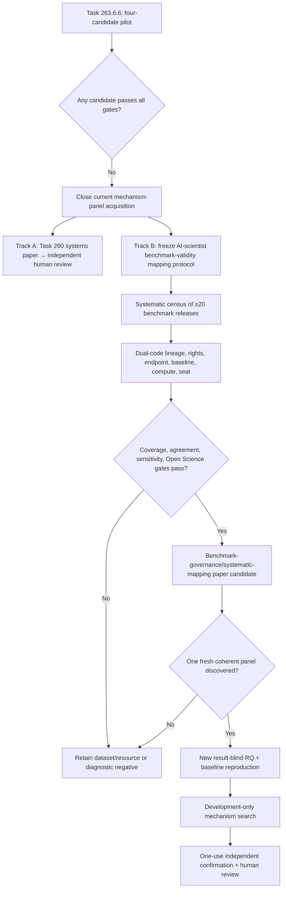

# 自动科研基准入场审计与可发表研究路径重构

## 摘要

AutoResearch 已具备真实检索、Evidence Graph、受控 Harness、可恢复 Loop、实验执行、失败保留、
可复现工件和论文构建能力，但仍不能把“系统真实运行”直接升级为“可发表的科学贡献”。Task
263.6.6 在任何候选模型调用、provider credential、Research Question Certificate 或新确认面板
之前，对四个官方候选执行了结果盲、无预设赢家的入场锦标赛：

- AutoSDT-5K：按 source repository 计科学编码单位；
- ScienceAgentBench：按 publication/repository lineage 计科学编程单位；
- CORE-Bench：按 paper/capsule 计计算复现单位，三个 difficulty 不重复计数；
- QRData：按共享 data-file set 计统计/因果推理单位。

正式审计冻结官方 revision、完整文件哈希、任务到来源 lineage、四类许可用途、primary endpoint、
强基线和本地算力边界。要求一个候选同时保留至少 30 个 development group 和 84 个完全 sealed
reserve group。结果是 `all-candidates-rejected`：AutoSDT 有规模但没有冻结 evaluator、逐来源许可
对象或 sealed reserve；ScienceAgentBench 的独立上限只有 44；CORE-Bench 的 paper 上限为 90，
sealed reserve 只有 45；QRData 有 190 个共享表组和确定性 scorer，但答案同包、逐表来源许可缺失、
官方强基线复现命令缺失。两套干净解释器零重试得到完全一致的投影。

这次失败揭示了真正的系统短板：不是缺少另一个 Agent，而是缺少“可被合法使用、独立、客观评分、
有强基线、可承受且未被看过”的科学单位。优化后的路线应把当前四候选视为 protocol-development
pilot，转向一项前瞻冻结的 AI Scientist benchmark-validity 系统映射研究；同时把已经完成的
Task 260 systems-paper 路线交给独立人类评审。只有未来出现单一构念、全门通过的 fresh panel，
才恢复 critic 或新机制效应研究。

## 1. 研究问题

本轮在读取候选 outcome 前冻结三个问题：

1. 哪个候选在逐来源许可和 lineage 聚类后，仍有至少 30 个 development group 与 84 个完全
   sealed reserve group？
2. 每个候选的真正独立科学单位和 deterministic primary endpoint 是什么？
3. 在任何 candidate model call 前，官方强基线能否在有界本地算力内精确复现？

三者是合取门，不做加权补偿。task count、Agent 数、seed、attempt、difficulty、投票和 reviewer
score 都不能补足独立单位、许可或 seal。

## 2. 检索与审计方法

### 2.1 一手材料与时间边界

检索截止日为 2026-07-31。使用论文原文、官方 GitHub、官方 Hugging Face revision、官方
license 文件、ACL/PMLR/OpenReview/arXiv 页面；博客和二手摘要只用于发现，不作为门禁证据。正式
live smoke 又探测了 AutoSDT、ScienceAgentBench、CORE-Bench、QRData、POPPER、AstaBench、
AI Scientist-v2、Kosmos、AutoResearchBench、Socratic Agents 和 FAIR4RS 共 11 个一手页面。

四个候选的冻结版本为：

| Candidate | Dataset/repository revision |
|---|---|
| AutoSDT-5K | dataset `659b60f3fabdfc5d6b80ef08176f602f4cfb24a6`; repository `744a3c70a49c6e53effae65a93d2a7ad9ce923ba` |
| ScienceAgentBench | dataset `9c6e96c9e74572e979b0930ee735041cef528cb7`; repository `c26e151ed601ba109dc4d35e057ff8e73fec469d` |
| CORE-Bench | dataset `18ac8edf2532d9edb9d13ae71f715410de6ee5a0`; repository `e32a2980e72fe6eb04ee04eb749458f570625663` |
| QRData | repository `de450af45ff7101b328bb064c6b475f73414a7ed` |

### 2.2 结果盲边界

冻结 runner 只接收：

- candidate identifier；
- 经过许可门后的 source-group identifier；
- task count 和未绑定来源的保守上限；
- development、potential reserve、sealed reserve capacity；
- revision、lineage、license、objective endpoint、construct coherence、strong baseline、
  bounded local compute、reserve seal 八个布尔门。

它不接收 prompt、question、answer、reference program、gold output、model output、judge output 或
reserve result。生产 parser 在 JSON object-pair 进入业务对象前丢弃这些敏感字段；CORE-Bench 只
保留每篇 paper 的 variant 数。所有候选 model call 固定为 false。

### 2.3 独立单位

独立单位由 scientific source lineage 决定：

- AutoSDT：一个 source repository；
- ScienceAgentBench：一个 publication 为目标上界，released table 可直接核验到 repository；
- CORE-Bench：一个 paper/capsule，三个难度是技术变体；
- QRData：一个完全相同的 data-file set。

同一来源的多任务、多文件、多难度、seed、retry、best-of-three attempt、interpreter 和 Agent vote
都不是新科学单位。`30 + 84` 来自先前冻结的 exact paired design；本轮没有在看到候选规模后修改
门槛。

### 2.4 许可不是一个布尔字段

每个候选分别记录四种用途：

1. local execution；
2. software reuse；
3. derivative creation；
4. content redistribution。

仓库许可证不自动许可上游数据；dataset card 的全局许可证不自动绑定每张 source sheet；MIT
harness 不自动许可每个 Docker capsule；“公开可见”或“假定 academic use”不构成许可证据。这里
记录的是保守工程边界，不是法律意见；最终公开发布仍需人类许可审查。

## 3. 从相关研究借鉴什么

### 3.1 Graph Engineering：把证据关系做成研究状态，而不是装饰

Graph 的有效贡献是把 claim、source、code、data、environment、result、counterevidence 和
human decision 绑定为可查询因果关系。W3C PROV、RO-Crate 和当前 AutoResearch Evidence Graph
支持 provenance、派生关系与 research object 的内容寻址。[11–13]

但 Graph 不能：

- 把相同 repository 的 20 个任务变成 20 个独立研究；
- 推断缺失许可证；
- 把 public answer 重新变成 sealed reserve；
- 证明某个 critic 有因果增量。

因此系统应保留四张不同的图：Evidence Graph、Control Graph、Artifact Graph 和 Scientific
Lineage Graph。只有最后一张图负责 source-group clustering；不能让工作流节点数替代科学单位数。

### 3.2 Harness Engineering：把执行真实性变成可比较测量

AstaBench 的关键启发是统一工具接口、环境、agent class、成本与强基线；CORE-Bench 展示了
paper-reproduction capsule 和快速并行 evaluation 的价值。[3,5] 对 AutoResearch 而言，应继续：

- 固定 HarnessSpec、依赖、命令、预算、timeout 和 failure semantics；
- primary endpoint 优先 deterministic execution；
- LLM/VLM judge 只作 secondary，不能决定主效应；
- 在 novelty search 前复现 strongest open baseline；
- 把 privileged Docker、GPU 和 mutable external service 作为显式算力门。

Harness 使比较可信，但如果数据不独立、无许可或已泄漏，它只能稳定地重复一个无效研究。

### 3.3 Loop Engineering：长循环必须服从确认边界

Kosmos 通过多轮 literature/analysis/hypothesis cycle 扩大研究深度；AI Scientist-v2 用
experiment-manager 和 progressive tree search 探索候选；POPPER 把 hypothesis validation
改造成 sequential falsification，并显式控制 Type-I error。[6–8]

适合借入 AutoResearch 的是：

- development-only tree/portfolio search；
- checkpoint、resume 和 complete failure trace；
- 每一轮都绑定 evidence/counterevidence；
- 预先定义 falsifier、alpha policy、promotion 和 stop rule；
- confirmation panel 一次性 reveal，禁止 loop 回写并重调同一面板。

不应借入的是“循环越长越科学”的假设。没有固定 endpoint 和 holdout，长循环会放大 adaptive
overfitting、选择偏差和结果驱动叙事。

### 3.4 Open Science：可用、可复现、可发布是三件事

FAIR4RS 把研究软件的 findability、accessibility、interoperability 和 reusability 作为独立维度；
RO-Crate/PROV 提供 research object 和 provenance 表达。[11–13] 系统升级应继续生成：

- exact revision 和 artifact hash；
- environment lock 与 replay command；
- positive、negative、invalid、timeout 和 human intervention 全量记录；
- internal/review/public 三种权限视图；
- source-specific license 与 citation evidence；
- human responsibility、authorship、release 和 submission gate。

Open Science 能让结论被检查，不能授权未知内容，也不能代替科学新颖性和统计效力。

## 4. 四候选的正式审计

### 4.1 总表

| Candidate | Released technical tasks | Independent upper bound | Dev | Potential reserve | Sealed reserve | Deterministic primary | Strong baseline | Bounded local | Decision |
|---|---:|---:|---:|---:|---:|---|---|---|---|
| AutoSDT-5K | 5,148 | 1,002 license-labelled repos | 30 | 972 | 0 | no | no | no | reject |
| ScienceAgentBench | 102 | 44 publications | 30 | 14 | 0 | mixed/no | yes | no | reject |
| CORE-Bench | 270 | 90 papers | 45 | 45 | 45 | yes | yes | no | reject |
| QRData | 411 | 190 shared-sheet groups | 30 | 160 | 0 | yes | no | yes | reject |

“upper bound”不等于可发表样本；它还须同时通过 exact source license、lineage、seal、endpoint、baseline
和 compute。

### 4.2 AutoSDT-5K

论文和 card 报告 5,404 tasks、1,325 repositories；当前冻结 JSON 实际包含 5,148 rows、
1,317 normalized repositories 和 5,108 unique source files。[1] 这不是小问题：规模主张必须绑定
release revision，而不能从论文数字推定当前文件。

repository-level license label 分布中有 315 个 `None`，排除后仅 1,002 个 labelled groups。即使
规模足够，仍有四个不可补偿问题：

- source file URL 指向 branch path，不是 source commit；
- label 不是逐 repository license object，无法证明四类用途；
- release 是 public reference-program/training corpus，没有冻结 per-task test/scorer；
- prompt/reference program 公开，同一 release 无法提供 fresh sealed reserve。

因此它适合训练、代码能力研究或未来重新封装，不适合直接成为本轮确认面板。

### 4.3 ScienceAgentBench

冻结 release 有 102 tasks、30 个直接 repository group；论文声明来自 44 publications。[2] 为避免
虚假精确，本轮只把 `44 - 30 = 14` 视为尚未逐任务绑定的 publication upper bound，而不虚构
publication ID。

它有真实程序生成、执行脚本、官方 baseline 和成本记录，但完整评估包含 visualization 的 GPT-4o
judge，并采用三次 attempt 的最好结果。全量 artifact 还明确要求不要再分发解压数据，六个任务有
特殊上游许可边界。即使许可和 deterministic subset 将来修复，44 个 publication 仍不足
`30 + 84`。

### 4.4 CORE-Bench

CORE-Bench 的 270 tasks 来自 90 papers，每篇 paper 有三个 difficulty。[3] 冻结公开 train JSON
含 45 个 paper capsule、每个三种变体；test 文件以加密 bytes 保留，正式审计未解密、未读取结果。
因此合理单位是 90 papers，不是 270 tasks；最多 45 development + 45 sealed reserve。

它是四者中 construct 和 evaluator 最强的候选：primary reproduction Q&A 可确定性评分，官方
baseline 存在。但：

- 45 reserve < 84；
- MIT repository license 只覆盖 harness，不自动许可 90 个 capsules；
- 完整执行需要 Docker-in-Docker、privileged container，且部分任务需要 GPU/Azure；
- 当前本机不能把它称为 bounded local panel。

它适合作为计算复现专项 benchmark 或 future external-validity study，不可通过三倍 difficulty
计数满足本轮功效。

### 4.5 QRData

QRData 冻结 release 有 411 questions、195 个 archive files；按完全相同的 data-file set 聚类后
为 190 groups。[4] 官方 `eval.py` 对 numeric/multiple-choice 使用确定性容差，下载和展开规模在
本地可控，因此 endpoint、construct 和 compute 门通过。

失败点是：

- repository 的 CC-BY-NC-4.0 是全局许可，没有 195 张上游 source sheet 的逐项许可 manifest；
- 官方仓库没有可精确复现的 strong baseline inference implementation/command；
- question 与 answer 同一 JSON 公开，当前 release 不是 sealed reserve；
- 本项目的 exploratory process 已接触该公开 answer-bearing file，所以不能把它重新声明为 fresh
  confirmation。

QRData 是最接近可修复的候选，但修复需要作者提供新加密 holdout 或独立新数据、逐 sheet 权利链和
官方/clean-room baseline；不能由本系统自行“重新封条”。

## 5. 为什么真实系统仍产不出可发表级新结果

| 层 | 已经真实发生 | 仍缺的发表条件 |
|---|---|---|
| Product execution | 检索、代码、模型、实验、PDF、manifest 都能运行 | 运行事实不是科学效应 |
| Graph | claim/evidence/failure 可追踪 | provenance 不生成独立样本 |
| Harness | 环境、预算、timeout、重放可冻结 | 稳定测量不保证 construct/数据有效 |
| Loop | 可多分支搜索、恢复、淘汰 | 自适应 search 必须隔离 confirmation |
| Data | 四套公开 benchmark 可下载 | public 不等于 licensed、independent、sealed |
| Endpoint | 部分任务可执行评分 | 同一 coherent construct 和 primary scorer 未普遍成立 |
| Baseline | 部分官方 baseline 存在 | 必须 exact、same-budget、local-feasible |
| Inference | seed/repeat 很多 | 科学单位仍是 source/paper/repository/data set |
| Novelty | 可实现 Socratic/critic/tree/graph | AstaBench、POPPER、Socratic Agents、AI Scientist-v2 已覆盖大量机制 |
| Publication | 可构建 paper object | 仍需新贡献、独立确认、人类作者/许可/投稿责任 |

最关键的诊断是：

> AutoResearch 的后端已经接近“可审计研究操作系统”，但前端仍缺少稳定供应的合格科学问题和
> fresh objective panel。继续增强生成、写作或 Agent 数量只会提高吞吐量，不会提高有效发现率。

## 6. 综合结论

### 6.1 Benchmark task scale 不是 inferential sample size

自动构造或多难度 benchmark 很容易把一个 repository、paper、semantic tree 或 data sheet 扩为
多条任务。训练规模可以按任务计算；科学效应的独立样本必须按真实来源计算。四个候选从表面
5,148/102/270/411 tasks 变为 1,002/44/90/190 upper-bound groups 后，只有两个达到 114；它们又都
没有 sealed reserve。

### 6.2 “开放”至少包含五个不同问题

1. 页面是否可访问；
2. 软件是否允许本地执行/复用；
3. 数据内容是否允许派生和再分发；
4. scorer/baseline 是否可以精确复现；
5. holdout 是否仍未被开发过程接触。

任一项缺失都不能由 repository visibility 补偿。

### 6.3 最成熟的自动科研系统仍依赖外部科学责任

AI Scientist-v2 和 Kosmos 展示了长链研究生产；POPPER 展示了自动 falsification；AstaBench 展示
了严谨 harness；AutoResearchBench 展示了 objective literature-discovery evaluation。[5–10]
共同边界仍是：问题选择、数据权利、construct validity、不可撤销的确认设计、作者责任和外部发布
不能由系统自我声明通过。

## 7. 优化后的双轨研究路径

### 7.1 Track A：先完成系统论文的人类评审

Task 260 Route B 已证明后端系统/论文/复现路径可以通过内部门并达到
`ready_for_human_submission_review`。它应作为 systems/reproducibility paper candidate 单独进入：

- 独立人类 novelty、scope 和 venue review；
- 明确贡献是 evidence-first research OS、failure semantics 和 reproducibility，不声称新 critic
  的正效应；
- 作者、license、public release 和 submission 仍由人批准。

这是近期最短的发表路径，但不是自动提交授权。

### 7.2 Track B：把真正瓶颈改造成前瞻研究问题

四候选结果只能作为 protocol-development pilot，不能在看到结果后直接包装成 confirmatory
systematic review。下一任务应先冻结新的研究协议，再检索额外 benchmark：

- 研究单位：一个有固定 revision 的 AI-scientist/scientific-agent benchmark release；
- 样本目标：至少 20 个独立 benchmark releases，当前四个标记为 pilot/calibration；
- 数据项：headline tasks、source-group upper bound、exact source license、四类 rights、primary
  endpoint、LLM/human judge role、baseline command、compute、split seal、contamination policy；
- primary outcomes：各门通过率、task-to-independent-unit compression ratio、完整 admission
  conjunction 的通过率；
- analysis：descriptive intervals、按 construct/source/year 的 sensitivity，不做虚假 causal claim；
- quality：双人独立编码关键许可/lineage 字段、预设冲突处理和一致性指标；
- artifact：machine-readable Benchmark Admission Card、source registry、parser、schema、manifest、
  negative/unknown evidence。

如果协议覆盖度、双人一致性或一手来源不足，合法终点是开放资源或诊断负结果，而不是泛化到整个
领域。

### 7.3 Mechanism effect track 暂缓

Socratic critic、Graph intervention、tree search 或 external feedback 只有在以下条件同时出现时
才能恢复：

1. 一个 fresh、single-construct panel；
2. 至少 30 development + 84 sealed reserve source groups；
3. per-source rights 完整；
4. deterministic executable primary endpoint；
5. official/clean-room strongest baseline 可在有界算力复现；
6. result-blind RQ、SESOI、null/Type-I、ablation 和 human novelty review 全冻结。

不得事后拼 AutoSDT、CORE 和 QRData 的不同构念来凑样本量。

## 8. 下一任务的停止条件

Task 263.6.7 应在下列任一条件发生时停止，而不是滑向新模型实验：

- 搜索协议未在新 benchmark extraction 前冻结；
- 找不到至少 20 个符合纳入标准的独立 release；
- 一手 revision、license 或 evaluator evidence 大面积不可恢复；
- 当前四个 pilot 被错误计为独立确认集；
- 双人关键字段一致性未达到预设门；
- descriptive endpoint 被改写为“某机制有效”的 causal claim；
- human authorship、license、release 或 submission 未批准。

## 9. 开放问题

1. repository、paper、dataset 和 topic 哪个是不同构念下最合理的 independence level？
2. benchmark license card 应如何表达 software、database、individual contents、generated derivative 和
   model-output rights？
3. 公开答案的 benchmark 如何在持续开发环境中保留 fresh evaluation：author-held holdout、
   procedural generation、secure enclave 还是 time-split？
4. mutable web/retrieval benchmark 如何同时满足生态真实性与 exact replay？
5. 如何把 LLM judge 保留为定性诊断，又不让它决定可发表主效应？
6. 长期 Loop 的 alpha spending、adaptive branch selection 和 one-use confirmation 应如何统一？
7. Benchmark Admission Card 能否成为 AI Scientist 论文的最低 Open Science 附件？

## 10. 结论

Task 263.6.6 没有找到可立即运行的新机制面板，但它把“为什么真实不可产出”从抽象抱怨变成了可复演
证据：可下载任务不等于独立样本；公开仓库不等于逐来源许可；确定性 scorer 不等于 sealed panel；
强基线不等于有界本地复现；Graph、Harness、Loop 和 Open Science 是可信研究的基础设施，不是科学
效应本身。

四候选全部失败是一次正确的研究决策。正式 projection 为
`265d8c1b1195f6ad488a2d2fe12dd5133afaeadfd18d109fff56edefd11c7491`，
report contract 为
`292899ec660d38490fd95dd40c832e304f6c816a1dd5f9f401b19f6615eea89a`，
manifest contract 为
`4e4a47495d23f44c3df72cb3005cb4846d5f356f65b606a9677fd1c80013fc9a`。

最合理的升级不是再建一个 paper-writing Agent，而是：近期推进已经通过证据门的 systems-paper
人类评审；中期把 benchmark admission/validity 做成前瞻系统映射研究；长期只在发现 fresh qualified
panel 后恢复机制效应实验。这样每条路线都有独立、不可事后修改的发表终点。

## 参考文献

1. Li et al. “AutoSDT: Scaling Data-Driven Discovery Tasks Toward Open Co-Scientists.”
   arXiv:2506.08140, 2025. Official dataset revision
   `659b60f3fabdfc5d6b80ef08176f602f4cfb24a6`.
2. Chen et al. “ScienceAgentBench: Toward Rigorous Assessment of Language Agents for
   Data-Driven Scientific Discovery.” ICLR 2025; arXiv:2410.05080.
3. Siegel et al. “CORE-Bench: Fostering the Credibility of Published Research Through a
   Computational Reproducibility Agent Benchmark.” TMLR, 2025; arXiv:2409.11363.
4. Liu et al. “Are LLMs Capable of Data-based Statistical and Causal Reasoning?
   Benchmarking Advanced Quantitative Reasoning with Data.” Findings of ACL 2024,
   paper 548; arXiv:2402.17644.
5. Bragg et al. “AstaBench: Rigorous Benchmarking of AI Agents with a Scientific Research
   Suite.” ICLR 2026; arXiv:2510.21652v2.
6. Huang et al. “Automated Hypothesis Validation with Agentic Sequential Falsifications.”
   ICML 2025, PMLR 267:25372–25437.
7. Yamada et al. “The AI Scientist-v2: Workshop-Level Automated Scientific Discovery via
   Agentic Tree Search.” arXiv:2504.08066, 2025.
8. Mitchener et al. “Kosmos: An AI Scientist for Autonomous Discovery.”
   arXiv:2511.02824, 2025.
9. “AutoResearchBench: Benchmarking AI Agents on Complex Scientific Literature
   Discovery.” arXiv:2604.25256, 2026.
10. “Socratic Agents for Autonomous Scientific Discovery in High-Dimensional Physical
    Systems.” arXiv:2606.26722, 2026.
11. Lamprecht et al. “Towards FAIR Principles for Research Software.” Data Science 3,
    37–59, 2020.
12. Barker et al. “Introducing the FAIR Principles for Research Software.”
    Scientific Data 9, 622, 2022.
13. Soiland-Reyes et al. “Packaging Research Artefacts with RO-Crate.”
    Data Science 5, 97–138, 2022; W3C PROV-O Recommendation, 2013.
14. AutoResearch Task 263.6.6 formal report,
    `runs/manual-live/task26366-replacement-objective-data-tournament-v1/`, 2026-07-31.

## 关联

- [[exploration/licensed-objective-socratic-inventory-gate-2026]]
- [[exploration/workload-qualified-ai-scientist-opportunity-tournament-2026]]
- [[exploration/graph-harness-loop-open-science-2026]]
- [[projects/ai_researcher_system/progress/task-263-6-6-replacement-objective-data-tournament]]
- [[projects/ai_researcher_system/index]]
