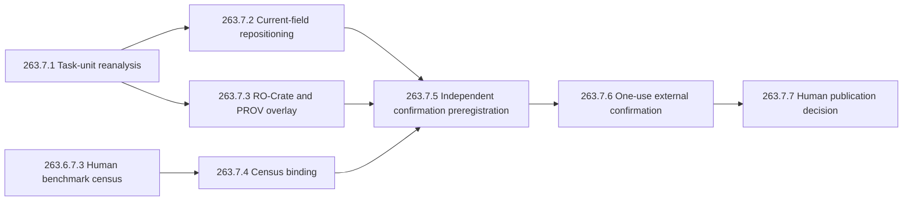

# Task 260 Route B publication-currency and independent-unit audit

## Decision

Task `260` v2 is a credible content-addressed engineering object, but it is not
a publication-ready confirmatory study. The audit verdict is
`major-revision-new-independent-evidence-and-human-review-required`, with a
readiness score of 3/10 and 3 critical, 28 major, and 5 minor findings.

The defensible center claim is narrower than the frozen manuscript: AutoResearch
implements a tamper-evident, failure-linked research state machine whose
transitions, negative-result lineage, and claim provenance can be independently
audited. Whether this architecture improves scientific outcomes remains a new
prospective external question.

## What the current field changes

The live audit retained 21 primary-source snapshots: 10 peer-reviewed articles,
8 preprints, and 3 normative standards or policies. Five adversarial
perspectives were covered, with sources allowed to inform more than one view.

- [AI Scientist](https://www.nature.com/articles/s41586-026-10265-5) shows an
  end-to-end research loop, but its own evaluation still required manual
  filtering and did not establish consistent main-conference quality.
- [AI Co-Scientist](https://www.nature.com/articles/s41586-026-10644-y) uses
  generation, debate, ranking, and evolution while retaining expert evaluation.
- [Robin](https://www.nature.com/articles/s41586-026-10652-y) combines agents
  with human candidate review and human-executed experimental protocols.
- [ERA](https://www.nature.com/articles/s41586-026-10658-6) succeeds in a
  bounded, automatically scorable empirical-software search space and explicitly
  distinguishes that setting from general scientific discovery.
- [Kosmos](https://arxiv.org/abs/2511.02824) makes structured world models and
  claim traceability part of the current baseline; its
  [independent audit](https://arxiv.org/abs/2511.13825) shows why plausible
  discoveries still require null models and external checking.
- [AstaBench](https://arxiv.org/abs/2510.21652),
  [PaperBench](https://arxiv.org/abs/2504.01848),
  [CORE-Bench](https://arxiv.org/abs/2409.11363), and
  [REPRO-Bench](https://arxiv.org/abs/2507.18901) show that literature work,
  paper replication, and computational reproduction remain difficult despite
  rapid agent-system progress.
- [SciIntegrity-Bench](https://arxiv.org/abs/2605.10246) and
  [Risks of AI Scientists](https://www.nature.com/articles/s41467-025-63913-1)
  make scientific integrity and human responsibility non-optional evaluation
  dimensions.

The implication is direct: end-to-end execution, multiple agents, iterative
loops, and traceability are no longer sufficient novelty claims. The research
contribution has to be a precisely tested mechanism or an evidence-governance
property with external confirmation.

## Independent-unit reconstruction

All three deterministic seeds produce identical scientific output within each
`(mode, task)` pair. They are idempotency checks, not independent task samples.

| Quantity | Frozen publication-facing view | Independent-task audit |
|---|---:|---:|
| Nominal pairs / independent tasks | 30 | 10 |
| Mean paired difference | 0.50 | 0.50 |
| 95% interval | seed-cell interval | `[0.20, 0.80]` |
| Exact sign test | not reported | 5 wins, 0 losses, 5 ties |
| One-sided / two-sided p | not reported | `0.03125 / 0.0625` |
| UCI / MDBench means | pooled | `0.25 / 0.666667` |
| Family-balanced mean | not reported | `0.458333` |

Two task families cannot estimate broad across-domain variability. The gap
between family means is therefore a warning about external validity, not a
generalization estimate.

## Seven-stage repair route

Stages 1 to 3 can improve truthfulness and interoperability using existing
evidence. They cannot manufacture independent task authors, external baselines,
new task families, or human scientific judgment. Stages 4 to 6 must create the
missing independent evidence, and stage 7 remains an accountable human decision.

The confirmation design must use task as the primary independent unit,
independently authored tasks from at least three substantive families,
compute-matched external agents and simple baselines, prospective power, frozen
null controls, role-separated scoring, one-use outcomes, and a registered
diagnostic-negative endpoint.

## Formal evidence

Package: `runs/manual-live/task26370-systems-paper-currency-audit-v1/`

- immutable parent package: `bd4a2b74c271d321c4b859e4f16004f9eb8cd1cc6de6409bb8d6c71eb4c194ac`;
- report: `92a478ee85f2324353f5310425408fb60d5c58fc2ee222b16069cbcdc1bfa190`;
- source registry: `50fbd19ad2a03896988ffa2d66d5b6499cf30c9996e9613a26c1cc4e97067427`;
- independent-unit audit: `b6a6e2cb59be88ebb4dc747a8c6d36d91a2279568a3c2cde711ac12acb751eb3`;
- task projection: `4247521dab59e0a65318f8391367aa11c26323d04335697be3e1f74f322f9cba`;
- replay certificate: `de0273ff820b898a58afc3689d5d524c9f7f8b1185a7d0e5cc4a84605416d253`;
- repair plan: `4ad117a02defc318646456a9a754e91159756b5f148ae01f36f8ed1ddf36b3ec`;
- manifest: `8e2dd7b5cbee5aa4274b125bc9f7c2cdab3ef33017a38f37e782ea35d089b9c9`.

Publication, public release, external submission, authorship, license, AI
disclosure, and venue decisions remain false or human-owned.

## Related

- [[publishability-recovery-ai-scientist-2026]]
- [[benchmark-validity-systematic-mapping-protocol-2026]]
- [[benchmark-validity-human-review-handoff-2026]]
- [[graph-harness-loop-open-science-2026]]
- [[../projects/ai_researcher_system/progress/task-263-7-0-systems-paper-currency-audit]]
