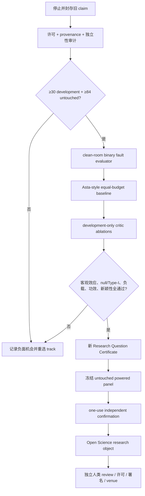

# 负载合格的 AI Scientist 机会锦标赛与可发表性恢复

> [!summary]
> AutoResearch 已经能真实运行、记录 Graph、封装 Harness、循环搜索、生成可复现工件和论文包；
> 仍达不到可发表级别的原因不是“没有再加几个 Agent”，而是科学构念、真实负载、独立单位、统计
> 功效、客观评价和开放许可没有同时成立。Task 263.6.4 以结果盲方式比较三条新机制路线，并在任何
> 新科学 freeze 前加入 `WorkloadQualificationCertificate`。正式结果只允许
> `socratic-falsification` 进入 development-only baseline/evaluator construction；它不是新颖性、
> 效应或发表证书。

## 1. 冻结研究问题

在读取新 track 的任何科学结果前，本轮冻结三个问题：

1. 2024—2026 年自动科研系统中，哪些机制有客观增量证据，哪些只证明可运行、可检查或作者自评？
2. structured world model、Socratic falsification critic、external feedback 三条路线中，哪一条同时
   具备强基线、客观终点、足量独立单位、开放许可和可承受算力？
3. 什么样的 workload contract 能阻止 fixture success 被错误解释为 full-workload reproducibility？

冻结判断是：当前最可能的系统贡献不是“更多 Agent”，而是
**objective feedback + workload-qualified verification**。这个判断允许被三条路线全部失败所推翻。

## 2. 为什么“真实执行”仍不等于可发表

本项目已经排除了“只是聊天机器人、没有真跑实验”这一原因。旧
`portfolio_memory` 路线真实完成了 development、60-task one-use confirmation、clean-room replay
与 technical repair；合法终点仍是停止。原因分为五层：

| 层 | 已有证据 | 为什么不能发表 |
|---|---|---|
| Artifact | 代码、日志、Graph、Markdown/PDF、manifest 都存在 | 工件存在只证明过程发生 |
| Instrument | v1 label 类型缺陷被 v2 certificate 修复 | 修复仪器不能把已消耗 panel 变回 confirmation |
| Runtime | fixture 与 null replay 可精确复现 | full workload 有 8 个 deadline-sensitive trajectory mismatch |
| Effect | 修复后真实 diagnostic 可计算 | `40/60 < 43/60`，方向和实际幅度都不支持旧主张 |
| Publication | 可生成 research object | 没有有效新颖机制 + powered independent confirmation + human review |

因此“真实不可产出”的准确表述是：

> 系统能够真实产出研究工件，但尚未产出同时通过构念有效性、客观增量、独立功效、真实负载复现、
> 开放许可与人类科学审查的研究主张。

## 3. 一手研究交叉检索

### 3.1 Structured world model 与可检查轨迹

[Kosmos](https://arxiv.org/html/2511.02824) 以 structured world model 支持约 200 个 rollout、
约 12 小时的长程 discovery，并将语句绑定到代码或文献。这支持持久结构化记忆与 provenance；
但公开的 `kosmos-figures` 只复现图表，不是完整系统，部分数据尚未公开，独立科学家判定的 statement
accuracy 也不是相对强基线的机制效应。

[Graph of Trace](https://arxiv.org/html/2606.15116) 证明图式 trajectory 有助于专家检查；
[Code as an Agent Harness](https://arxiv.org/html/2605.18747) 则将 code 归纳为 reasoning、action、
state、environment 与 verifier 的共同载体。两者加强本项目 Graph/Harness 方向，却都没有证明
“加入 evidence graph 会在足量独立科学任务上提高正确率”。可检查性是必要条件，不是科学终点。

### 3.2 Socratic critics、证伪与 validity checking

[AHOIS / Socratic Agents](https://arxiv.org/html/2606.26722) 的 critic 使用 causal questions、
constraint checks、counterexamples 与 falsification criteria，并在一个真实多模光纤平台展示
autonomous hypothesis discovery。它为四项 critic primitive 提供直接先例，但目前是单平台预印本，
未找到可复用的公开 code/data license。

[POPPER](https://proceedings.mlr.press/v267/huang25n.html) 将假设验证表达为 sequential
falsification，并控制 Type-I error；它支持“先尝试推翻，再决定晋级”的路径。官方 GitHub 当前没有
LICENSE，因而本项目可借鉴论文机制和统计思想，不能复制仓库代码。

[DiscoveryBench](https://arxiv.org/abs/2407.01725) 提供 data-driven discovery 问题、数据与
自然语言 `gold_hypo`。实时 Hugging Face tree 有 987 个 entry、189 个 depth-four provisional
source-group folder；card metadata 是 ODC-By。关键限制是 `gold_hypo` 为自由文本，不能把字符串
exact match 假装成科学正确率，也不能让 LLM judge 成为主要门。

[AstaBench](https://arxiv.org/abs/2510.21652) 在 ICLR 2026 提供科学 Agent suite、标准工具/
环境、成本记录和 Apache-2.0 harness。完整 aggregate dataset 需要 gated access，full suite 可能需要
10GB 以上内存，coding task 可达 20—30GB，部分 scoring 依赖 API key 或模型评分。因此本路线只采用
其 license-clear interface/budget 思想和开放 DiscoveryBench 数据，不直接宣称可复现整个 suite。

[SciAgentArena](https://arxiv.org/abs/2606.12736) 是本轮最关键的新 nearest work：约 200 个
stepwise-verified task、18 个 Agent、五个科学域，并包含 validity category。作者报告当前 Agent
会执行 premise 本身错误的任务，且相同运行稳定性不足；这直接支持 constraint-first/Socratic
criticism，也显著压缩了我们的 novelty space。其 Hugging Face data 需要接受访问条件，公开 GitHub
仓库没有可核验 LICENSE，所以当前只作为必须战胜的 prior art 与未来资源候选。

### 3.3 External feedback、环境与人类责任

[Robin](https://www.nature.com/articles/s41586-026-10652-y) 将多 Agent 推理、数据分析和湿实验
连接起来，但实验 protocol 由人类执行，LLM tournament 后仍有人类审阅。它证明外部实验反馈比纯文本
自评强，也证明“自主科研”仍有不可委托的人类职责。

[Execution-Grounded Automated AI Research](https://arxiv.org/html/2601.14525) 在两个执行环境
展示演化式反馈，报告的 nanoGPT 路线使用 8×H100，且没有跨环境 generalization test。官方仓库没有
可核验 LICENSE；两个环境也远少于本轮 exact paired-power 所需的 84。

[EurekAgent](https://arxiv.org/html/2606.13662) 把 permissions、artifacts、budget、hidden
grader 与 HITL 作为 environment engineering 核心。这些约束应进入 AutoResearch Harness，但
“环境任务得分提高”仍不是广义科学创新证明。

## 4. Benchmark 不能直接互换

| Benchmark / system | 客观性 | 开放性 | 独立单位/规模 | 本轮用法 |
|---|---|---|---:|---|
| PaperBench | 细 rubric，但主评分含模型 judge | paper/code 可查 | 20 papers | 复现失败边界，不作主终点 |
| MLR-Bench | 201 ML research tasks，rubric 丰富 | MIT code | 201 | MLR-Judge 不能作本轮主要 gate |
| MLS-Bench | 140 objective ML tasks | root LICENSE 未核验 | 140 | 许可解决前不得复用 |
| AIRS-Bench | objective tasks | CC BY-NC | 20 | 对 SESOI `.20` 功效不足 |
| BixBench | 205 questions | code Apache；data gated | 205 | open-ended scoring 含模型 judge |
| DiscoveryBench | 数据与 gold hypothesis | ODC-By database | 189 provisional groups | 只用于 clean-room objective fixture 设计 |
| AstaBench | suite/harness/cost | code Apache；aggregate data gated | >2,400 examples | 强基线接口与预算规范 |
| SciAgentArena | stepwise metrics、validity tasks | data gated；repo LICENSE 未核验 | ~200 tasks | 最新决定性 prior art，等待许可审计 |

这里最重要的否定结论是：**任务数多不等于统计独立，answer key 存在不等于 evaluator 客观，
repository public 不等于代码有许可。**

## 5. 预注册功效与独立单位

主要规划使用 paired binary endpoint 与两侧 exact McNemar：

- alpha: `0.05`;
- target power: `0.80`;
- SESOI: paired risk difference `+0.20`;
- primary discordance assumption: `p10=0.30`, `p01=0.10`;
- sensitivity: `.15/.20/.25`;
- required independent source groups: `129/84/60`;
- seed、retry、同一 task 的多次运行：不是独立单位。

189 个 folder 仅证明候选规模可能足够。正式 RQ freeze 前必须按 source provenance、raw/processed
派生、real/synthetic family、generator lineage 与数据重叠重新聚类。目标是至少保留：

- 30 个 disjoint development groups；
- 84 个完全未读、未分配的潜在后续 groups；
- 其余仅作 calibration 或被排除。

如果去重后不足 114，当前路线应停止或寻找新的开放 objective panel，不能把 seed 当样本补足。

## 6. WorkloadQualificationCertificate

冻结的标准库 probe 为每条 track 提供一个代表性 deterministic kernel：

- evidence graph coherence；
- causal/constraint/counterexample/falsification scan；
- external environment feedback loop。

每条 track 的 protocol：

1. clean interpreter A/B；
2. planned concurrency `1` 与 `2`；
3. calibration 每格一次；
4. calibration 完成后冻结 deadline 与至少 `8×` slack；
5. qualification 每格三次；
6. 每条 track 共 `6 + 18 = 24` observations；
7. algorithmic budget = `20,000 work units + 5s CPU`；
8. retry = `0`；
9. scientific projection exact；wall/CPU/memory telemetry tolerant；
10. consumed confirmation/outcome read count = `0`。

三条 track 都通过 workload gate：

| Track | Exact projection | Qualification deadline | Runtime conclusion |
|---|---|---:|---|
| structured world model | `a8e779…fcc3d1` | calibration-derived | stable representative kernel |
| Socratic falsification | `e8dce3…c316e9` | calibration-derived | stable representative kernel |
| external feedback | `953e90…e734f4` | calibration-derived | stable representative kernel |

这只证明 contract 能拒绝 trajectory drift；并不增加任何 track 的科学效果分数。

## 7. 机会锦标赛裁决

| Track | Workload | Power feasibility | Objective spec | License/resource | Compute | Development admission |
|---|---:|---:|---:|---:|---:|---:|
| structured world model | pass | fail (`0 < 84`) | fail | fail | fail | no |
| Socratic falsification | pass | pass (`189 ≥ 84`, provisional) | pass as specification only | pass for Asta/Discovery clean-room boundary | pass | yes |
| external feedback | pass | fail (`2 < 84`) | spec exists | fail | fail | no |

选择规则没有 weighted score，也没有 hardcoded winner；任何一个失败门都不能被其他优点补偿。

正式 artifacts：

- report: `13e31dbe29f2d34ec3924459207610f04618271ed21ce551e13a3d0b7716e72c`;
- manifest: `8461c05491ca487443b0a0ab5250a048ac7721d53e61af2199654ce02824e933`;
- frozen runner:
  `c109d368cd64cd5356cc95304948ed9d6594a823b0bddf00fa4faaa797e6bcca`.

## 8. 优化后的研究路径

下一任务 [[projects/ai_researcher_system/progress/task-263-6-4-workload-qualified-opportunity|Task
263.6.4 progress note]] 的后续是 `263.6.5`，而不是 paper generation。它必须构建：

- 预冻结 binary valid/fault-injected labels；
- causal inversion、constraint violation、counterexample omission、unfalsifiable claim 四类 fault；
- no-critic、rule/null、四个 component、full critic；
- same model/tool/token/call/CPU/wall-clock/failure budget；
- provider-neutral `base_url/api_key/model_name`；
- full failure/cost/human-input retention；
- clean interpreter exact replay。

只有这些 development evidence 存在后，才讨论新 RQ。当前明确为 false：

- strong baseline implementation verified；
- objective evaluator implementation verified；
- scientific independence audit complete；
- Research Question Certificate issued；
- confirmatory panel created；
- novelty search started；
- public release；
- external submission。

## 9. 结论

相关论文没有给出一套可直接复制的“全自动科研已解决”方案。共同有效部分反而高度一致：

1. 用结构化状态和 provenance 延长任务，而不是只堆 context；
2. 用外部、客观、可重放反馈替代 Agent 自评；
3. 先证伪、检查约束和无效前提，再晋级实验；
4. 分离 running framework 与 evaluation framework；
5. 记录稳定性、成本和失败，而不只记录最终成功；
6. 保留人类对实验、伦理、解释、许可和发表的责任。

AutoResearch 的可发表性恢复因此是“收窄并加硬”：
**先证明 evaluator 和 workload 可信，再证明机制在独立单位上有增量；没有增量就保留高质量负面
research object，不把完整流水线误写成科学突破。**

## 关联

- [[exploration/publishability-recovery-ai-scientist-2026]]
- [[exploration/graph-harness-loop-open-science-2026]]
- [[projects/ai_researcher_system/progress/task-263-6-2-technical-replay-stop]]
- [[projects/ai_researcher_system/index]]
